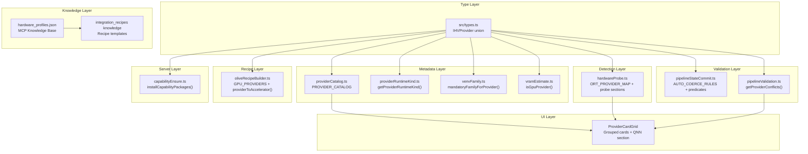

# Design Document: EP Expansion Pack

## Overview

This feature expands Olive Studio's execution provider coverage across four workstreams:

1. **MIGraphX EP** — Full first-class local provider for AMD Instinct datacenter GPUs (MI300X/MI325X/MI350X/MI355X), including type registration, runtime classification, hardware probe, validation rules, recipe builder support, and MCP knowledge base integration.
2. **oneDNN/DNNL EP** — First-class local provider for Intel CPU inference with AVX-512/AMX optimization, zero-install venv experience (bundled in default ORT wheel), and appropriate validation constraints.
3. **QNN ABI Unification** — Adding the missing `QnnAbiExecutionProvider` catalog entry and presenting both QNN EPs in a unified "Qualcomm Snapdragon" section with clear workflow differentiation.
4. **ROCm RX 9xxx Polish** — New RDNA 4 hardware profiles in the MCP knowledge base, consumer/datacenter validation differentiation based on GPU architecture, and recipe templates for consumer Radeon GPUs.
5. **Cross-cutting** — Exhaustive switch coverage for all TypeScript files that pattern-match on `IHVProvider`.

The design follows existing patterns: type union extension → catalog entry → runtime kind → venv family → probe detection → validation rules → recipe builder → MCP knowledge base. Each new provider slots into the same layered architecture.

## Architecture



### Data Flow for New Provider Registration

1. Add literal to `IHVProvider` union → triggers exhaustive-switch compile errors everywhere.
2. Add `ProviderCatalogEntry` to `PROVIDER_CATALOG` → UI card metadata.
3. Add case to `getProviderRuntimeKind()` → classifies as `local`, `exportTarget`, or `platformLocal`.
4. Add case to `mandatoryFamilyForProvider()` → routes to correct venv slot (or `null` for default).
5. Add to `ORT_PROVIDER_MAP` → hardware probe can detect it from ORT's available_providers list.
6. Add to `isGpuProvider()` → VRAM estimation knows whether to include GPU memory.
7. Add to `GPU_PROVIDERS` / `NPU_PROVIDERS` (if applicable) → recipe builder emits correct `device`.
8. Add validation rules in `getProviderConflicts()` and `CROSS_PASS_RULES` / `AUTO_COERCE_RULES`.
9. Add server-side capability install logic (if the EP requires pip packages beyond the base ORT wheel).
10. Add MCP knowledge base profiles and recipe templates.

## Components and Interfaces

### New Type Union Members

```typescript
// src/types.ts — additions to IHVProvider
export type IHVProvider =
  | /* ...existing 17 providers... */
  | "MIGraphXExecutionProvider"  // AMD Instinct datacenter GPU
  | "DnnlExecutionProvider";     // Intel oneDNN CPU
```

### Provider Catalog Entries

**MIGraphXExecutionProvider:**
```typescript
{
  id: "MIGraphXExecutionProvider",
  name: "AMD MIGraphX",
  shortName: "MIGraphX",  // 8 chars
  desc: "Graph-compiled inference on AMD Instinct datacenter GPUs via MIGraphX.",  // ≤120 chars
  icon: Layers,  // GPU-class icon consistent with CUDA/ROCm
  tooltip: {
    requirements: "AMD Instinct MI200 or newer (MI300X, MI325X, MI350X, MI355X) with ROCm 5.7+ stack.",
    quantMethods: "FP16 (recommended), INT8 static quantization.",
    recommendation: "Use FP16 for maximum throughput on Instinct GPUs. INT8 provides additional compression with minimal accuracy loss for batch inference workloads.",
  },
}
```

**DnnlExecutionProvider:**
```typescript
{
  id: "DnnlExecutionProvider",
  name: "Intel oneDNN (DNNL)",
  shortName: "oneDNN",  // 6 chars
  desc: "Intel CPU optimization with AVX-512/AMX instruction set acceleration.",  // ≤120 chars
  icon: CpuIcon,  // CPU-class icon
  tooltip: {
    requirements: "Intel CPU with AVX2 (minimum). AVX-512/AMX recommended for best performance.",
    quantMethods: "INT8 static quantization, BF16 (AMX required for full BF16 throughput).",
    recommendation: "Use INT8 static quantization for best oneDNN throughput. BF16 yields smaller models but requires AMX-capable hardware (Sapphire Rapids+).",
  },
}
```

**QnnAbiExecutionProvider (new catalog entry for existing type):**
```typescript
{
  id: "QnnAbiExecutionProvider",
  name: "Qualcomm QNN ABI (QairtPipeline)",
  shortName: "QNN ABI",  // 7 chars
  desc: "Single-pass QairtPipeline direct compilation for Snapdragon NPU context binaries.",
  icon: CpuIcon,
  tooltip: {
    requirements: "Snapdragon 8 Gen 2/3 or newer SoC. Windows ARM64 (on-device NPU) or Windows x64 (ahead-of-time preparation).",
    quantMethods: "INT4 via QairtPipeline built-in quantization, INT8.",
    recommendation: "Use QNN ABI for new Snapdragon projects packaging model + runtime into a deployable context binary. Use standard QNN for existing pipelines needing individual pass configuration.",
  },
}
```

### Runtime Kind Classification

| Provider                    | Runtime Kind | Rationale                                                                              |
| --------------------------- | ------------ | -------------------------------------------------------------------------------------- |
| `MIGraphXExecutionProvider` | `"local"`    | AMD GPU EP installable via pip; can run locally via Execute Live when probe/venv allow |
| `DnnlExecutionProvider`     | `"local"`    | Intel CPU EP bundled in default ORT wheel; runs locally                                |

### Venv Family Assignment

| Provider                    | `mandatoryFamilyForProvider()` | `resolveVenvFamily()` result | Rationale                                                                                                                                                                                                                    |
| --------------------------- | ------------------------------ | ---------------------------- | ---------------------------------------------------------------------------------------------------------------------------------------------------------------------------------------------------------------------------- |
| `MIGraphXExecutionProvider` | `"default"`                    | `"default"`                  | ROCm dependency overlap with ROCMExecutionProvider but no separate `rocm` family exists today; placing in `default` avoids creating a new family. Future iteration may introduce a `rocm` family if package conflicts arise. |
| `DnnlExecutionProvider`     | `null`                         | `"default"`                  | CPU-class EP, no mandatory family. Falls through to CPU resolution logic in `resolveVenvFamily()`.                                                                                                                           |

**Design Decision:** MIGraphX returns `"default"` from `mandatoryFamilyForProvider()` rather than creating a new `"rocm"` or `"migraphx"` family. Rationale: the `migraphx` pip package installs cleanly alongside the base `onnxruntime` wheel in the default venv. If future testing reveals ROCm version conflicts, the family can be changed to a dedicated `"rocm"` family (shared with ROCMExecutionProvider) without API changes.

### GPU Classification

| Provider                    | `isGpuProvider()` | In `GPU_PROVIDERS` | In `NPU_PROVIDERS` | `providerToAccelerator()` device |
| --------------------------- | ----------------- | ------------------ | ------------------ | -------------------------------- |
| `MIGraphXExecutionProvider` | `true`            | Yes                | No                 | `"gpu"`                          |
| `DnnlExecutionProvider`     | `false`           | No                 | No                 | `"cpu"`                          |

### Hardware Probe Extensions

**New probe result sections:**

```typescript
// Additions to HardwareProbeResult interface
export interface HardwareProbeResult {
  // ...existing fields...
  migraphx?: {
    loadable: boolean;    // true when ORT reports MIGraphXExecutionProvider
    version?: string;     // MIGraphX library version if resolvable
  };
  dnnl?: {
    available: boolean;   // true when ORT reports DnnlExecutionProvider
    provider: string;     // "DnnlExecutionProvider"
  };
}
```

**ORT_PROVIDER_MAP additions:**
```typescript
MIGraphXExecutionProvider: "MIGraphXExecutionProvider",
DnnlExecutionProvider: "DnnlExecutionProvider",
```

**Detection logic:**
- MIGraphX: Only populate `migraphx` section when `probe.rocm?.gpus.length >= 1`. Check ORT `get_available_providers()` for `"MIGraphXExecutionProvider"`.
- DNNL: Populate `dnnl` section when ORT reports `"DnnlExecutionProvider"` in available providers. No hardware gating beyond ORT availability.
- Provider recommendation ordering: When both DNNL and OpenVINO detected, OpenVINO ranks higher. When only DNNL detected (no OpenVINO), DNNL becomes primary Intel recommendation.

### Capability Ensure (Server-Side)

**MIGraphXExecutionProvider:**
- Platform gate: Linux x86_64 only. Return `{ ok: false }` with ROCm requirement message on other platforms.
- Install: `pip install migraphx` (+ transitive ROCm deps) into the assigned venv family.
- Timeout: 300 seconds.
- Rollback: On failure, do not leave partial installs. Report failure cause (missing ROCm stack, platform, network).

**DnnlExecutionProvider:**
- No package installation. DNNL is bundled in the default `onnxruntime` pip wheel.
- Verify: Check `onnxruntime.get_available_providers()` includes `"DnnlExecutionProvider"` within the existing 10-second ORT probe timeout.
- Failure: If not present, return failure suggesting ORT wheel rebuild with DNNL support.

### Validation Rules

#### MIGraphX Conflicts

| Pass/Config                                        | Severity | Autofix                                                          |
| -------------------------------------------------- | -------- | ---------------------------------------------------------------- |
| `conversionFormat: "openvino"`                     | critical | Revert to `"onnx"`                                               |
| `qairtPipeline: true`                              | critical | Disable qairtPipeline                                            |
| TensorRT-gated passes (e.g., `trtFp16`, `trtInt8`) | critical | Disable the pass                                                 |
| `pruningType: "structured"`                        | warning  | None (user advisory — 2:4 sparsity requires NVIDIA tensor cores) |

**Allowed passes (no conflict):** OnnxConversion (format "onnx"), OnnxFloatToFloat16, OnnxStaticQuantization (PTQ), OnnxModelOptimizer, AWQ, GPTQ, SpinQuant, QuaRot, HQQ, PEFT (LoRA/QLoRA).

#### oneDNN Conflicts

| Pass/Config                                                      | Severity | Autofix                                          |
| ---------------------------------------------------------------- | -------- | ------------------------------------------------ |
| `conversionFormat: "openvino"`                                   | critical | Revert to `"onnx"`                               |
| `qairtPipeline: true`                                            | critical | Disable qairtPipeline                            |
| `simplifiedLayerNormToRMSNorm: true`                             | critical | Disable                                          |
| TensorRT-gated passes                                            | critical | Disable                                          |
| `mobiusBuilder: true`                                            | critical | Disable                                          |
| PyTorch-native quant methods (AWQ, GPTQ, HQQ, SpinQuant, QuaRoT) | critical | Revert to `"ptq"` (OnnxStaticQuantization INT8)  |
| `OnnxFloatToFloat16` without AMX hardware                        | warning  | None (user advisory — BF16 degraded without AMX) |

**Allowed passes:** OnnxConversion, OnnxStaticQuantization (INT8 only), OnnxModelOptimizer, OnnxFloatToFloat16.

#### ROCm Consumer/Datacenter Differentiation

New validation logic in `getProviderConflicts()` or a dedicated `validateRocmConsumerHardware()`:

| Condition                              | Severity            | Message                                                                               |
| -------------------------------------- | ------------------- | ------------------------------------------------------------------------------------- |
| ROCm + RDNA ISA (gfx10, gfx103, gfx11) | warning             | "ROCm support on consumer RDNA GPUs is limited; some passes may fail at runtime."     |
| ROCm + gfx12xx (RDNA 4)                | info                | "RDNA 4 ROCm support is experimental. Prefer GPTQ over AWQ for better compatibility." |
| ROCm + AWQ enabled                     | info (non-blocking) | Recommendation to use GPTQ instead                                                    |
| ROCm + structured 2:4 sparsity         | critical            | "Structured sparsity unavailable on non-CDNA architectures."                          |
| ROCm + FP16 accumulation passes        | critical            | "Mixed-precision FP16 accumulation unsupported on consumer RDNA."                     |
| Probe lacks architecture field         | —                   | Skip RDNA differentiation; fall back to existing ROCm rules                           |

#### QNN ABI Selection Coercion

When `QnnAbiExecutionProvider` is selected via `commitUiStateUpdate()`:
- Auto-enable: `qairtPipeline: true`
- Auto-disable: `conversion: false` (onnxConversion), `onnxDiscrepancyCheck: false`, incompatible quant passes
- These go into `AUTO_COERCE_RULES` in `pipelineStateCommit.ts`

When `QNNExecutionProvider` is selected:
- Auto-disable: `qairtPipeline: false`
- Re-enable: `conversion: true` (allow standard OnnxConversion path)

### IHV Panel UI Changes

**Qualcomm Snapdragon Section:**
The `ProviderCardGrid` component will group QNN-related providers under a shared "Qualcomm Snapdragon" section heading. Each card includes:
- **QNNExecutionProvider card:** Badge/subtitle: "Multi-pass plugin workflow (OnnxConversion → quantization → QNN compilation)"
- **QnnAbiExecutionProvider card:** Badge/subtitle: "Single-pass QairtPipeline (direct model-to-context-binary)"

**Inline notification on coercion:**
When selecting QNN ABI coerces passes off, display a transient inline notification (≤200ms appearance) listing disabled passes and rationale.

### MCP Knowledge Base Additions

**hardware_profiles.json — New entries:**

| Target                        | accelerator | execution_providers | memory_gb | typical_speedup | calibration_size | optimal_batch_size |
| ----------------------------- | ----------- | ------------------: | --------: | --------------: | ---------------: | -----------------: |
| AMD Instinct MI300X           | gpu         |    [MIGraphX, ROCm] |       192 |         "8-15x" |              128 |                 32 |
| AMD Instinct MI325X           | gpu         |    [MIGraphX, ROCm] |       256 |         "8-15x" |              128 |                 64 |
| AMD Instinct MI350X           | gpu         |    [MIGraphX, ROCm] |       288 |        "10-18x" |              128 |                 64 |
| AMD Instinct MI355X           | gpu         |    [MIGraphX, ROCm] |       288 |        "10-18x" |              128 |                 64 |
| AMD Radeon RX 9070 XT         | gpu         |              [ROCm] |        16 |          "3-6x" |              128 |                  8 |
| AMD Radeon RX 9070            | gpu         |              [ROCm] |        12 |          "3-6x" |               64 |                  4 |
| AMD Radeon RX Consumer / ROCm | gpu         |              [ROCm] |        16 |          "3-5x" |               64 |                  8 |
| Intel Core (oneDNN)           | cpu         |         [Dnnl, CPU] |         — |        "1.5-3x" |               64 |                 16 |

Each Instinct profile includes:
- `recommended_passes`: ["OnnxConversion", "OnnxFloatToFloat16", "OnnxStaticQuantization", "OnnxModelOptimizer"]
- `ops_supported`: ["Conv", "Gemm", "Attention", "LayerNormalization", "MatMul"]
- `known_issues`: MIGraphX operator subset coverage, custom-op/dynamic-control-flow limitations
- `notes`: MIGraphX performs graph-level compilation; preferred over ROCm when ops are within coverage

Each RX 9xxx profile includes:
- `known_issues`: RDNA 4 experimental ROCm support, operator coverage gaps vs CDNA, driver minimum version
- `notes`: Consumer Radeon relies on community-maintained ROCm builds

**integration_recipes — New entry:**
- "AMD Radeon RX Consumer": OnnxConversion → GptqQuantizer (bits: 4, group_size: 128) → OnnxModelOptimizer, targeting ROCMExecutionProvider, optimal_batch_size: 8

## Data Models

### Extended `IHVProvider` Type

```typescript
export type IHVProvider =
  | "CPUExecutionProvider"
  | "CUDAExecutionProvider"
  | "TensorrtExecutionProvider"
  | "NvTensorRTRTXExecutionProvider"
  | "DmlExecutionProvider"
  | "OpenVINOExecutionProvider"
  | "QNNExecutionProvider"
  | "QnnAbiExecutionProvider"
  | "ROCMExecutionProvider"
  | "WebGpuExecutionProvider"
  | "CoreMLExecutionProvider"
  | "NNAPIExecutionProvider"
  | "VitisAIExecutionProvider"
  | "SNPEExecutionProvider"
  | "TensorflowLiteExecutionProvider"
  | "XnnpackExecutionProvider"
  | "WasmExecutionProvider"
  | "MIGraphXExecutionProvider"   // NEW
  | "DnnlExecutionProvider";      // NEW
```

### Hardware Profile JSON Schema (MCP Knowledge Base)

Each hardware profile object in `hardware_profiles.json` must conform to:

```typescript
interface HardwareProfile {
  target: string;                    // e.g. "AMD Instinct MI300X"
  accelerator: "gpu" | "cpu" | "npu";
  execution_providers: string[];     // e.g. ["MIGraphXExecutionProvider", "ROCMExecutionProvider"]
  recommended_passes: string[];      // e.g. ["OnnxConversion", "OnnxFloatToFloat16", ...]
  typical_speedup: string;           // e.g. "8-15x"
  calibration_size: number;          // e.g. 128
  optimal_batch_size: number;        // e.g. 32
  memory_gb: number;                 // e.g. 192
  ops_supported: string[];           // e.g. ["Conv", "Gemm", "Attention", ...]
  known_issues: string[];            // Known limitations/issues
  notes: string;                     // Contextual guidance
}
```

### Probe Result Extensions

```typescript
// Added to HardwareProbeResult
migraphx?: {
  loadable: boolean;
  version?: string;
};
dnnl?: {
  available: boolean;
  provider: "DnnlExecutionProvider";
};
```

### GpuInfo Architecture Extension (ROCm consumer/datacenter)

```typescript
// Extended GpuInfo for ROCm GPUs
interface GpuInfo {
  name: string;
  memoryMb: number;
  // NEW: ISA family for ROCm GPUs (populated by rocm-smi / hip info)
  isaFamily?: string;  // e.g. "gfx1100", "gfx1201", "gfx942" (MI300X)
}
```

## Correctness Properties

*A property is a characteristic or behavior that should hold true across all valid executions of a system — essentially, a formal statement about what the system should do. Properties serve as the bridge between human-readable specifications and machine-verifiable correctness guarantees.*

### Property 1: Provider Catalog Entry Schema Invariant

*For any* entry in `PROVIDER_CATALOG`, the `shortName` field SHALL have a length of 8 characters or fewer, the `desc` field SHALL have a length of 120 characters or fewer, and the `tooltip` object SHALL contain non-empty `requirements`, `quantMethods`, and `recommendation` string fields.

**Validates: Requirements 1.2, 5.2, 9.1**

### Property 2: Hardware Profile Schema Completeness

*For any* hardware profile object in the MCP knowledge base `hardware_profiles.json`, the object SHALL contain all required schema fields (`target`, `accelerator`, `execution_providers`, `recommended_passes`, `typical_speedup`, `calibration_size`, `optimal_batch_size`, `memory_gb`, `ops_supported`, `known_issues`, `notes`) with values of the correct type (strings are non-empty, numbers are positive, arrays are non-empty).

**Validates: Requirements 11.1, 11.2, 11.5, 13.4, 14.1, 14.5, 15.1**

### Property 3: GPU Provider Accelerator Mapping

*For any* provider in the `GPU_PROVIDERS` array (including `MIGraphXExecutionProvider`), `providerToAccelerator(provider)` SHALL return an object with `device: "gpu"`. *For any* provider NOT in `GPU_PROVIDERS` and NOT in `NPU_PROVIDERS` (including `DnnlExecutionProvider`), `providerToAccelerator(provider)` SHALL return an object with `device: "cpu"`.

**Validates: Requirements 4.1, 8.1, 16.3**

### Property 4: MIGraphX Incompatible Pass Conflict Detection

*For any* UIState where `ihvProvider` is `"MIGraphXExecutionProvider"` and any of {`conversionFormat: "openvino"`, `qairtPipeline: true`, TensorRT-gated passes} is enabled, `getProviderConflicts()` SHALL return at least one `HardwareConflict` entry with `severity: "critical"` referencing the incompatible pass.

**Validates: Requirements 4.2**

### Property 5: MIGraphX Compatible Pass Allowance

*For any* UIState where `ihvProvider` is `"MIGraphXExecutionProvider"` and passes are limited to the compatible set {OnnxConversion with format "onnx", OnnxFloatToFloat16, OnnxStaticQuantization, OnnxModelOptimizer, AWQ, GPTQ, SpinQuant, QuaRot, HQQ}, `getProviderConflicts()` SHALL return zero `HardwareConflict` entries for those passes.

**Validates: Requirements 4.3**

### Property 6: oneDNN Incompatible Pass Conflict Detection

*For any* UIState where `ihvProvider` is `"DnnlExecutionProvider"` and any of {`conversionFormat: "openvino"`, `qairtPipeline: true`, `simplifiedLayerNormToRMSNorm: true`, TensorRT-gated passes, `mobiusBuilder: true`} is enabled, `getProviderConflicts()` SHALL return at least one `HardwareConflict` entry with `severity: "critical"`.

**Validates: Requirements 8.2**

### Property 7: oneDNN GPU Quantization Method Blocking

*For any* PyTorch-native quantization method in {"awq", "gptq", "hqq", "spinquant", "quarot"} combined with `ihvProvider: "DnnlExecutionProvider"`, `isQuantMethodAllowed(method, provider)` SHALL return `false`.

**Validates: Requirements 8.5**

### Property 8: QNN ABI Selection Coercion Invariant

*For any* initial pass state, when `commitUiStateUpdate()` is called with `ihvProvider: "QnnAbiExecutionProvider"`, the resulting state SHALL have `qairtPipeline: true`, `conversion: false` (onnxConversion disabled), and `onnxDiscrepancyCheck: false`.

**Validates: Requirements 9.5**

### Property 9: QNN Plugin Selection Inverse Coercion

*For any* initial pass state where `qairtPipeline: true`, when `commitUiStateUpdate()` is called with `ihvProvider: "QNNExecutionProvider"`, the resulting state SHALL have `qairtPipeline: false`.

**Validates: Requirements 9.6**

## Error Handling

### Capability Install Failures

| Scenario                          | Provider              | Error Response                                                                                                                                               |
| --------------------------------- | --------------------- | ------------------------------------------------------------------------------------------------------------------------------------------------------------ |
| Platform not Linux x86_64         | MIGraphX              | `{ ok: false, error: "MIGraphX requires a Linux host with a compatible AMD ROCm stack." }`                                                                   |
| pip install fails (non-zero exit) | MIGraphX              | `{ ok: false, error: "MIGraphX installation failed: [pip error]. Target venv: [family]." }`                                                                  |
| Timeout (>300s)                   | MIGraphX              | `{ ok: false, error: "MIGraphX installation timed out after 300s. Check network connectivity and ROCm availability." }`                                      |
| ORT wheel lacks DNNL              | DnnlExecutionProvider | `{ ok: false, error: "DnnlExecutionProvider not found in ORT. The installed wheel may not include DNNL support. Reinstall onnxruntime with DNNL enabled." }` |

### Probe Failures

- If `rocm-smi` is unavailable or fails, the `rocm` section is omitted → `migraphx` section is also omitted (Req 3.5).
- If ORT probe times out (>10s), treat provider as undetected. Do not block other providers.

### Validation Edge Cases

- If the hardware probe lacks the `isaFamily` field on ROCm GPUs (older probe format), skip RDNA consumer/datacenter differentiation entirely (Req 12.4). Fall back to existing ROCm rules.
- If `PROVIDER_CATALOG` has no entry for a valid `IHVProvider` literal, `getProviderCatalogEntry()` returns `undefined`. The IHV panel will not render a card for that provider (Req 1.4). This is a graceful degradation, not an error.

### MCP Knowledge Base Validation

- If a hardware profile is missing any required schema field, the MCP validation layer reports the profile as incomplete and excludes it from assistant recommendations (Req 14.5). The assistant will not crash — it simply omits the incomplete profile.

## Testing Strategy

### Unit Tests (pnpm test)

**Scope:** `src/lib/` — all pure-function logic for provider classification, validation, recipe building, venv family resolution.

| Test Area                     | Key Assertions                                                                                         |
| ----------------------------- | ------------------------------------------------------------------------------------------------------ |
| `providerRuntimeKind.test.ts` | New providers return correct runtime kind                                                              |
| `venvFamily.test.ts`          | `mandatoryFamilyForProvider()` returns correct values; `normalizeIhvProvider()` recognizes new aliases |
| `vramEstimate.test.ts`        | `isGpuProvider()` returns `true` for MIGraphX, `false` for DNNL                                        |
| `oliveRecipeBuilder.test.ts`  | `providerToAccelerator()` maps correctly; `GPU_PROVIDERS` membership                                   |
| `pipelineValidation.test.ts`  | Conflict detection for new providers; PEFT allowance; structured pruning warning                       |
| `pipelineStateCommit.test.ts` | Auto-coercion rules fire for QNN ABI; quant method blocking for oneDNN                                 |
| `providerCatalog.test.ts`     | All entries pass schema invariants (shortName ≤ 8, desc ≤ 120, tooltip complete)                       |

### Property-Based Tests (pnpm test)

**Library:** fast-check (already available via vitest ecosystem)

**Configuration:** Minimum 100 iterations per property test.

| Property                             | Generator Strategy                                                               |
| ------------------------------------ | -------------------------------------------------------------------------------- |
| Property 1 (Catalog Schema)          | Enumerate all `PROVIDER_CATALOG` entries                                         |
| Property 2 (HW Profile Schema)       | Load all profiles from hardware_profiles.json, validate each                     |
| Property 3 (GPU Accelerator Mapping) | Generate random provider from `GPU_PROVIDERS` ∪ `NPU_PROVIDERS` ∪ CPU providers  |
| Property 4 (MIGraphX Conflicts)      | Generate random combinations of incompatible passes with MIGraphX                |
| Property 5 (MIGraphX Allowance)      | Generate random subsets of compatible passes with MIGraphX                       |
| Property 6 (oneDNN Conflicts)        | Generate random combinations of incompatible passes with DnnlExecutionProvider   |
| Property 7 (oneDNN Quant Blocking)   | Generate random PyTorch-native quant methods with DnnlExecutionProvider          |
| Property 8 (QNN ABI Coercion)        | Generate random initial pass states, apply QNN ABI selection                     |
| Property 9 (QNN Plugin Inverse)      | Generate random initial pass states with qairtPipeline=true, apply QNN selection |

**Tag format:** `/* Feature: ep-expansion-pack, Property N: [description] */`

### Server Tests (pnpm test:server)

| Test Area                  | Strategy                                                                            |
| -------------------------- | ----------------------------------------------------------------------------------- |
| `capabilityEnsure.test.ts` | Mock child_process; verify MIGraphX triggers pip install; verify DNNL skips install |
| Hardware probe endpoint    | Mock ORT output; verify new sections in probe result                                |

### Integration Tests (pnpm test:integration)

| Test Area                   | Strategy                                                                                  |
| --------------------------- | ----------------------------------------------------------------------------------------- |
| Probe → validation pipeline | Real Express server, mocked ORT providers; verify end-to-end validation for new providers |
| Recipe generation           | Verify complete recipe JSON for MIGraphX and DNNL providers                               |

### Component Tests (pnpm test:component)

| Test Area             | Strategy                                                             |
| --------------------- | -------------------------------------------------------------------- |
| IHV panel rendering   | Verify MIGraphX/DNNL/QNN ABI cards render with correct metadata      |
| QNN section grouping  | Verify "Qualcomm Snapdragon" section heading contains both QNN cards |
| Coercion notification | Verify inline notification appears when QNN ABI coerces passes       |

### MCP Server Tests (pytest)

| Test Area               | Strategy                                                  |
| ----------------------- | --------------------------------------------------------- |
| Hardware profile schema | Validate all new profiles against JSON schema             |
| Profile queries         | Verify MCP tools return complete profiles for new targets |

### Smoke / Compilation

- `tsc --noEmit` — verifies exhaustive switch coverage (Req 16.7)
- `pnpm lint` — ESLint with zero warnings
- `pnpm validate:recipe` — recipe builder smoke test with new providers
