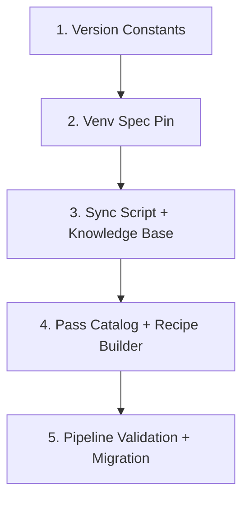
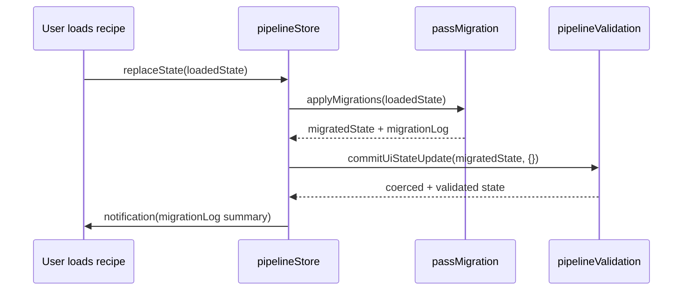

# Design Document: olive-ai 0.13.0 Upgrade

## Overview

This upgrade bumps Olive Studio's target runtime from olive-ai 0.12.1 to 0.13.0 across all layers: TypeScript frontend (pass catalog, recipe builder, validation, issue reporting), Python MCP knowledge base (passes.json, compatibility_matrix.json, hardware_profiles.json, troubleshooting.json), and the venv provisioning layer (pip install pins). The change is a coordinated version sweep with an opt-in migration mapping layer for backward compatibility with existing 0.12.x user recipes.

The upgrade is designed as an incremental, non-breaking rollout: the pip range remains inclusive of 0.12.x, and a new migration-mapping table silently translates deprecated/renamed parameters when loading saved recipes.

## 0.13.0 Release Delta

Source: [GitHub Release v0.13.0](https://github.com/microsoft/Olive/releases/tag/v0.13.0)

### New Passes (require PASS_CATALOG + PASS_BUILDERS entries)

| Pass Name                      | Category | Description                                                                                                                                                           | PR                         |
| ------------------------------ | -------- | --------------------------------------------------------------------------------------------------------------------------------------------------------------------- | -------------------------- |
| `MobiusBuilder`                | onnx     | ONNX export via Mobius; produces loadable ORT GenAI composite packages with caching                                                                                   | #2406, #2447, #2472, #2471 |
| `QairtPipeline`                | qnn      | Single-pass QAIRT LLM pipeline (YAML-recipe-driven model loading, quantization, compilation). Replaces the old multi-step QairtPreparation→QairtGenAIBuilder workflow | #2465                      |
| `KQuant`                       | pytorch  | ggml-style weight-only K-quant quantization (asymmetric/symmetric, 2/4/8-bit)                                                                                         | #2479                      |
| `OnnxKquantQuantization`       | onnx     | K-quant quantization for ONNX models                                                                                                                                  | #2428                      |
| `QuantizeEmbeddingInt8`        | onnx     | Graph surgery for INT8 embedding quantization                                                                                                                         | #2464                      |
| `ShareEmbeddingLmHead`         | onnx     | Graph surgery to share embedding/LM-head weights                                                                                                                      | #2464                      |
| `SimplifiedLayerNormToRMSNorm` | onnx     | Graph surgery converting SimplifiedLayerNorm nodes to RMSNorm                                                                                                         | #2348                      |
| `OnnxDiscrepancyCheck`         | onnx     | Measures numerical discrepancies on a test model to validate conversions/optimizations                                                                                | #2478                      |

### Existing Pass Changes

| Pass                      | Change                                                          | Impact                                                                                                                                                                                                                                                                                                        |
| ------------------------- | --------------------------------------------------------------- | ------------------------------------------------------------------------------------------------------------------------------------------------------------------------------------------------------------------------------------------------------------------------------------------------------------- |
| `Rtn`                     | Now advertises `uint2`/`int2` precisions                        | `quantPrecision` enum in UIState may need expansion (currently `"int4" \| "int8" \| "fp16"`). Recipe builder `buildRtn*` function needs no param change — Olive resolves precision from the existing `bits` parameter — but the UI's precision dropdown should surface 2-bit as an option in a future UI pass |
| `SelectiveMixedPrecision` | Added QKV-aware overrides, AUTO memory mode, MULTI_GPU dispatch | New optional parameters; no breaking change. Existing builder continues to work. New params can be exposed in UI later                                                                                                                                                                                        |

### Deprecations

| Item                                        | Change                        | Studio Impact                                                                                                                                   |
| ------------------------------------------- | ----------------------------- | ----------------------------------------------------------------------------------------------------------------------------------------------- |
| `auto-opt` CLI command                      | Marked deprecated             | Studio does not expose `auto-opt` as a workflow path (confirmed: no references in TS codebase). **No action required.**                         |
| QairtPreparation→QairtGenAIBuilder workflow | Superseded by `QairtPipeline` | Neither old pass exists in Studio's current catalog (confirmed: no references). **No migration entry needed** — just add `QairtPipeline` as new |

### Behavioral / Security Changes

| Change                                         | Description                                                 | Studio Impact                                                                                                                                                                                                                                                                                                                                                                              |
| ---------------------------------------------- | ----------------------------------------------------------- | ------------------------------------------------------------------------------------------------------------------------------------------------------------------------------------------------------------------------------------------------------------------------------------------------------------------------------------------------------------------------------------------ |
| `trust_remote_code` default flipped to `false` | Remote code is no longer executed unless explicitly enabled | **Needs attention.** If Studio's recipe builder relies on HuggingFace models that require custom code (e.g., Phi, Llama-3 with RoPE scaling), recipes may fail at runtime. **Action:** Add `trust_remote_code: true` to `ModelBuilder`/`OnnxConversion` pass configs when `modelSource === "huggingface"` and document the security implication. This is a recipe builder change (task 7). |
| QNN ABI execution provider                     | New EP support added to Olive                               | **Action:** Add entry to `hardware_profiles.json`. No `getProviderConflicts()` change needed unless QNN ABI has pass exclusions (none documented).                                                                                                                                                                                                                                         |

### New Capabilities (Out of Scope for This Upgrade)

These are runtime/evaluation features that don't affect the recipe builder or pass catalog:

- **Speech evaluation metrics** (WER, RTFx) — evaluator-only, no pass or recipe impact
- **Vision evaluation metrics** (exact_match, relaxed_accuracy, word_sort_ratio) — evaluator-only
- **LFM2 hybrid model support** — model-type support, no new pass
- **AMD VitisAI SD1.5 support** — EP support already modeled; no new pass class
- **Whisper recipe integration** — recipe template, not a new pass
- **HY-MT evaluation workflows** — evaluation-only
- **Chat-template hooks for ORT GenAI LM evaluation** — evaluator-only
- **ORTGenAI `--backend` benchmark option** — CLI-only, not recipe
- **`--test` HF CLI path for random models** — development tooling
- **Model package CLI alignment** — CLI-only
- **Faster ORT GenAI evaluation** — internal optimization
- **Vision VQA evaluation alignment** — evaluator-only

These may be addressed in a future "evaluation panel" spec but are not part of the pass catalog / recipe builder upgrade.

## Architecture

The upgrade touches five subsystems that form a linear dependency chain:



Each subsystem is independently testable and has a clear integration contract with its neighbors. The execution order matters because later stages depend on accurate data from earlier stages (e.g., the recipe builder needs the updated pass catalog, which needs the sync script output).

### Layer Boundaries

| Layer             | Files                                        | Responsibility                          |
| ----------------- | -------------------------------------------- | --------------------------------------- |
| Constants         | `passCatalog.ts`, `issueReport.ts`           | Version identity                        |
| Venv              | `src/server/services/venv/spec.ts`           | Pip install range + rebuild trigger     |
| Sync              | `scripts/sync-pass-catalog.mjs`              | Extract passes from live 0.13.0 install |
| Knowledge Base    | `olive-mcp-server/.../knowledge_base/*.json` | MCP tool truth source                   |
| Pass Catalog (TS) | `src/lib/passCatalog.ts`                     | UI-facing pass enumeration              |
| Recipe Builder    | `src/lib/oliveRecipeBuilder.ts`              | Recipe JSON emission                    |
| Validation        | `src/lib/pipelineValidation.ts`              | Cross-pass rules + coercion             |
| Migration         | New: `src/lib/passMigration.ts`              | Backward-compat parameter mapping       |

## Components and Interfaces

### 1. Version Constant Updates

**Scope:** Find-replace `"0.12.1"` with `"0.13.0"` in version-identity positions.

**Files:**

- `src/lib/passCatalog.ts` — `OLIVE_VERSION` constant and header comment URL
- `src/lib/issueReport.ts` — `collectOliveVersion()` return string
- `scripts/sync-pass-catalog.mjs` — header comment (if version-referencing)
- `olive-mcp-server/olive_mcp_server/knowledge_base/passes.json` — `olive_version` field
- `olive-mcp-server/olive_mcp_server/knowledge_base/compatibility_matrix.json` — `olive_version_support.max`
- All documentation URLs containing `/Olive/0.12.1/` path segments

**Approach:**

1. Update `OLIVE_VERSION` in `passCatalog.ts` from `"0.12.1"` to `"0.13.0"`
2. Update the module header comment URL to `https://microsoft.github.io/Olive/0.13.0/reference/pass.html`
3. Update `collectOliveVersion()` in `issueReport.ts` to return `"ORT pinned: 1.26.0 | Olive: 0.13.0"`
4. For documentation URLs: attempt HTTP HEAD on the 0.13.0 variant; if 2xx, replace; if not, retain 0.12.1 URL with a `// TODO: 0.13.0 link not yet live` comment

**Verification:** `grep -r "0.12.1" src/ olive-mcp-server/` should return zero hits after completion (excluding git history).

### 2. Venv Spec Pin Update

**File:** `src/server/services/venv/spec.ts`

**Current state:**

```typescript
export const VENV_SPEC_VERSION = 4;
export const PINNED_OLIVE_AI_INSTALL = "olive-ai>=0.9.0,<1";
```

**Target state:**

```typescript
export const VENV_SPEC_VERSION = 5;
export const PINNED_OLIVE_AI_INSTALL = "olive-ai>=0.12.0,<1";
```

**Design decisions:**

- The pip range narrows the lower bound from `>=0.9.0` to `>=0.12.0` — this drops support for olive-ai versions older than 0.12.0 which are no longer validated. The upper bound `<1` prevents accidental major-version drift.
- `VENV_SPEC_VERSION` bumps from 4 to 5, which triggers isolated venv rebuilds for all families the next time `getFamilySpec()` detects a manifest mismatch.
- The `requests` package remains in the same install argument list (`OLIVE_INSTALL_ARGS`), preserving its existing unconstrained version.
- Requirement 9.3 is satisfied: olive-ai 0.12.x is still within `>=0.12.0,<1`.

### 3. Sync Script Enhancement

**File:** `scripts/sync-pass-catalog.mjs`

**Current behavior:** Extracts passes from whatever olive-ai is installed in `.venv`. No version guard.

**Required enhancements:**

1. **Version check before extraction:**

   ```javascript
   // New: verify installed olive-ai version before proceeding
   const versionRaw = await runPython(["-c", "import olive; print(olive.__version__)"]);
   if (!versionRaw.startsWith("0.13")) {
     console.error(`❌ Expected olive-ai 0.13.x but found ${versionRaw}. Install 0.13.0 first.`);
     process.exit(1);
   }
   ```

2. **Metadata fields in output:**
   The script already writes `_generated` and `_source` metadata. Add:

   ```javascript
   const metadata = {
     _generated: new Date().toISOString(),
     _source: "olive-ai CLI pass registry",
     _passCount: Object.keys(merged).length,
     olive_version: "0.13.0",        // NEW
     version: "0.13.0",              // NEW — used by schemaEngine
     last_updated: new Date().toISOString().slice(0, 10),  // NEW
   };
   ```

3. **Header comment update:** Reference `0.13.0` as the target version.

**Exit code contract:** Non-zero exit + diagnostic message when:

- `.venv/` python not found (existing)
- Olive import fails (existing — falls through to error)
- Installed olive version is not 0.13.x (new)

### 4. Pass Catalog (TypeScript) Synchronization

**File:** `src/lib/passCatalog.ts`

**Process:**

1. Run `node scripts/sync-pass-catalog.mjs` against a 0.13.0 venv
2. Use the resulting `passes.json` as the authoritative source
3. For each pass in `passes.json`:
   - If it exists in `PASS_CATALOG` array: verify name, category, inputs, outputs match; update if changed
   - If it's new: add a `PassCatalogEntry` with all required fields
   - If a current catalog entry is absent from `passes.json`: remove it
4. Ensure `PASS_CATALOG.length === passes.json._passCount`

**Interface contract with schemaEngine:**

- `schemaEngine.ts` imports `OLIVE_VERSION` and `getPassCatalogEntry()` from `passCatalog.ts`
- It also directly imports `passes.json` for parameter schemas
- Both must reference the same set of pass names — the sync script is the single source of truth

### 5. Recipe Builder Updates

**File:** `src/lib/oliveRecipeBuilder.ts`

**Update protocol for 0.13.0 parameter changes:**

| Change Type                         | Action                                                                     |
| ----------------------------------- | -------------------------------------------------------------------------- |
| New required param on existing pass | Add to the corresponding `build*` function with Olive's documented default |
| Removed param                       | Delete from `build*` function output                                       |
| Renamed param                       | Emit new name; add migration entry (see section 6)                         |
| New pass class                      | Add `PASS_BUILDERS` entry + insert in `preferredPassOrder()`               |
| Changed enum values                 | Update the emitted literal; add coercion in `commitUiStateUpdate` path     |

**New pass integration checklist:**

1. Create a `build<PassName>` function returning `PassSpec`
2. Add entry to `PASS_BUILDERS` (or `QUANT_METHOD_BUILDERS` for quant methods)
3. Insert the pass key at the correct position in both branches of `preferredPassOrder()`
4. Add corresponding `UIState["passes"]` fields if the pass has user-configurable options
5. Add a `CROSS_PASS_RULES` entry if the pass has incompatibilities

**Concrete 0.13.0 new pass builder requirements:**

| New Pass                       | Builder Approach                                                  | UIState Fields                                      | Notes                                     |
| ------------------------------ | ----------------------------------------------------------------- | --------------------------------------------------- | ----------------------------------------- |
| `MobiusBuilder`                | `buildMobiusBuilder()` — emit model_name, cache config            | Likely needs `passes.mobiusBuilder: boolean` toggle | Produces ORT GenAI composite packages     |
| `QairtPipeline`                | `buildQairtPipeline()` — emit YAML recipe path, quant config      | `passes.qairtPipeline: boolean` + recipe path       | Replaces multi-step QNN workflow          |
| `KQuant`                       | Add to `QUANT_METHOD_BUILDERS` under key `"kquant"`               | Add `"kquant"` to `quantMethod` union               | ggml-style; supports 2/4/8-bit            |
| `OnnxKquantQuantization`       | Add to `QUANT_METHOD_BUILDERS` as ONNX variant of kquant          | Same `"kquant"` method key, ONNX input branch       | Dispatched based on input model format    |
| `QuantizeEmbeddingInt8`        | `buildQuantizeEmbeddingInt8()` — graph surgery, minimal config    | `passes.quantizeEmbeddingInt8: boolean`             | Pairs with ShareEmbeddingLmHead           |
| `ShareEmbeddingLmHead`         | `buildShareEmbeddingLmHead()` — graph surgery, minimal config     | `passes.shareEmbeddingLmHead: boolean`              | Often combined with QuantizeEmbeddingInt8 |
| `SimplifiedLayerNormToRMSNorm` | `buildSimplifiedLayerNormToRMSNorm()` — graph surgery             | `passes.simplifiedLayerNormToRMSNorm: boolean`      | QNN-targeted surgery                      |
| `OnnxDiscrepancyCheck`         | `buildOnnxDiscrepancyCheck()` — validation pass, not optimization | `passes.onnxDiscrepancyCheck: boolean`              | Emits metrics, doesn't modify model       |

**`trust_remote_code` default change (0.13.0 security fix):**

Olive 0.13.0 disables `trust_remote_code` by default. For HuggingFace model sources that require custom code (e.g., Phi, Mistral with custom RoPE), recipes will fail at runtime unless `trust_remote_code: true` is explicitly set.

**Action in recipe builder:**

- When `modelSource === "huggingface"` (the common case in Studio), emit `trust_remote_code: true` in the model config section of the recipe JSON.
- Add a `UIState.passes.trustRemoteCode` boolean (default `true`, togglable in Advanced settings) so security-conscious users can opt out.
- Add a pipeline validation advisory (severity: `info`) when `trustRemoteCode` is `false` explaining that some HuggingFace models will fail without it.

### 6. Migration Mapping Architecture (Backward Compatibility)

**New file:** `src/lib/passMigration.ts`

This module provides a declarative mapping table for translating deprecated/removed/renamed parameters and pass names when loading recipes created against olive-ai 0.12.x.

```typescript
export interface ParamMigration {
  /** The pass type this migration applies to */
  passType: string;
  /** Old parameter name (0.12.x) */
  oldParam: string;
  /** New parameter name (0.13.0), or null if removed */
  newParam: string | null;
  /** Optional value transform (e.g., enum value mapping) */
  transformValue?: (oldValue: unknown) => unknown;
  /** Olive version that introduced this change */
  since: string;
}

export interface PassNameMigration {
  oldName: string;
  newName: string | null; // null = pass was removed
  since: string;
}

export const PARAM_MIGRATIONS: readonly ParamMigration[] = [
  // 0.13.0: No parameter renames confirmed in the release notes.
  // The SelectiveMixedPrecision pass gained new *optional* params (qkv_overrides,
  // memory_mode, multi_gpu_dispatch) but no existing params were renamed or removed.
  // If future investigation of the 0.13.0 source reveals renames, add them here.
];

export const PASS_NAME_MIGRATIONS: readonly PassNameMigration[] = [
  // 0.13.0: MobiusModelBuilder was renamed to MobiusBuilder during development
  // (PR #2406 → #2447). Defensive entry for externally-created recipes:
  {
    oldName: "MobiusModelBuilder",
    newName: "MobiusBuilder",
    since: "0.13.0",
  },
  // QairtPreparation and QairtGenAIBuilder are superseded by QairtPipeline.
  // Neither exists in Studio's 0.12.x catalog, but handles externally-imported recipes.
  {
    oldName: "QairtPreparation",
    newName: null, // removed — user should switch to QairtPipeline
    since: "0.13.0",
  },
  {
    oldName: "QairtGenAIBuilder",
    newName: null, // removed — superseded by QairtPipeline
    since: "0.13.0",
  },
];
```

**Integration with recipe loading:**

The `pipelineStore.ts` `replaceState()` path is used when loading a saved recipe. The migration layer hooks into this path:



**Key functions:**

```typescript
export interface MigrationResult {
  state: UIState;
  migratedParams: number;
  discardedParams: number;
  renamedPasses: string[];
  removedPasses: string[];
}

/** Apply all applicable migrations to a loaded recipe state. */
export function applyMigrations(state: UIState): MigrationResult;
```

**Behavioral guarantees (Requirement 9):**

- Known rename: old param name replaced with new name, value preserved
- Unknown removed param: discarded, warning-severity issue emitted by pipeline validator
- Removed pass: excluded from built recipe, warning-severity issue emitted
- All other passes preserved in declared order
- Summary notification displayed within 2s of load completion

### 7. Pipeline Validation Updates

**File:** `src/lib/pipelineValidation.ts`

**If 0.13.0 introduces new incompatibilities:**

- Add entries to `CROSS_PASS_RULES[]` with full schema:

  ```typescript
  {
    id: string,           // unique kebab-case identifier
    applies: (passes, provider) => boolean,
    fix: Partial<UIState["passes"]>,
    autoCoerce: boolean,
    severity: IssueSeverity,
    title: string,
    description: string,
    affectedTabs: string[],
    affectedPasses: string[],
    actionLabel: string,
  }
  ```

- If `autoCoerce: true`, the rule is automatically applied in `coercePassFields()` on every `commitUiStateUpdate()` call.

**If 0.13.0 changes hardware requirements:**

- Update `getProviderConflicts()` with new/modified `HardwareConflict` entries.

**If no compatibility rules change:** Zero diff to validation module (Req 6.4).

**Migration-specific validation:**

- A new rule category for "removed pass in loaded recipe" — severity `warning`, no autoCoerce (the migration layer handles removal, validation just surfaces the notification).

### 8. Knowledge Base Refresh

**Directory:** `olive-mcp-server/olive_mcp_server/knowledge_base/`

| File                        | Update Scope                                                                                              |
| --------------------------- | --------------------------------------------------------------------------------------------------------- |
| `passes.json`               | Authoritative output of sync script; `olive_version: "0.13.0"`. Add 8 new passes (see Release Delta)      |
| `compatibility_matrix.json` | `olive_version_support.max: "0.13.0"`, version bump to `"0.4.0"`, evidence URLs updated, new pass entries |
| `hardware_profiles.json`    | Add QNN ABI EP entry; update QNN profile to reference `QairtPipeline`                                     |
| `troubleshooting.json`      | Add entry for `trust_remote_code` default change; add `olive_versions` field to affected entries          |

**Concrete pass additions for `passes.json`:**

The following 8 passes must be added with full schema (name, type, class path, inputs, outputs, parameters):

1. `MobiusBuilder` — inputs: PyTorchModelHandler, outputs: ONNXModelHandler
2. `QairtPipeline` — inputs: PyTorchModelHandler, outputs: QNNModelHandler
3. `KQuant` — inputs: PyTorchModelHandler, outputs: PyTorchModelHandler
4. `OnnxKquantQuantization` — inputs: ONNXModelHandler, outputs: ONNXModelHandler
5. `QuantizeEmbeddingInt8` — inputs: ONNXModelHandler, outputs: ONNXModelHandler
6. `ShareEmbeddingLmHead` — inputs: ONNXModelHandler, outputs: ONNXModelHandler
7. `SimplifiedLayerNormToRMSNorm` — inputs: ONNXModelHandler, outputs: ONNXModelHandler
8. `OnnxDiscrepancyCheck` — inputs: ONNXModelHandler, outputs: ONNXModelHandler (validation pass; model passes through unchanged)

**Hardware profiles update for `hardware_profiles.json`:**

- Add `QnnAbiExecutionProvider` entry with applicable passes (QairtPipeline, QNN-targeted surgeries)
- Update existing `QNNExecutionProvider` profile to list `QairtPipeline` as a recommended pass
- Add `KQuant` to CPU and CUDA profiles (same as Rtn — PyTorch quantization)

**Troubleshooting additions:**

- New entry: "HuggingFace model fails to load after upgrading to 0.13.0" → cause: `trust_remote_code` default changed to `false` → fix: add `trust_remote_code: true` to model config
- New entry: "QairtPreparation/QairtGenAIBuilder not found" → cause: superseded by QairtPipeline in 0.13.0 → fix: replace with single QairtPipeline pass

**Compatibility matrix update protocol:**

1. Bump `version` from `"0.3.3"` to `"0.4.0"` (minor bump per Req 4.7)
2. Set `olive_version_support.max` to `"0.13.0"`
3. Keep `olive_version_support.min` at `"0.12.0"`
4. For each evidence URL containing `/0.12.1/`: test HEAD on `/0.13.0/` variant, update if 2xx
5. For new passes: add compatibility entries under each applicable hardware profile
6. For removed/renamed passes: set `support: "unsupported"` with explanatory note
7. Set `last_updated` to the ISO 8601 date of the change

## Data Models

### ParamMigration Entry

```typescript
{
  passType: string;        // e.g., "OnnxQuantization"
  oldParam: string;        // e.g., "per_channel" (0.12.x name)
  newParam: string | null; // e.g., "quantize_per_channel" or null if removed
  transformValue?: (v: unknown) => unknown;
  since: "0.13.0";
}
```

### PassNameMigration Entry

```typescript
{
  oldName: string;      // e.g., "DeprecatedPassName"
  newName: string|null; // e.g., "NewPassName" or null if removed entirely
  since: "0.13.0";
}
```

### MigrationResult

```typescript
{
  state: UIState;          // The migrated state object
  migratedParams: number;  // Count of parameters that were renamed
  discardedParams: number; // Count of parameters that were removed (no mapping)
  renamedPasses: string[]; // Pass names that were renamed (old names)
  removedPasses: string[]; // Pass names that were removed
}
```

### VenvSpec Changes

| Field                     | Before                 | After                   |
| ------------------------- | ---------------------- | ----------------------- |
| `VENV_SPEC_VERSION`       | `4`                    | `5`                     |
| `PINNED_OLIVE_AI_INSTALL` | `"olive-ai>=0.9.0,<1"` | `"olive-ai>=0.12.0,<1"` |

## Error Handling

### Version Mismatch in Sync Script

- If olive-ai is not installed: exit 1, message "Project .venv not found"
- If olive-ai version is not 0.13.x: exit 1, message identifying expected vs actual version
- If pass extraction fails after version check passes: exit 1, refuse to overwrite passes.json

### Migration Failures

- If a migration `transformValue` throws: catch, log warning, discard the parameter (treat as removed)
- If a pass name migration targets a pass not in the loaded recipe: no-op (migration is declarative)
- All migration failures are non-fatal — the recipe loads with whatever survived migration

### Documentation URL Validation

- HTTP GET/HEAD to 0.13.0 URLs: if non-2xx or network error, retain 0.12.1 URL
- Add `// TODO: update when 0.13.0 docs are published` comment for retained URLs
- This prevents broken links in the codebase

### Recipe Loading with Removed Passes

- Removed passes are silently excluded from the built recipe
- Pipeline validation emits a warning-severity `PipelineIssue` with:
  - `id: "removed-pass-<passName>"`
  - `severity: "warning"` (not "critical" — existing passes still work)
  - `description: "<passName> was removed in olive-ai 0.13.0 and has been excluded from this recipe"`

## Correctness Properties

*A property is a characteristic or behavior that should hold true across all valid executions of a system — essentially, a formal statement about what the system should do. Properties serve as the bridge between human-readable specifications and machine-verifiable correctness guarantees.*

### Property 1: Migration produces valid UIState

*For any* valid UIState that was generated targeting olive-ai 0.12.x (all passes are valid PassCatalogEntry names from either 0.12.x or 0.13.0, all parameter values are of correct type), `applyMigrations(state)` SHALL return a MigrationResult whose `state` field is a valid UIState where every pass name exists in the 0.13.0 PASS_CATALOG and every parameter conforms to its current schema.

**Validates: Requirements 9.1**

### Property 2: Migration idempotence

*For any* UIState, applying `applyMigrations` twice produces the same result as applying it once: `applyMigrations(applyMigrations(state).state).state` is deeply equal to `applyMigrations(state).state`, and the second application reports zero migrated params and zero discarded params.

**Validates: Requirements 9.4, 9.5**

### Property 3: Renamed parameter value preservation

*For any* UIState containing a pass with a parameter that has a known `ParamMigration` entry mapping `oldParam` to `newParam`, `applyMigrations(state)` SHALL produce a state where the pass config contains `newParam` with the same value that `oldParam` held, and `oldParam` is absent.

**Validates: Requirements 9.4**

### Property 4: Removed pass exclusion and counting

*For any* UIState containing one or more passes whose names appear in `PASS_NAME_MIGRATIONS` with `newName: null`, `applyMigrations(state)` SHALL produce a MigrationResult where: (a) `removedPasses` contains exactly those pass names, (b) the output `state` does not include those passes, and (c) all other passes remain in their original declared order.

**Validates: Requirements 9.2**

### Property 5: Recipe schema validity after full pipeline

*For any* valid UIState where all passes exist in the 0.13.0 PASS_CATALOG, `buildOliveRecipe(commitUiStateUpdate(state, {}))` SHALL produce a recipe object that passes `pnpm validate:recipe` structural checks — specifically: every pass in the output has a `type` string matching a known pass name, a `config` object, and no parameters absent from the pass's schema.

**Validates: Requirements 5.6**

## Testing Strategy

### Property-Based Tests (fast-check)

The migration mapping logic is the primary candidate for PBT. Use `fast-check` (already available via vitest ecosystem) with minimum 100 iterations per property.

**Library:** `fast-check` (TypeScript PBT library)
**Config:** Each property test runs minimum 100 iterations

**Implementation approach:**

- Define `Arbitrary<UIState>` generators that produce valid UIState objects with varying pass configurations, parameter sets, and model sources
- Define `Arbitrary<ParamMigration[]>` generators for migration table variations
- Each property test references its design document property via tag comment

**Tag format:** `// Feature: olive-013-upgrade, Property {N}: {property_text}`

| Property                            | Test File                            | Generator Strategy                                                             |
| ----------------------------------- | ------------------------------------ | ------------------------------------------------------------------------------ |
| 1: Migration produces valid UIState | `src/lib/passMigration.test.ts`      | Generate UIState with random passes from 0.12.x catalog                        |
| 2: Migration idempotence            | `src/lib/passMigration.test.ts`      | Same as Property 1                                                             |
| 3: Renamed param preservation       | `src/lib/passMigration.test.ts`      | Generate UIState containing passes with old param names from PARAM_MIGRATIONS  |
| 4: Removed pass exclusion           | `src/lib/passMigration.test.ts`      | Generate UIState containing passes from PASS_NAME_MIGRATIONS with newName:null |
| 5: Recipe schema validity           | `src/lib/oliveRecipeBuilder.test.ts` | Generate valid UIState with random pass combinations from 0.13.0 catalog       |

### Unit Tests (existing frameworks)

**Pass catalog consistency:**

- Assert `PASS_CATALOG.length` matches `passes.json` entry count
- Assert every `PASS_CATALOG` entry has non-empty name, category, description, inputs, outputs
- Assert `OLIVE_VERSION === "0.13.0"`

**Venv spec:**

- Assert `VENV_SPEC_VERSION === 5`
- Assert `PINNED_OLIVE_AI_INSTALL` satisfies PEP 440 parse and includes `0.13.0`
- Assert `PINNED_OLIVE_AI_INSTALL` excludes `1.0.0`
- Assert `OLIVE_INSTALL_ARGS` includes `"requests"`

**Issue report:**

- Assert `collectOliveVersion()` contains `"Olive: 0.13.0"`

**Migration mapping:**

- For each `PARAM_MIGRATIONS` entry: assert `applyMigrations()` renames the param correctly
- For each `PASS_NAME_MIGRATIONS` entry: assert removed passes are excluded, renamed passes updated
- Assert `MigrationResult` counts are accurate
- Assert unknown parameters (no mapping) are discarded with correct count

**Recipe builder:**

- `pnpm validate:recipe` passes for all supported pipeline configurations
- Regression: existing test fixtures continue to produce valid recipes

**Pipeline validation:**

- New `CROSS_PASS_RULES` entries (if any) have test cases asserting `applies` trigger and `fix` correctness
- Removed-pass warning is surfaced correctly for loaded recipes containing deprecated passes

### Integration Tests

- Load a recipe fixture targeting 0.12.1 with renamed params → verify migration produces valid state
- Load a recipe fixture with a removed pass → verify warning issue is surfaced, pass excluded
- `pnpm validate:recipe` after full catalog update

### Smoke Tests

- `grep -r "0.12.1" src/ olive-mcp-server/ scripts/` returns zero matches
- `node scripts/sync-pass-catalog.mjs` exits 0 against a 0.13.0 venv
- `pnpm lint:quick` passes after all changes

## Recommended Execution Order

The upgrade should be applied in this order to maintain a testable, bisectable commit history:

1. **Version constants** (Req 1, 8) — Update `OLIVE_VERSION`, `collectOliveVersion()`, doc URLs, comments. Zero behavioral change. Fast to verify with grep.

2. **Venv spec pin** (Req 2) — Bump `VENV_SPEC_VERSION` to 5, update `PINNED_OLIVE_AI_INSTALL`. Testable in isolation.

3. **Sync script enhancement** (Req 3.7) — Add version guard. Testable by running against a non-0.13.x venv (should fail) and a 0.13.x venv (should succeed).

4. **Knowledge base refresh** (Req 7, 4) — Run sync script against 0.13.0, update `passes.json`, `compatibility_matrix.json`, `hardware_profiles.json`, `troubleshooting.json`. Testable via pytest + schema checks.

5. **Pass catalog synchronization** (Req 3) — Update `PASS_CATALOG` array to match `passes.json`. Testable with `pnpm test`.

6. **Recipe builder updates** (Req 5) — Add/modify `PASS_BUILDERS` and `QUANT_METHOD_BUILDERS` for 0.13.0 parameter changes. Testable with `pnpm validate:recipe`.

7. **Pipeline validation rules** (Req 6) — Add/remove/update `CROSS_PASS_RULES` and `getProviderConflicts()` entries. Testable with `pnpm test`.

8. **Migration mapping** (Req 9) — Implement `passMigration.ts`, integrate with `pipelineStore.ts` `replaceState()` path. Testable with dedicated unit tests + integration recipe-load fixtures.

Each step produces a standalone, testable commit. Steps 1-3 can be merged as a single "prep" PR. Steps 4-8 form the "substance" PR(s).
