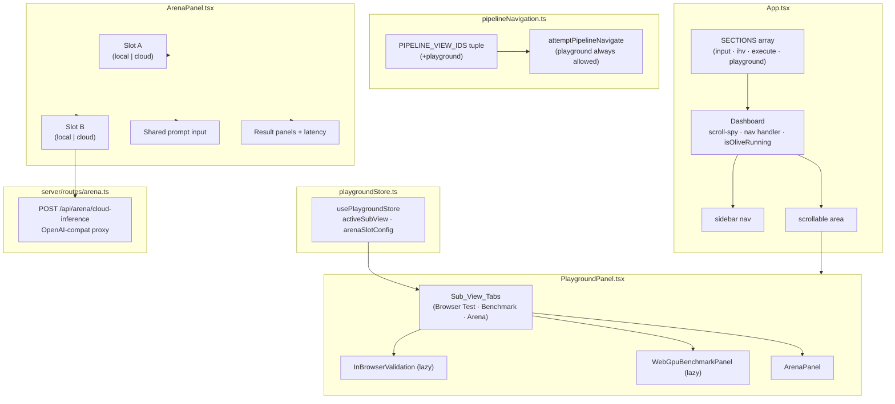
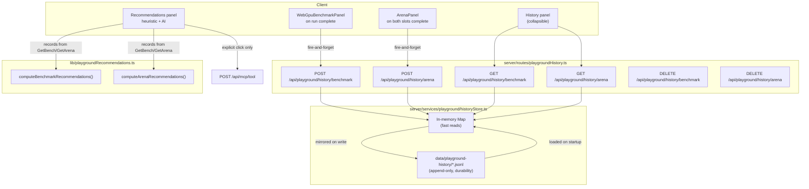

# Design Document: Playground Tab

## Overview

The Playground tab adds a fourth top-level navigation entry to the Olive Studio left sidebar. It promotes the in-browser ONNX inference validator (`InBrowserValidation`) and WebGPU benchmark panel (`WebGpuBenchmarkPanel`) out of the `ExecutionWorkspace` "More" dropdown and introduces a new Arena sub-view for side-by-side model comparison. Because these tools are model-agnostic and exploratory in nature — they don't participate in the Olive optimization pipeline — they belong in their own dedicated section rather than being hidden inside the Recipe & Run workspace.

The change is additive for the navigation system and the store layer, and surgical for `ExecutionWorkspace`: two menu items and their render branches are removed, two lazy imports move to the new Playground component.

---

## Architecture



### Key architectural decisions

**Navigation gating**: The existing `attemptPipelineNavigate` blocks `"input"` and `"ihv"` during a run. `"playground"` must be explicitly excluded from this guard — Playground tools are independent of the pipeline execution state. The simplest correct implementation is to change the condition from `id !== "execute"` to `id !== "execute" && id !== "playground"`.

**Separate Zustand store**: Playground state (active sub-view, Arena slot config) lives in `playgroundStore.ts`, not `pipelineStore.ts`.

The original rationale — "avoids unnecessary re-renders of unrelated components" — does not hold and should not be cited. `pipelineStore` is consumed via selector subscriptions, so a component that does not select `activeSubView` does not re-render when it changes. Zustand already solves that problem regardless of which store the field lives in.

The actual reasons the split is worth keeping:

1. **Lifetime mismatch.** `pipelineStore` is the serializable description of an optimization run: it is read by `buildRecipeFromState`, and its shape is effectively a persistence contract. Playground state is Session_Scoped (Requirement 2.7) and holds a `File` handle, which is *not* serializable. Putting a `File` inside `pipelineStore` would mean every future consumer that persists, clones, or round-trips pipeline state has to remember to exclude it. The type system would not catch that mistake.
2. **Direction of dependency.** Playground reads `pipelineStore` (for `hfModelId`, active passes) and never writes to it. Keeping them separate makes that one-way relationship structural rather than conventional.

**When to merge them instead:** if Playground ever needs to *write* pipeline state — e.g. "use this Arena winner as the pipeline's input model" — the one-way dependency is gone and the split stops paying for itself. At that point, fold Playground state into `pipelineStore` behind a `playground:` key namespace rather than maintaining cross-store writes, which are the harder thing to reason about.

**No `persist` middleware.** `playgroundStore` is created with a bare `create()`, deliberately. Adding Zustand's `persist` would serialize `slotA.file`/`slotB.file` to `{}` and silently rehydrate slots that look configured but hold no model. If sub-view selection is ever worth persisting across reloads, persist *only* `activeSubView` via a `partialize` allowlist — never the whole store.

**Arena execution model**: The Arena needs two distinct execution paths, chosen at run-time based on slot types:

- Both local → sequential (`await slotA`, then `await slotB`) — avoids GPU/CPU contention
- Mixed (one local, one cloud) → concurrent (`Promise.all([localRun, cloudFetch])`) — minimizes wall-clock comparison time

**Cloud inference proxy**: A new Express route `POST /api/arena/cloud-inference` forwards requests to arbitrary OpenAI-compatible endpoints. This avoids browser-side CORS issues when the target API doesn't include the correct headers. The API key is passed in the request body (not stored server-side) and forwarded verbatim in the `Authorization` header. It is never logged.

**Shared timeout constant**: The 30-second cloud timeout is a product decision surfaced in Requirement 7.5, so it lives in one place rather than as a default parameter buried in the route signature:

```ts
// src/lib/arenaConstants.ts
/** Default wall-clock budget for a single Arena cloud inference request. */
export const ARENA_CLOUD_TIMEOUT_MS = 30_000;

/** Server-side clamp bounds for a client-supplied `timeoutMs`. */
export const ARENA_CLOUD_TIMEOUT_MIN_MS = 1_000;
export const ARENA_CLOUD_TIMEOUT_MAX_MS = 120_000;

/** Normalizes an untrusted `timeoutMs` from a request body into the valid range. */
export function resolveCloudTimeoutMs(raw: unknown): number {
  if (typeof raw !== "number" || !Number.isFinite(raw)) return ARENA_CLOUD_TIMEOUT_MS;
  return Math.min(Math.max(raw, ARENA_CLOUD_TIMEOUT_MIN_MS), ARENA_CLOUD_TIMEOUT_MAX_MS);
}
```

`ArenaPanel` imports `ARENA_CLOUD_TIMEOUT_MS` and sends it explicitly in the request body; the route imports `resolveCloudTimeoutMs` and applies it to `req.body.timeoutMs`. The current route's `const { timeoutMs = 30_000 } = req.body` is replaced — a bare destructuring default both duplicates the literal and accepts `timeoutMs: 0` (which aborts instantly) and `timeoutMs: 1e9` (which never aborts) without complaint.

The client sends the value rather than relying on the server default so that the timeout the user is promised in the UI ("30s") and the timeout actually enforced are the same number by construction.

---

### `File` and blob lifecycle

`File` objects enter the Playground from drop-zones and `<input type="file">` and are held in `playgroundStore` (`slotA.file`, `slotB.file`) and in `InBrowserValidation` / `WebGpuBenchmarkPanel` local state.

**Lifetime.** Session-scoped, matching Requirement 2.7. A `File` is a live handle to an on-disk blob; it is not serializable and is not persisted anywhere. Reload clears it.

**Reading.** Model bytes are read with `await file.arrayBuffer()` at run time and handed to `InferenceSession.create` — the existing `InBrowserValidation` path. The Arena reuses it verbatim. No `URL.createObjectURL` is needed for inference, and none is created.

> If a future change does introduce `URL.createObjectURL` for a file (e.g. a download link for a baseline), the URL must be revoked in the same effect's cleanup or immediately after use. An un-revoked object URL pins the entire blob for the document's lifetime — for a multi-GB ONNX file that is a real leak, not a nit. Requirement 2.8 covers this.

**Replacement and clearing.** Assigning a new `File` into a slot drops the previous reference; clearing sets it to `null`. In both cases the old blob becomes collectable once no `ArrayBuffer` read from it is still in scope. `arrayBuffer()` produces a *copy*, so a long-lived `Uint8Array` from a previous run would keep that copy alive independently — run buffers are therefore kept function-local and never stored in state.

**Why the `File` lives in the store at all.** Slot configuration must survive a sub-view switch, and the store is what makes that survival explicit rather than an accident of keep-alive rendering. The cost is that `playgroundStore` holds a non-serializable value — which is precisely why it must stay out of `pipelineStore` and out of `persist` (see "Separate Zustand store" above).

**Keep-alive rendering**: Sub-views the user has opened stay mounted for the session; inactive ones are hidden with CSS (`hidden`), not unmounted. This follows the `visitedViews` pattern already used in `ExecutionWorkspace`.

The ONNX *session* is not the reason. Sessions are local to `runInference` in `InBrowserValidation` and are recreated per run anyway — losing one costs nothing. The reason is the surrounding state, which is genuinely unrecoverable:

| State | Recoverable after unmount? |
| --- | --- |
| `selectedFile: File` | **No** — a `File` from a drop-zone or `<input type="file">` cannot be re-created programmatically. The user must re-select the file from disk. |
| `metrics`, `logOutput`, `sessionInfo` | **No** — these are the results of a run the user already paid for (seconds to minutes of compute). |
| An in-flight benchmark | **No** — unmounting orphans the loop; its `setState` calls land on a dead component. |
| ONNX `InferenceSession` | Yes — recreated per run. Irrelevant to this decision. |

So the rule is: **unmounting a Playground sub-view discards user work, not just a cache.** Tab-switching is a cheap, frequent action, and a cheap action must not destroy expensive state.

**Why not lazy + unmount + Suspense?** `lazy`/`Suspense` and keep-alive solve different problems and are both used here. `lazy` keeps `onnxruntime-web` out of the initial bundle — it affects when the *module* loads, once. Keep-alive affects whether the *component instance* survives a tab switch. Rendering hidden costs one detached subtree per opened sub-view (three maximum), which is negligible next to re-selecting a model file.

**Cost accepted:** hidden sub-views still hold their `File` references and any in-flight work for the session. That is the intended trade — bounded at three sub-views, released on reload (Requirement 2.7).

---

## Components and Interfaces

### `pipelineNavigation.ts` — changes

```ts
export const PIPELINE_VIEW_IDS = ["input", "ihv", "execute", "playground"] as const;

// Updated guard — playground is always navigable
export function attemptPipelineNavigate(id: PipelineViewId): boolean {
  if (olivePipelineRunning && id !== "execute" && id !== "playground") {
    announcePipelineNavBlocked(id);
    return false;
  }
  return true;
}
```

### `App.tsx` — changes

SECTIONS gets a fourth entry:

```ts
{
  id: "playground",
  step: "04",
  label: "Playground",
  desc: "In-browser inference, WebGPU benchmarks, and model Arena.",
  icon: FlaskConical,   // Lucide icon
}
```

The `isOliveRunning` disabled condition on nav buttons changes from:

```ts
disabled={isOliveRunning && id !== "execute"}
```

to:

```ts
disabled={isOliveRunning && id !== "execute" && id !== "playground"}
```

The navigation event handler `onNavigate` removes its manual allowlist guard — `isPipelineViewId` already validates the detail, so the handler simply calls `scrollToSection(detail)` for any valid ID.

The `"playground"` section renders `<PlaygroundPanel />` wrapped in `<ErrorBoundary label="Playground">`.

### `src/lib/stores/playgroundStore.ts` — new file

```ts
import { create } from "zustand";

export type PlaygroundSubView = "browser-test" | "benchmark" | "arena";

export interface ArenaSlotConfig {
  type: "local" | "cloud";
  // local
  file: File | null;
  // cloud
  endpointUrl: string;
  apiKey: string;
  modelId: string;
}

const defaultSlot = (): ArenaSlotConfig => ({
  type: "local",
  file: null,
  endpointUrl: "",
  apiKey: "",
  modelId: "",
});

interface PlaygroundStore {
  activeSubView: PlaygroundSubView;
  setActiveSubView: (v: PlaygroundSubView) => void;
  slotA: ArenaSlotConfig;
  slotB: ArenaSlotConfig;
  setSlotA: (patch: Partial<ArenaSlotConfig>) => void;
  setSlotB: (patch: Partial<ArenaSlotConfig>) => void;
}

export const usePlaygroundStore = create<PlaygroundStore>((set) => ({
  activeSubView: "browser-test",
  setActiveSubView: (v) => set({ activeSubView: v }),
  slotA: defaultSlot(),
  slotB: defaultSlot(),
  setSlotA: (patch) => set((s) => ({ slotA: { ...s.slotA, ...patch } })),
  setSlotB: (patch) => set((s) => ({ slotB: { ...s.slotB, ...patch } })),
}));
```

Note: `file` (a `File` object) is kept in the Zustand store for convenience but is only meaningful within a session — it is not serializable and does not need persistence across reloads.

### `src/components/features/PlaygroundPanel.tsx` — new file

Top-level Playground section content. Responsibilities:

- Renders Sub_View_Tabs using the same pill/button-group pattern as the `graph/json` toggle in `ExecutionWorkspace`
- Uses a `visitedSubViews` Set (local state) to keep-alive sub-views that have been opened, hiding them with `hidden` instead of unmounting
- Lazy-loads `InBrowserValidation` and `WebGpuBenchmarkPanel` with `Suspense` + spinner fallback
- Wraps each sub-view in `<ErrorBoundary label="..." />`
- Reads/writes `activeSubView` from `usePlaygroundStore`

```ts
interface PlaygroundPanelProps {
  // no required props — reads pipeline recipe from pipelineStore if needed
}

// Sub-view tab definitions
const SUB_VIEWS: { id: PlaygroundSubView; label: string; icon: LucideIcon }[] = [
  { id: "browser-test", label: "Browser Test", icon: Globe },
  { id: "benchmark",    label: "Benchmark",    icon: Gauge },
  { id: "arena",        label: "Arena",         icon: SwordCrossed }, // or Swords
];
```

Lazy imports (live only in this file, removed from ExecutionWorkspace):

```ts
const InBrowserValidation = lazy(() =>
  import("./InBrowserValidation").then((m) => ({ default: m.InBrowserValidation }))
);
const WebGpuBenchmarkPanel = lazy(() =>
  import("./WebGpuBenchmarkPanel").then((m) => ({ default: m.WebGpuBenchmarkPanel }))
);
```

### `src/components/features/ArenaPanel.tsx` — new file

Props: none (reads slot config from `usePlaygroundStore`)

Internal state (component-local, not in Zustand):

```ts
interface ArenaRunResult {
  output: string;
  elapsedMs: number;
  status: "idle" | "running" | "done" | "error";
  error?: string;
}
```

```ts
const [prompt, setPrompt] = useState("");
const [promptError, setPromptError] = useState(false);
const [resultA, setResultA] = useState<ArenaRunResult>({ output: "", elapsedMs: 0, status: "idle" });
const [resultB, setResultB] = useState<ArenaRunResult>({ output: "", elapsedMs: 0, status: "idle" });
```

**Slot configuration UI**: Each slot renders a header with a toggle (`"Local file"` / `"Cloud / API"`). When local: a file drop-zone identical in style to `InBrowserValidation`'s, accepting `.onnx` and `.ort`, **plus** a "From Olive outputs" control (Requirement 18) that lists recent/browseable Olive_Output_Entry items and loads the selected file into the slot as a Session_Scoped `File`. When cloud: three input fields (endpoint URL, optional API key, optional model identifier), **plus** a "Use active Assistant provider" control that one-click snapshots an OpenAI_Compat_Provider into those fields when eligible.

**Run button**: Disabled when the prompt is empty/whitespace-only. Clicking validates the prompt, clears prior results, and dispatches the appropriate execution strategy.

### `src/server/routes/arena.ts` — new file

```ts
import { Router } from "express";
import { resolveCloudTimeoutMs } from "../../lib/arenaConstants";

export function mountArenaRoutes(router: Router): void {
  router.post("/arena/cloud-inference", async (req, res) => {
    const { endpointUrl, apiKey, modelId, prompt, timeoutMs } = req.body ?? {};
    // Clamped, never a bare destructuring default — see "Shared timeout constant" above.
    const resolvedTimeoutMs = resolveCloudTimeoutMs(timeoutMs);

    // Validation
    if (!endpointUrl || typeof endpointUrl !== "string")
      return res.status(400).json({ error: "endpointUrl is required" });
    if (!prompt || typeof prompt !== "string")
      return res.status(400).json({ error: "prompt is required" });

    // Restrict to http/https only — no file://, data:, etc.
    let targetUrl: URL;
    try {
      targetUrl = new URL(endpointUrl);
      if (targetUrl.protocol !== "http:" && targetUrl.protocol !== "https:")
        throw new Error("Only http/https endpoints are supported");
    } catch (err) {
      return res.status(400).json({ error: err instanceof Error ? err.message : "Invalid endpointUrl" });
    }

    const headers: Record<string, string> = { "Content-Type": "application/json" };
    if (apiKey) headers["Authorization"] = `Bearer ${apiKey}`;

    const body = JSON.stringify({
      model: modelId || undefined,
      messages: [{ role: "user", content: prompt }],
    });

    const ac = new AbortController();
    const timer = setTimeout(() => ac.abort(), resolvedTimeoutMs);

    try {
      const upstream = await fetch(`${targetUrl.origin}${targetUrl.pathname}/chat/completions`, {
        method: "POST",
        headers,
        body,
        signal: ac.signal,
      });
      clearTimeout(timer);

      if (!upstream.ok) {
        const errText = await upstream.text().catch(() => "");
        return res.status(upstream.status).json({
          error: `Upstream error ${upstream.status}`,
          detail: errText.slice(0, 500),
        });
      }

      const data = await upstream.json();
      const text = data?.choices?.[0]?.message?.content ?? JSON.stringify(data);
      return res.json({ output: text });
    } catch (err: unknown) {
      clearTimeout(timer);
      const isTimeout = err instanceof Error && err.name === "AbortError";
      return res.status(isTimeout ? 504 : 502).json({
        error: isTimeout ? `Request timed out after ${resolvedTimeoutMs}ms` : (err instanceof Error ? err.message : String(err)),
      });
    }
  });
}
```

This route is registered in `server.ts` following the same pattern as other routes:

```ts
import { mountArenaRoutes } from "./src/server/routes/arena.ts";
const arenaRouter = Router();
mountArenaRoutes(arenaRouter);
app.use("/api", arenaRouter);
```

`mountArenaRoutes` also hosts Requirement 18 convenience endpoints (`GET /arena/olive-outputs`, `GET /arena/olive-outputs/file`, `GET /arena/assistant-cloud-snapshot`) described in "Requirement 18 Additions" below — same router, same `/api` mount.

### `ExecutionWorkspace.tsx` — cleanup

The following are removed:

- `recipeView` state type: `"browser-test" | "benchmark"` removed → becomes `"graph" | "json"`
- `setRecipeView` parameter type updated to match
- `visitedRecipeViews` initial Set: `new Set(["graph"])` (no change needed, but `"browser-test"` and `"benchmark"` are removed from ever being added)
- Lazy imports: `InBrowserValidation` and `WebGpuBenchmarkPanel` imports deleted
- "Browser Test" and "Benchmark" `<button>` elements inside the `moreToolsOpen` dropdown removed
- `CardContent` branches for `view === "browser-test"` and `view === "benchmark"` removed from the render map

The `recipeView` card min-height conditional can simplify: `recipeView === "graph"` is the only non-standard height.

---

## Data Models

### `PlaygroundSubView`

```ts
type PlaygroundSubView = "browser-test" | "benchmark" | "arena";
```

### `ArenaSlotConfig`

Held in `usePlaygroundStore`. Represents one side of the Arena.

| Field         | Type                  | Description                                     |
|---------------|-----------------------|-------------------------------------------------|
| `type`        | `"local" \| "cloud"` | Source type for this slot                       |
| `file`        | `File \| null`        | Loaded ONNX/ORT file (local only)               |
| `endpointUrl` | `string`              | OpenAI-compat chat completions base URL         |
| `apiKey`      | `string`              | Optional bearer token for cloud endpoint        |
| `modelId`     | `string`              | Optional model identifier for cloud endpoint    |

### `ArenaRunResult`

Component-local state in `ArenaPanel`. Not persisted to Zustand.

| Field       | Type                                         | Description                       |
|-------------|----------------------------------------------|-----------------------------------|
| `output`    | `string`                                     | Raw output text                   |
| `elapsedMs` | `number`                                     | Wall-clock inference time         |
| `status`    | `"idle" \| "running" \| "done" \| "error"`   | Run lifecycle state               |
| `error`     | `string \| undefined`                        | Error message if status is error  |

### `PipelineViewId` (updated)

```ts
export const PIPELINE_VIEW_IDS = ["input", "ihv", "execute", "playground"] as const;
export type PipelineViewId = (typeof PIPELINE_VIEW_IDS)[number];
// → "input" | "ihv" | "execute" | "playground"
```

---

## Correctness Properties

*A property is a characteristic or behavior that should hold true across all valid executions of a system — essentially, a formal statement about what the system should do. Properties serve as the bridge between human-readable specifications and machine-verifiable correctness guarantees.*

### Property 1: Sub-view selection round-trip

*For any* valid `PlaygroundSubView` value, setting it as the active sub-view and then reading it back from `usePlaygroundStore` should return the same value — the store persists the selection faithfully without mutation or coercion.

**Validates: Requirements 2.5**

### Property 2: File metadata displayed for any loaded file

*For any* `File` object loaded into a Model_Slot (either slot A or slot B), the rendered slot header must contain both the filename and a non-empty file size string. This must hold regardless of filename length, extension, or byte size.

**Validates: Requirements 5.5**

### Property 3: Empty or whitespace-only prompt always blocks a run

*For any* string composed entirely of whitespace characters (including the empty string), attempting to start an Arena_Run must result in a validation error being displayed and the run must not be initiated. The Arena result state must remain unchanged.

**Validates: Requirements 5.7**

### Property 4: Elapsed time is always positive for completed runs

*For any* completed Arena_Run slot (status `"done"`), the `elapsedMs` value must be strictly greater than zero. This holds regardless of model type, model size, prompt content, or whether the slot is local or cloud.

**Validates: Requirements 6.4**

### Property 5: Cloud failure does not corrupt local result; timeout is treated as failure

*For any* mixed-slot Arena_Run where the cloud call either returns a non-2xx HTTP response or exceeds the configured timeout threshold, the local slot's result must remain unaffected (its `output` and `elapsedMs` must equal the values produced by the local inference run), and the cloud slot must display an error message. The timeout case must produce a timeout-specific error message.

**Validates: Requirements 7.4, 7.5**

### Property 6: Faster slot always receives the emerald highlight

*For any* pair of completed Arena_Run results where `elapsedMs` values are distinct (A ≠ B), the slot with the smaller `elapsedMs` must be assigned the emerald accent color class and the other slot must receive a neutral color class. This must hold regardless of which slot (A or B) is faster.

**Validates: Requirements 8.3**

### Property 7: Starting a new Arena_Run always clears prior outputs

*For any* prior Arena state where at least one slot has a non-idle status, initiating a new Arena_Run must set both `resultA` and `resultB` to the cleared initial state (empty output, zero elapsedMs, status `"running"` or `"idle"`) before any new results are written. No prior output text must persist into the new run.

**Validates: Requirements 8.6**

### Property 13: Cloud timeout resolution always yields a bounded value

*For any* value of `timeoutMs` in a request body — including `undefined`, `null`, `NaN`, `Infinity`, negative numbers, `0`, strings, objects, and arbitrarily large integers — `resolveCloudTimeoutMs` must return a finite number within `[ARENA_CLOUD_TIMEOUT_MIN_MS, ARENA_CLOUD_TIMEOUT_MAX_MS]`. It must never return `0` (which would abort instantly), never return a non-finite value (which would disable the timer), and never throw.

**Validates: Requirements 7.5, 7.6, 7.7**

### Property 14: Tensor Preview matches the tensors the run feeds

*For any* `(profileId, params, inputNames)` triple accepted as valid, the shape/dtype descriptors returned by `describeInputFeeds` must equal — key for key, dims for dims, dtype for dtype — the shapes and dtypes of the tensors that `buildInputFeeds` produces for the same inputs.

This is the machine-checkable form of the reactivity contract: the preview cannot claim one thing while the run does another, whatever the parameter values.

**Validates: Requirements 11.2, 11.8**

---

## Error Handling

### Component render errors

Each sub-view rendered inside `PlaygroundPanel` is wrapped in its own `<ErrorBoundary label="...">`. This means a crash in `InBrowserValidation` cannot affect the Benchmark or Arena panels, and the user sees a recoverable "retry" UI rather than a blank section.

### Arena local inference errors

When `onnxruntime-web` throws during session creation or `session.run()`, the error is caught and stored in `resultA.error` / `resultB.error` with `status: "error"`. In sequential mode, Slot B is not started if Slot A produces an error.

### Arena cloud inference errors

All HTTP and network errors from `POST /api/arena/cloud-inference` are surfaced to the cloud slot's result panel. The proxy route distinguishes:

- `400` — bad request (missing fields, invalid URL)
- `504` — timeout exceeded
- `502` — upstream network error or non-2xx response

The Express route returns `{ error: string }` in all failure cases; the client reads this field and sets `resultB.error`.

### Navigation during a run

`attemptPipelineNavigate` is updated so `"playground"` is never blocked. Even while `isOliveRunning` is true, the user can freely navigate to Playground. The sidebar button's `disabled` condition is updated accordingly.

### Missing or unsupported WebGPU

Both `InBrowserValidation` and `WebGpuBenchmarkPanel` already handle `WebGPU unavailable` gracefully by falling back to WASM execution. The Arena's local slot reuses the same ONNX Runtime Web session creation path, so it inherits this behavior.

---

## Testing Strategy

### Unit tests (vitest, `src/lib/`)

- **`playgroundStore` tests** — verify `setActiveSubView` updates state, `setSlotA`/`setSlotB` apply partial patches, default state is correct.
- **`pipelineNavigation` tests** — verify `isPipelineViewId("playground")` returns `true`, `attemptPipelineNavigate("playground")` returns `true` even when `olivePipelineRunning` is `true`.

### Component tests (vitest + jsdom, `vitest.component.config.ts`)

- **`PlaygroundPanel` rendering** — assert that the section renders with `id="playground"`, `aria-labelledby="playground-heading"`, and the three Sub_View_Tabs. Assert `InBrowserValidation` mounts when "Browser Test" tab is active.
- **`ArenaPanel` slot configuration** — assert that selecting "Local file" renders a file drop-zone; selecting "Cloud / API" renders the endpoint URL, API key, and model ID inputs. Assert that submitting with an empty prompt shows the validation error.
- **`ArenaPanel` result display** — after mocking a completed run with `resultA.elapsedMs < resultB.elapsedMs`, assert that Slot A receives the emerald CSS class and Slot B does not.
- **`ExecutionWorkspace` cleanup** — assert that the "Browser Test" and "Benchmark" menu items no longer appear in the rendered More dropdown.
- **Sidebar nav** — assert that clicking the Playground entry does not receive the `disabled` attribute when `isOliveRunning` is `true`.

### Property-based tests (vitest + fast-check, collocated with component tests)

The feature uses [fast-check](https://github.com/dubzzz/fast-check) (already viable to add with no net-new npm deps beyond test scope — or can be added as a `devDependency`).

Each test must run a minimum of **100 iterations** and be tagged with the design property it validates.

**Property 1 — Sub-view selection round-trip** (`playgroundStore`)

- Generator: `fc.constantFrom("browser-test", "benchmark", "arena")`
- Assert: `store.setActiveSubView(v); expect(store.getState().activeSubView).toBe(v)`
- Tag: `// Feature: playground-tab, Property 1: sub-view selection round-trip`

**Property 3 — Whitespace prompt blocks run** (`ArenaPanel`)

- Generator: `fc.stringOf(fc.constantFrom(' ', '\t', '\n', '\r'))` (whitespace-only strings including empty)
- Assert: After setting prompt to generated string and calling the run handler, `promptError` is truthy and neither `resultA.status` nor `resultB.status` transitions to `"running"`
- Tag: `// Feature: playground-tab, Property 3: empty/whitespace prompt blocks run`

**Property 4 — Elapsed time positive for completed runs** (Arena execution logic, pure function)

- Extract `computeElapsed(startTime: number, endTime: number): number` as a pure helper
- Generator: `fc.tuple(fc.nat(), fc.nat()).map(([a, b]) => [Math.min(a, b), Math.max(a, b)])`
- Assert: `computeElapsed(start, end) > 0` when `end > start`
- Tag: `// Feature: playground-tab, Property 4: elapsed time positive for completed runs`

**Property 6 — Faster slot gets emerald highlight** (pure `getFasterSlot` helper)

- Extract `getFasterSlot(a: number, b: number): "a" | "b" | "tie"` as a pure function
- Generator: `fc.tuple(fc.float({ min: 0.1, max: 10000 }), fc.float({ min: 0.1, max: 10000 })).filter(([a, b]) => a !== b)`
- Assert: `getFasterSlot(a, b) === (a < b ? "a" : "b")`
- Tag: `// Feature: playground-tab, Property 6: faster slot receives emerald highlight`

**Property 7 — New run clears prior outputs** (Arena state reducer / `clearRunResults` pure function)

- Extract `clearRunResults(): { resultA: ArenaRunResult; resultB: ArenaRunResult }` as a pure reset function
- Generator: `fc.record({ outputA: fc.string(), outputB: fc.string(), elapsedA: fc.nat(), elapsedB: fc.nat() })`
- Assert: After `clearRunResults()`, both results have `output === ""` and `elapsedMs === 0`
- Tag: `// Feature: playground-tab, Property 7: new run always clears prior outputs`

### Server tests (`vitest.server.config.ts`)

- **`arena.ts` route** — unit-test the Express handler with mocked `fetch`: assert correct forwarding of `Authorization` header when `apiKey` is provided; assert `504` is returned when fetch is aborted; assert `400` when `endpointUrl` is missing or uses a non-http/https protocol.

### Integration tests (`vitest.integration.config.ts`)

- **Sidebar navigation** — with a real Express server and `OLIVE_PIPELINE_NAVIGATE` events, assert that dispatching `"playground"` causes the correct section to become visible.
- **Arena proxy end-to-end** — mock the upstream `fetch` to return a valid OpenAI chat completion; assert the route returns `{ output: "..." }` with the extracted content string.

---

## Requirement 11 Additions: Benchmark — Task-Appropriate Input Profiles

### New Data Models

#### `InputProfileId`

```ts
export type InputProfileId =
  | "synthetic"
  | "nlp-causal-lm"
  | "nlp-encoder-bert"
  | "vision-image-classification"
  | "embedding-sentence";
```

#### `InputProfileParams`

```ts
export interface InputProfileParams {
  seqLen?: number;           // NLP profiles (default 128; causal-lm default 128, embedding default 64)
  vocabSize?: number;        // NLP / Causal LM (default 32000); ignored by encoder/embedding profiles
  imageH?: number;           // Vision profile (default 224)
  imageW?: number;           // Vision profile (default 224)
  syntheticShape?: number[]; // Synthetic fallback (default [1, 128])
}
```

#### `InputProfile`

```ts
export interface InputProfile {
  id: InputProfileId;
  label: string;
  description: string;
  defaultParams: InputProfileParams;
}
```

#### Built-in profiles

| `id` | `label` | Tensors produced | Dtype |
| ------ | --------- | ----------------- | ------- |
| `synthetic` | Synthetic | 1 Float32 tensor per model input, shape `syntheticShape` (default `[1, 128]`) | float32 |
| `nlp-causal-lm` | NLP / Causal LM | 1 `input_ids` tensor `[1, seqLen]` with random token IDs in `[0, vocabSize)` | int64 |
| `nlp-encoder-bert` | NLP / Encoder (BERT) | 3 named tensors: `input_ids` random `[0, 30522)`, `attention_mask` ones, `token_type_ids` zeros — all `[1, seqLen]` | int64 |
| `vision-image-classification` | Vision / Image | 1 NCHW Float32 tensor `[1, 3, H, W]` normalized to `[-1, 1]` | float32 |
| `embedding-sentence` | Embedding / Sentence | 1 `input_ids` tensor `[1, seqLen]` random `[0, 30522)` | int64 |

The five profiles are defined as a typed constant array in `src/lib/benchmarkProfiles.ts` (co-located with the `buildInputFeeds` helper):

```ts
export const INPUT_PROFILES: InputProfile[] = [
  {
    id: "synthetic",
    label: "Synthetic",
    description: "Random Float32 tensors with user-configurable shape. Matches current behavior.",
    defaultParams: { syntheticShape: [1, 128] },
  },
  {
    id: "nlp-causal-lm",
    label: "NLP / Causal LM",
    description: "Integer token ID tensors for transformer decoder (GPT-style) models.",
    defaultParams: { seqLen: 128, vocabSize: 32000 },
  },
  {
    id: "nlp-encoder-bert",
    label: "NLP / Encoder (BERT)",
    description: "Three int64 tensors: input_ids, attention_mask, token_type_ids.",
    defaultParams: { seqLen: 128 },
  },
  {
    id: "vision-image-classification",
    label: "Vision / Image",
    description: "NCHW Float32 pixel tensor normalized to [-1, 1]. Suitable for ViT, ResNet, EfficientNet.",
    defaultParams: { imageH: 224, imageW: 224 },
  },
  {
    id: "embedding-sentence",
    label: "Embedding / Sentence",
    description: "Single int64 input_ids tensor for sentence embedding models.",
    defaultParams: { seqLen: 64 },
  },
];
```

#### `BenchmarkExportSnapshot`

Matches the required export schema:

```ts
export interface BenchmarkExportSnapshot {
  modelName: string;
  profileId: InputProfileId;
  profileLabel: string;
  tensorShapes: string[];   // e.g. ["input_ids: [1, 128]", "attention_mask: [1, 128]"]
  epUsed: string;
  iterations: number;
  avgMs: number;
  minMs: number;
  maxMs: number;
  p50Ms: number;
  p99Ms: number;
  throughputPerSec: number;
  exportedAt: string;       // ISO 8601 timestamp
}
```

---

### `WebGpuBenchmarkPanel` Component Changes

The following additions are made to `WebGpuBenchmarkPanel.tsx`. No existing functionality is removed.

#### New state

```ts
const [selectedProfile, setSelectedProfile] = useState<InputProfileId>("synthetic");
const [profileParams, setProfileParams] = useState<InputProfileParams>(
  INPUT_PROFILES[0].defaultParams
);
```

When `selectedProfile` changes, `profileParams` resets to the newly selected profile's `defaultParams`.

#### Profile selector UI

A horizontal pill button group (same style as the existing iteration presets) rendered immediately below the file drop-zone when a file is loaded, or above it when no file is loaded. Shows the 5 profile labels:

```
[ Synthetic ] [ NLP / Causal LM ] [ NLP / Encoder (BERT) ] [ Vision / Image ] [ Embedding / Sentence ]
```

The active profile pill uses the `bg-electric-blue text-white` style; inactive pills use `text-slate-400 hover:text-slate-200`.

#### Parameter override UI

When a non-synthetic profile is selected, numeric override inputs appear inline below the profile selector:

- **NLP profiles** (`nlp-causal-lm`, `nlp-encoder-bert`, `embedding-sentence`): a `seqLen` input (label: "Seq Len", min 1, max 2048).
- **NLP / Causal LM only**: additionally a `vocabSize` input (label: "Vocab Size", min 100, max 100000).
- **Vision profile** (`vision-image-classification`): `imageH` and `imageW` inputs (label: "H" and "W", min 1, max 1024).

#### Tensor Preview section

Rendered below the parameter override UI (and above the run button row) once a profile is selected. Shows what will be fed to the model before any run starts:

```
Tensor Preview
  input_ids: [1, 128]  int64
  attention_mask: [1, 128]  int64
  token_type_ids: [1, 128]  int64
```

**Reactivity contract (Requirements 11.8–11.10).** The preview describes the *next* run, never a past one. It is therefore **derived during render**, not stored in state and not deferred to run time:

```ts
// Derived every render — no useState, no useEffect, no run-time deferral.
const previewShapes = useMemo(
  () => describeInputFeeds(inputNames, selectedProfile, profileParams),
  [inputNames, selectedProfile, profileParams],
);
```

Storing the preview in `useState` and syncing it from a `useEffect` is the failure mode this rule exists to prevent: it introduces a render in which the preview and the parameters disagree, and the user reads shapes that no longer match what the run button will do.

`describeInputFeeds` is a **shape-only sibling** of `buildInputFeeds`, exported from the same module. It returns `{ name, dims, dtype }[]` and allocates no tensor data — the preview must stay cheap enough to recompute on every keystroke in a `seqLen` field, and a vision profile at `[1, 3, 1024, 1024]` would otherwise allocate 12 MB per render. Both functions derive their shapes from one shared internal table so the preview cannot drift from what the run actually feeds.

**Locked during a run.** While `runStatus === "running"`, the profile pills and every parameter input are `disabled`. Without this, a user editing `seqLen` mid-run would see a preview describing tensors the in-flight run is not using, and the result's "Run Details" would then contradict the preview that was on screen when the run started.

**Invalid parameters block the run.** Each override input is validated against the ranges in Requirement 11.4 (`seqLen` 1–2048, `vocabSize` 100–100000, `imageH`/`imageW` 1–1024). When any field is empty or out of range:

- The preview area renders a validation message naming the field (`"Seq Len must be between 1 and 2048"`) instead of a tensor list.
- The run button is `disabled`.

The panel deliberately does **not** silently clamp or substitute a default here. A silent correction would produce a benchmark whose reported shape is not the shape the user asked for — which is worse than a blocked button, because the number still looks legitimate afterward.

**Empty-field nuance.** A partially-typed field (`""` while the user is mid-edit) is treated as invalid-but-not-an-error: the run button disables and the message appears, but the previously valid value is not overwritten, so clearing and retyping a field does not lose the prior state.

#### `buildInputFeeds` pure helper

Extracted to `src/lib/benchmarkProfiles.ts` for testability:

```ts
import type * as OrtTypes from "onnxruntime-web";

export type OrtTensor = OrtTypes.Tensor;

export function buildInputFeeds(
  ort: typeof OrtTypes,
  inputNames: string[],
  profile: InputProfileId,
  params: InputProfileParams,
): Record<string, OrtTensor> {
  // ...
}
```

Behavior by profile:

- **`synthetic`**: For each name in `inputNames`, creates a Float32 tensor with shape `params.syntheticShape ?? [1, 128]` filled with values in `[-1, 1]`.
- **`nlp-causal-lm`**: Creates one `int64` tensor `[1, seqLen]` with random token IDs in `[0, vocabSize)`. Assigned to `inputNames[0]` (positional).
- **`nlp-encoder-bert`**: Creates three `int64` tensors all of shape `[1, seqLen]`:
  - `input_ids`: random `[0, 30522)`
  - `attention_mask`: all ones
  - `token_type_ids`: all zeros
  
  **Named assignment rule**: if `inputNames` exactly equals `["input_ids", "attention_mask", "token_type_ids"]` (same order), map by name. Otherwise assign positionally (first tensor → `inputNames[0]`, etc.). Any `inputNames` beyond the 3 generated tensors receive a synthetic Float32 `[1, 128]` tensor.
- **`vision-image-classification`**: Creates one Float32 tensor of shape `[1, 3, imageH ?? 224, imageW ?? 224]` with values uniform-random in `[-1, 1]`. Assigned to `inputNames[0]`.
- **`embedding-sentence`**: Creates one `int64` tensor `[1, seqLen]` with random IDs in `[0, 30522)`. Assigned to `inputNames[0]`.

The `runBenchmark` handler replaces its hard-coded Float32 feed-building with a call to `buildInputFeeds`.

#### Results panel additions

After a successful run with a non-synthetic profile, the existing "Run Details" card gains two additional rows:

```
Profile:       NLP / Encoder (BERT)
Tensor shapes: input_ids: [1, 128] int64 · attention_mask: [1, 128] int64 · token_type_ids: [1, 128] int64
```

The `BenchmarkResult` type gains two optional fields to carry this through to the display:

```ts
interface BenchmarkResult {
  // ... existing fields ...
  profileLabel?: string;
  tensorShapes?: string[];  // replaces the existing inputShapes string-array for non-synthetic runs
}
```

#### `exportResults` handler and button

```ts
function exportResults(): void {
  if (!result || !selectedFile) return;
  const snapshot: BenchmarkExportSnapshot = {
    modelName: selectedFile.name,
    profileId: selectedProfile,
    profileLabel: INPUT_PROFILES.find((p) => p.id === selectedProfile)?.label ?? selectedProfile,
    tensorShapes: result.tensorShapes ?? result.inputShapes,
    epUsed: result.epUsed,
    iterations: result.iterations,
    avgMs: result.avgMs,
    minMs: result.minMs,
    maxMs: result.maxMs,
    p50Ms: result.p50Ms,
    p99Ms: result.p99Ms,
    throughputPerSec: result.throughputPerSec,
    exportedAt: new Date().toISOString(),
  };
  const blob = new Blob([JSON.stringify(snapshot, null, 2)], { type: "application/json" });
  const url = URL.createObjectURL(blob);
  const a = document.createElement("a");
  a.href = url;
  a.download = `benchmark-${selectedFile.name.replace(/\.[^.]+$/, "")}-${Date.now()}.json`;
  a.click();
  URL.revokeObjectURL(url);
}
```

The "Export Results" button is rendered in the results grid row only when `runStatus === "done"`. It uses the `variant="ghost"` Button with a `Download` Lucide icon.

#### `KNOWN_BASELINES` constant

Defined in `WebGpuBenchmarkPanel.tsx` (not a separate module):

```ts
const KNOWN_BASELINES: Record<string, { label: string; avgMs: number; ep: string }> = {
  "bert-base": { label: "BERT-base (CPU WASM)", avgMs: 25, ep: "wasm" },
  "vit":       { label: "ViT-B/16 (CPU WASM)",  avgMs: 40, ep: "wasm" },
};
```

After a successful run, the results panel checks:

```ts
const baseline = Object.entries(KNOWN_BASELINES).find(([key]) =>
  selectedFile?.name.toLowerCase().includes(key)
)?.[1] ?? null;
```

If a match is found, a small "Reference baseline" chip is rendered below the Avg Latency card:

```
ⓘ  Reference baseline: BERT-base (CPU WASM) ~25ms avg
```

The chip uses the `border-slate-700 bg-slate-900/20` style and a muted `text-slate-500` label to make it visually subordinate to the measured result. It includes a tooltip or inline note clarifying it is informational only.

---

### Property 8: `buildInputFeeds` produces correct shapes and dtypes for every profile

*For any* valid `InputProfileId` and compatible `InputProfileParams`, calling `buildInputFeeds` must produce tensors whose shapes and dtypes exactly match the profile specification. This must hold for all parameter combinations across:

- `seqLen ∈ [1, 2048]`
- `imageH`, `imageW ∈ [1, 1024]`
- `vocabSize ∈ [100, 100000]`
- `syntheticShape` arrays of length 1–4 with each dimension in `[1, 256]`

The named-vs-positional assignment rule for `nlp-encoder-bert` must also be verified: when `inputNames` is exactly `["input_ids", "attention_mask", "token_type_ids"]`, the feeds object must have those three keys; otherwise the feeds must use the positional names from `inputNames`.

**Validates: Requirements 11.1, 11.3**

PBT generators (fast-check):

```ts
// Profile
fc.constantFrom(
  "synthetic",
  "nlp-causal-lm",
  "nlp-encoder-bert",
  "vision-image-classification",
  "embedding-sentence"
)

// seqLen
fc.integer({ min: 1, max: 2048 })

// imageH / imageW
fc.integer({ min: 1, max: 1024 })

// vocabSize
fc.integer({ min: 100, max: 100000 })
```

Assert for each generated `(profileId, params)` pair:

- The number of tensors in the returned feeds matches the profile's expected count (1 for all except `nlp-encoder-bert` which produces 3).
- Each tensor's `dims` array matches the expected shape derived from the profile table and the generated params.
- Each tensor's `type` matches the expected dtype (`"float32"` or `"int64"` per the profile table).
- For `nlp-encoder-bert` with matching `inputNames`: feed keys are `"input_ids"`, `"attention_mask"`, `"token_type_ids"`.

---

### Testing Additions

#### Unit / property tests (`src/lib/`)

- **`benchmarkProfiles.test.ts`** — tests for `buildInputFeeds` exported from `src/lib/benchmarkProfiles.ts`:

  **Property 8 — `buildInputFeeds` produces correct shapes and dtypes**
  - Uses fast-check with generators described above
  - Minimum 100 iterations
  - Tests all 5 profiles, asserting shape dims and dtype for each tensor in the returned feeds
  - Tests the `nlp-encoder-bert` named-vs-positional branch with both matching and non-matching `inputNames`
  - Tag: `// Feature: playground-tab, Property 8: buildInputFeeds produces correct shapes and dtypes for every profile`

  **Unit tests for edge cases:**
  - `buildInputFeeds` with `seqLen: 1` (minimum boundary) for NLP profiles
  - `buildInputFeeds` with `imageH: 1, imageW: 1` (minimum boundary) for vision profile
  - `nlp-encoder-bert` with mismatched `inputNames` (e.g., `["a", "b", "c"]`) assigns positionally
  - `synthetic` profile with a multi-dimensional `syntheticShape` (e.g., `[2, 4, 8]`)

#### Component tests (`vitest.component.config.ts`)

- **Profile selector rendering** — after loading a file, assert that 5 profile pill buttons are rendered with the correct labels, and the "Synthetic" pill is active by default.
- **Parameter override fields** — selecting `nlp-causal-lm` renders a `seqLen` input and a `vocabSize` input; selecting `vision-image-classification` renders `imageH` and `imageW` inputs; selecting `nlp-encoder-bert` renders only `seqLen`; re-selecting `synthetic` hides all override fields.
- **Tensor Preview section** — after selecting `nlp-encoder-bert` with default params, assert the Tensor Preview section shows three rows with shapes `[1, 128]` and dtype `int64`; after changing `seqLen` to 64, assert shapes update to `[1, 64]`.
- **Export Results button** — assert the button is absent when `runStatus` is `"idle"` or `"error"`, and present when `runStatus` is `"done"`.
- **Run Details profile annotation** — after simulating a completed run with a non-synthetic profile, assert the "Run Details" card contains the `profileLabel` string and at least one tensor shape entry.
- **Baseline annotation** — with `selectedFile.name = "bert-base-uncased.onnx"` and a completed run, assert the "Reference baseline" chip is rendered; with `selectedFile.name = "resnet50.onnx"`, assert no baseline chip is rendered.

---

## Requirement 12 Additions: Knowledge Base and Troubleshooting Integration (Sidebar-Routed)

### Overview

This section documents the design for wiring Olive MCP knowledge base tools into the Playground tab — routed through the existing `GeminiSidebar` Audit tab rather than a new inline surface duplicated into the three Playground sub-views. All integration is additive — no existing sub-view behaviour changes, and no changes to the Pipeline_Audit_Mode the sidebar already provides for Input/IHV/Execute.

**Status: optional, decoupled from core ship.** Requirements 1–10 (navigation, Browser Test/Benchmark promotion, Arena) are the Playground tab. Requirement 12 is a knowledge-layer addon on top of it, and is explicitly **not** a precondition for shipping the core feature — see "Scope and sequencing" below for why, and Task 17 in tasks.md for where it sits in the build order.

The MCP server upgrade (PR #73) introduces `get_context_for_pipeline` and improves `troubleshoot_olive_error` (hybrid semantic+keyword scoring) and `search_olive_documentation` (MiniLM-L6-v2 embeddings with keyword fallback). The existing `POST /api/mcp/tool` proxy handles all three tools; no new server routes are needed.

**Correction against the current codebase.** An earlier draft of this section assumed a hook shape — `useMcpDiagnosticKeyed(key, errorMessage, args)` — that does not match what `src/lib/hooks.ts` actually exports. The real `useMcpDiagnosticKeyed()` takes no arguments; it returns `{ fetchKeyedDiagnostic(key, logs), diagnostics, diagnosingKeys, errors }`, and the caller invokes `fetchKeyedDiagnostic` imperatively (e.g. from an error-effect) rather than passing the error as a hook argument. Everything below is written against the real signature.

---

### Why the sidebar, not a third inline surface

The first draft of this requirement specified `MCPDiagnosticCard` embedded inline in each of the three Playground sub-views — the same pattern already used in `ExecutionWorkspace.tsx` and `BatchProcessingPanel.tsx`. That draft was reconsidered before implementation, for three reasons:

1. **`GeminiSidebar` already exists for exactly this purpose.** It has an Audit tab, and `ExecutionWorkspace` already opens the sidebar into that tab via `onOpenAiAudit`/`openToAudit` when the user wants AI help with something that just happened. Building a second, parallel "AI help surface" inline in Playground — rather than extending the one that already exists — means maintaining two places a user might look for the same kind of guidance, and two places engineering has to keep the "MCP unavailable" degradation contract correct.
2. **The inline approach required its own defensive layout rules** (the original Requirement 12.9–12.11: bounding the error region's height, `items-start` on the Arena grid, no auto-scroll, a skeleton loading state) purely because a card of unknown height was being dropped into a content grid that wasn't built to expect it. `GeminiSidebar` already wraps every tab's content in its own `overflow-y-auto` region (see each tab's `absolute inset-0 p-4 overflow-y-auto` wrapper), so an unbounded diagnostic body is already handled by the host — no bespoke layout defense needs inventing for Playground specifically.
3. **Audit's existing "apply fix" machinery is the right shape to reuse.** `useAiAudit`'s `applyAutofix` already knows how to take a structured patch and merge it into `pipelineStore` state. A KB diagnostic's `updated_config`/`relevant_quirks` is the same *kind* of payload (a config patch), just sourced from a keyword/semantic KB match instead of an LLM's pipeline review. Reusing the mechanism means one "apply this patch to the pipeline" code path in the whole app, not two.

The tradeoff this creates, and the concrete decision made about it: `useAiAudit`/`AuditPanel` are built around one data shape (`AnalysisResult` — `{ score, suggestions, autofix }`) driven by a `UIState` snapshot. A Playground error isn't `UIState` — it's a bare error string with no recipe context. So the sidebar's Audit tab needs **two mutually exclusive render modes**, not a single unified data model:

- **Pipeline_Audit_Mode** — the existing behavior. Drives from `useAiAudit`, unchanged.
- **Playground-Diagnostic_Mode** — new. Drives from a KB lookup (`troubleshoot_olive_error` / `get_context_for_pipeline` / `search_olive_documentation`) keyed to a specific Playground trigger, rendering `McpDiagnostic` shape via the existing `MCPDiagnosticCard` component instead of `AnalysisResult`.

Mode is not derived from "which pipeline section happens to be scrolled into view" — a user could open the sidebar from a Playground diagnostic, then scroll back to Execute while still reading it, and the diagnostic should not vanish out from under them. Mode is derived from **how the sidebar was opened**: the existing `onOpenAiAudit` path always sets Pipeline_Audit_Mode; a new `onPlaygroundDiagnostic(request)` path (see "Trigger wiring" below) always sets Playground-Diagnostic_Mode. Mode reverts to Pipeline_Audit_Mode when the user dismisses the diagnostic or manually re-triggers a pipeline audit — never automatically on scroll or navigation.

---

### Consolidation: one client, six requests become five configs

**The problem.** An earlier draft specified six independent call sites (Browser Test error, Benchmark error, Benchmark pipeline context, Arena cloud error ×2 slots, Arena local error ×2 slots, docs search) — each hand-writing its own `toolName`/`args` shape inline in a different component. With the sidebar-routed design, the *call site* problem is smaller by construction — every KB call now originates from one place, `GeminiSidebar`'s Playground-Diagnostic_Mode — but the *request shape* problem is the same regardless of how many components call it: five distinct request configurations still need their `toolName`/`args` shape defined exactly once, not re-derived per trigger.

**The fix.** All Playground MCP calls go through one module, `src/lib/playgroundMcpClient.ts`, which owns the `toolName`/`args` shape for each of the three tools used. The sidebar calls typed functions, not `fetch`/`POST /api/mcp/tool` directly; the three Playground sub-views never call `playgroundMcpClient` themselves — they only pass a request payload to `onPlaygroundDiagnostic` (see "Trigger wiring" below), and the sidebar resolves it:

```ts
// src/lib/playgroundMcpClient.ts

/** Every args shape this module sends is declared once, here — not duplicated at call sites. */
export interface TroubleshootArgs {
  error_message: string;
  domain: "auto" | "studio";
  pass_name?: string;
}

export interface PipelineContextArgs {
  pipeline_passes: string[];
  model_name: string;
  target_hardware: string;
  top_k: 5;
}

export interface DocsSearchArgs {
  query: string;
  top_k: 5;
  live: false;
}

/** Thin, typed wrappers over the existing POST /api/mcp/tool proxy. Each one:
 *  1. Builds the args object from a small, named parameter list (not a raw object literal at the call site).
 *  2. Runs the raw response through a runtime shape check (see "Runtime validation" below) before returning it.
 *  3. Never throws — a malformed or missing response resolves to `null`, same as "no match". */
export async function troubleshoot(params: {
  errorMessage: string;
  domain: "auto" | "studio";
  passName?: string;
}): Promise<McpDiagnostic | null> { /* ... */ }

export async function getPipelineContext(params: {
  activePasses: string[];
  modelName: string;
  targetHardware: string;
}): Promise<PipelineContextResult | null> { /* ... */ }

export async function searchDocs(params: {
  query: string;
}): Promise<DocsSearchResult[]> { /* ... */ }
```

The five configurations that were previously six hand-written call sites become five parameter objects passed to three functions, all resolved from the one place that now ever imports `playgroundMcpClient.ts` — the sidebar:

| Trigger (originates in a Playground sub-view) | Function | Distinguishing params |
| --- | --- | --- |
| Browser Test error | `troubleshoot` | `domain: "auto"` |
| Benchmark error | `troubleshoot` | `domain: "auto"`, `passName: "OnnxRuntime"` |
| Benchmark pipeline context | `getPipelineContext` | `activePasses` from `getActivePipelinePassNames` |
| Arena slot error (local) | `troubleshoot` | `domain: "auto"` |
| Arena slot error (cloud) | `troubleshoot` | `domain: "studio"` |
| Docs search | `searchDocs` | user query |

(Arena's two slots share one call shape per source type — "local vs. cloud" is the axis that matters, not "slot A vs. slot B" — so the table above is five distinct configurations even though there are six trigger *sites* across the two slots.)

If the MCP server ever changes `troubleshoot_olive_error`'s expected arguments, there is exactly one function signature to update — `troubleshoot()` — and TypeScript will flag every call site whose params no longer match. Because the sidebar is the only caller, "every call site" now means one file, not three.

**Runtime validation, not just try/catch.** A `try/catch` around `fetch` only protects against network failure and non-2xx responses. It does nothing if the MCP server is *reachable* and returns `200` with a payload shaped differently than expected — e.g. a future MCP version renames `root_cause` to `rootCause`. In that case `try/catch` never fires, and the sidebar receives `undefined` for a field it renders without checking, which is a silent wrong-UI bug, not a caught exception. `playgroundMcpClient.ts` closes that gap with an explicit shape check before returning:

```ts
function isMcpDiagnostic(v: unknown): v is McpDiagnostic {
  if (typeof v !== "object" || v === null) return false;
  const d = v as Record<string, unknown>;
  return typeof d.title === "string"
    && typeof d.root_cause === "string"
    && typeof d.workaround === "string";
}

export async function troubleshoot(params: TroubleshootParams): Promise<McpDiagnostic | null> {
  try {
    const res = await fetch("/api/mcp/tool", {
      method: "POST",
      headers: { "Content-Type": "application/json" },
      body: JSON.stringify({ toolName: "troubleshoot_olive_error", args: toTroubleshootArgs(params) }),
    });
    if (!res.ok) return null;
    const data: unknown = await res.json();
    return isMcpDiagnostic(data) ? data : null;   // shape mismatch degrades to "no diagnosis", not a crash
  } catch {
    return null;   // network failure, JSON parse failure, anything else
  }
}
```

This turns "no crashes if MCP unavailable" from a hope enforced by scattered `try/catch` blocks into a mechanical guarantee: every caller of `troubleshoot`/`getPipelineContext`/`searchDocs` receives either a value matching the declared TypeScript type, or `null`/`[]` — never a partially-shaped object that the sidebar might read an `undefined` field from and render `"undefined"` in the UI. **The Property 9 contract (Requirements 12.1, 12.4, 12.5) is enforced in one place — `playgroundMcpClient.ts` — regardless of which of the three sub-views triggered the request.**

---

### Scope and sequencing

Requirement 12 depends on an MCP server upgrade (PR #73) landing and staying API-stable — a dependency the core Playground tab (Req 1–10) does not share. Coupling ship-readiness of the tab to that dependency means a knowledge-layer regression or an MCP server that isn't installed yet blocks navigation, Browser Test, Benchmark, and Arena from shipping, none of which need it to function. That coupling is removed explicitly:

- Requirements 1–10 SHALL be shippable and fully functional with the MCP server never configured, never reachable, or entirely absent from the environment. This is already true by construction — none of Req 1–10's acceptance criteria mention MCP — but it is worth stating as an explicit non-goal boundary now that Req 12 exists in the same spec.
- Requirement 12 SHALL be implemented and tested as an independent slice (Task 17), landed after the core tab, never gating it.
- IF the `playgroundMcpClient.ts` shape check starts rejecting every response (e.g. the MCP server was upgraded to a schema this client doesn't know about), THE Playground SHALL continue operating exactly as if the MCP server were absent — `troubleshoot`/`getPipelineContext`/`searchDocs` returning `null`/`[]` is indistinguishable, from every caller's perspective, from "MCP unavailable." No caller needs a separate code path for "MCP reachable but returned garbage" versus "MCP unreachable" — collapsing those into one degradation path is what makes the six-call-site fragility concern tractable at all.

---

### `getActivePipelinePassNames` Helper

**File:** `src/lib/playgroundKnowledge.ts` (new file)

```ts
import type { UIState } from "./stores/pipelineStore";

/**
 * Maps pipelineStore UI state to the list of Olive pass name strings
 * expected by `get_context_for_pipeline`.
 *
 * Mirrors the mapping logic in buildRecipeFromState.
 */
export function getActivePipelinePassNames(state: UIState): string[] {
  const passes: string[] = [];

  // Conversion
  if (state.conversionEnabled) {
    if (state.conversionFramework === "openvino") {
      passes.push("OpenVINOConversion");
    } else {
      passes.push("OnnxConversion");
    }
  }

  // Quantization
  if (state.quantizationEnabled) {
    switch (state.quantizationMethod) {
      case "awq":
        passes.push("AutoAWQQuantizer");
        break;
      case "gptq":
        passes.push("GptqQuantizer");
        break;
      case "hqq":
        passes.push("HqqQuantizer");
        break;
      default:
        // PTQ / default OnnxQuantization
        passes.push("OnnxQuantization");
        break;
    }
  }

  // Pruning
  if (state.pruningEnabled) {
    switch (state.pruningMethod) {
      case "sparse-gpt":
        passes.push("SparseGPT");
        break;
      case "wanda":
        passes.push("Wanda");
        break;
      default:
        passes.push("Prune");
        break;
    }
  }

  // ONNX Transformer optimizations
  if (state.onnxTransformsEnabled) {
    passes.push("OrtTransformersOptimization");
  }

  return passes;
}
```

The field names (`conversionEnabled`, `conversionFramework`, `quantizationEnabled`, `quantizationMethod`, `pruningEnabled`, `pruningMethod`, `onnxTransformsEnabled`) mirror the existing `pipelineStore` shape; adjust to actual field names if they differ. The function is a pure transformation of store state with no side effects, making it straightforward to unit-test exhaustively.

---

### Existing Hooks Reused — Now Hosted in the Sidebar

All error diagnosis calls use the existing `useMcpDiagnosticKeyed()` hook from `src/lib/hooks.ts`, with independent keys so each trigger's diagnostic state is isolated. The hook's real signature takes no arguments and returns an imperative fetch function plus keyed state maps:

```ts
const { fetchKeyedDiagnostic, diagnostics, diagnosingKeys, errors } = useMcpDiagnosticKeyed();
```

The one change from the original (inline) draft: this hook is now called **once, inside `GeminiSidebar` (or a child it owns for Playground-Diagnostic_Mode)** — not once per sub-view. `fetchKeyedDiagnostic(key, logs)` is invoked when `onPlaygroundDiagnostic(request)` fires (see "Trigger wiring" below), where `request.key` selects which keyed slot to populate and `request.errorMessage` is the string to diagnose. The keys are unchanged from the original design:

| Trigger | Key |
| --- | --- |
| Browser Test runtime error | `"browser-test-error"` |
| Benchmark run error | `"benchmark-error"` |
| Arena Slot A (local or cloud error) | `"arena-slot-a"` |
| Arena Slot B (local or cloud error) | `"arena-slot-b"` |

Keeping the keys stable and per-trigger (rather than one shared "current diagnostic" slot) matters more in the sidebar-routed design than it did inline: since the sidebar is a single shared panel, a user could trigger a Benchmark diagnosis, switch to Arena, hit a Slot A error, and trigger that too — without the keyed map, the second request would silently clobber the first before the user finished reading it. `diagnosingKeys`/`errors` being keyed means the sidebar can show "still diagnosing Benchmark" independently of "Arena Slot A diagnosis ready," if a future revision wants to surface more than one at once; the current design renders only the most recently requested key, but the underlying state doesn't foreclose showing more.

`MCPDiagnosticCard` is rendered only when the keyed diagnostic is present and its `title` is neither empty nor `"No exact match found"`. This guard applies to Arena cloud and local slots; Browser Test and Benchmark always render the card if a diagnosis is returned (any non-empty title is useful context there). Because `playgroundMcpClient.troubleshoot()` already collapses "unreachable" and "malformed response" into the same `null` return (see "Runtime validation" above), this guard is the *only* place the sidebar needs to reason about MCP degradation — there is no second failure mode to special-case.

---

### Trigger wiring: the "Diagnose with Assistant" affordance

Each of the three sub-views needs a way to say "the user wants KB help with this specific error" without importing `playgroundMcpClient` or `useMcpDiagnosticKeyed` themselves — that responsibility stays inside the sidebar, per the Consolidation section above. The mechanism mirrors the existing `onOpenAiAudit` prop `ExecutionWorkspace` already receives from `App.tsx`, extended with a payload:

```ts
// App.tsx passes this down to PlaygroundPanel, which forwards it to whichever sub-view is active
export interface PlaygroundDiagnosticRequest {
  key: "browser-test-error" | "benchmark-error" | "arena-slot-a" | "arena-slot-b";
  errorMessage: string;
  domain: "auto" | "studio";
  passName?: string;             // only for the Benchmark-error request
}

onPlaygroundDiagnostic: (request: PlaygroundDiagnosticRequest) => void;
```

`App.tsx`'s implementation opens the sidebar (same `setIsAiSidebarOpen(true)` call `onOpenAiAudit` already makes), sets Audit-tab mode to Playground-Diagnostic_Mode with the given `request`, and lets `GeminiSidebar` take it from there — call `playgroundMcpClient.troubleshoot(...)` with the request's `domain`/`passName`, key the result via `fetchKeyedDiagnostic(request.key, ...)`.

**The affordance itself** is a small inline element — not a full card — rendered next to the raw error output already shown in the sub-view:

```tsx
<button
  type="button"
  onClick={() => onPlaygroundDiagnostic({ key: "arena-slot-a", errorMessage, domain: "auto" })}
  className="text-[11px] text-slate-400 hover:text-electric-blue transition-colors cursor-pointer flex items-center gap-1"
>
  <Wrench className="h-3 w-3" /> Diagnose with Assistant
</button>
```

**Why a click, not an automatic open.** Two options were considered: auto-opening the sidebar the moment any Playground error occurs, or a one-click affordance the user chooses to use. Auto-open was rejected — a user iterating quickly on Arena slot configs (wrong endpoint, retry, wrong endpoint again, retry) would have the sidebar hijacking focus on every failed attempt, which is worse than the friction it's meant to remove. The affordance keeps the "help is one click away, right next to what failed" property the original inline-card design was going for, without forcing a UI takeover the user didn't ask for.

---

### Pipeline Context Panel Design

**Location:** Rendered inside `GeminiSidebar`'s Playground-Diagnostic_Mode, not inline in `WebGpuBenchmarkPanel` — a collapsible section within the sidebar's existing scrollable tab content.

**Trigger:** Rendered when the sidebar is in Playground-Diagnostic_Mode with Benchmark as the active sub-view context, and `getActivePipelinePassNames(state).length > 0`. The `get_context_for_pipeline` call is made once when this condition becomes true (not re-fired on every sidebar re-render); results are held in the sidebar's Playground-Diagnostic_Mode state, separate from any error diagnostic also being shown.

**Not rendered when:** `confidence < 0.3` OR `snippet_count === 0`.

**Styling:** Follows the existing `bg-slate-900/40 border border-slate-800` card pattern used elsewhere in the Studio.

**Structure (collapsed by default):**

```
▶  Pipeline Context  [chevron-down icon]
```

When expanded:

```
▼  Pipeline Context

  ┌─ Snippet card ──────────────────────────────────────┐
  │  ● source: olive/passes/quantization.md (truncated) │
  │  [relevance dot: emerald if score > 0.6,            │
  │                  amber if 0.3–0.6]                  │
  │  "The OnnxQuantization pass applies static PTQ…"    │
  └─────────────────────────────────────────────────────┘
  … up to top_k snippet cards …
```

Snippet cards:

- `source` field truncated to ~60 characters with a tooltip for the full value.
- `snippet` text rendered as-is (plain text, no markdown parsing needed).
- Relevance indicator dot: `bg-emerald-500` when score > 0.6; `bg-amber-400` when 0.3–0.6.
- Chevron toggle uses `rotate-180` CSS transform when expanded.

---

### Docs Search — Sidebar, Not Playground Header

**Location:** Within `GeminiSidebar`'s Playground-Diagnostic_Mode, alongside the diagnostic content — not a separate entry point in the `PlaygroundPanel` section header. There is exactly one docs-search UI in the app.

**Entry point:** A `Search` Lucide icon button inside the sidebar's Playground-Diagnostic_Mode header row. Clicking opens an inline search field (text input + submit) within the sidebar — the sidebar is already the "ask for help" surface, so this needs no separate modal or popover.

**Results:** Rendered inline within the sidebar's existing `overflow-y-auto` tab content, below the search field — no separate floating panel or `z-index` layering needed, since the sidebar already scrolls independently of the main content area.

**Result row structure:**

```
[title]
[snippet — first 140 chars, trailing ellipsis]
[source — muted, truncated]
```

Up to 5 rows. If the MCP call fails or returns zero results, the results area shows "No results found" rather than closing silently.

**Reaching docs search from any sub-view:** Since docs search isn't tied to a specific error, a sub-view doesn't need `onPlaygroundDiagnostic` to reach it — a plain "Open Assistant" affordance (or the existing sidebar toggle in the header) is enough; the user picks "Search docs" once inside.

---

### Diagnostic Layout — Why No New Rules Are Needed

An earlier (inline) draft of this requirement specified three defensive layout rules — Requirement 12.9–12.11 in that draft — because `MCPDiagnosticCard` was going to be dropped into content grids (an `ExecutionWorkspace`-style error region, the Arena two-column grid) that weren't built to expect an element of unknown height appearing below them. Those rules don't carry over to the sidebar-routed design, because the problem they solved doesn't exist here:

- **No unbounded-height risk.** `GeminiSidebar` already wraps every tab's content in its own `overflow-y-auto` region (`absolute inset-0 p-4 overflow-y-auto`, present on each existing tab today). A diagnostic of any length scrolls within that region exactly like the sidebar's existing chat and audit content already does — nothing new to bound.
- **No Arena grid alignment risk.** The diagnostic no longer renders inside the Arena two-column slot grid at all, so there's no "unequal-height diagnostic drags the other column" failure mode to guard against. (The `items-start` fix already applied to that grid this session stands on its own merits — unequal-height slot *configuration* content, independent of diagnostics — and is unaffected by this change.)
- **No auto-scroll risk carried over, but the underlying rule still holds in spirit:** opening the sidebar must not scroll the *main content area* — Requirement 12.11 is retained in the new requirements.md wording for exactly this reason, just scoped to "don't move the Playground scroll position," not "don't call `scrollIntoView` on the card."
- **Loading state:** still relevant, just relocated — `useMcpDiagnosticKeyed`'s `diagnosingKeys` state drives a skeleton within the sidebar's Playground-Diagnostic_Mode content, in the same place the eventual card will render, so opening the sidebar via `onPlaygroundDiagnostic` doesn't cause its own content to jump once the response lands.

Net effect: Task 7.4 in tasks.md (originally "apply diagnostic-card layout constraints" to the three sub-views) is no longer real work — those sub-views never host a diagnostic card. See tasks.md for how that task entry now reads.

---

### Graceful Degradation Contract

All KB features follow the same degradation pattern, now entirely within the sidebar:

1. The primary UI in the sub-view (inference result, error message, benchmark result) is already rendered before any KB feature can even be triggered — the "Diagnose with Assistant" affordance only appears once there's an error to diagnose.
2. KB features fire only after an explicit trigger (`onPlaygroundDiagnostic`, or opening docs search) — never automatically, never blocking anything in the sub-view.
3. On any error from `POST /api/mcp/tool` (network failure, 4xx, 5xx, MCP server not running), the sidebar renders a muted `"MCP unavailable"` inline message in place of the card/panel — it never throws or causes an ErrorBoundary to trigger. Because the sub-view itself never awaits or branches on this outcome, "MCP unavailable" is purely a sidebar-internal state; the sub-view's own error display is unaffected either way.
4. Loading states show a subtle spinner or skeleton only within the sidebar's Playground-Diagnostic_Mode content, never blocking the main content area.

---

### Property 9: Diagnostic shape contract for ONNX Runtime Web errors

For any non-empty error string from an ONNX Runtime Web session (session creation or inference), calling `troubleshoot_olive_error` via `POST /api/mcp/tool` must return a response whose shape satisfies `McpDiagnostic`: an object with non-undefined string fields `title`, `root_cause`, and `workaround`.

The `MCPDiagnosticCard` render guard, now evaluated inside the sidebar's Playground-Diagnostic_Mode rather than inline in a sub-view, must suppress the card when `title` is empty or equals `"No exact match found"` for Arena-triggered requests. This prevents a meaningless empty card from cluttering the sidebar when the KB has no entry for a given error.

**Validates: Requirements 12.1, 12.4, 12.5**

PBT approach: generate arbitrary non-empty error strings (including strings containing special characters, very long strings, strings that look like OOM messages, and strings that resemble ONNX error codes). For each generated string, mock the MCP proxy to return a `McpDiagnostic`-shaped response and assert that the response object passes a structural schema check (`hasOwnProperty("title")`, `typeof title === "string"`, etc.). Separately, assert that rendering `MCPDiagnosticCard` with `title: "No exact match found"` produces no DOM output when the request key is `"arena-slot-a"`/`"arena-slot-b"`.

---

### Testing Additions

#### Unit tests (`src/lib/`, `vitest.config.ts`)

**`playgroundKnowledge.test.ts`** — tests for `getActivePipelinePassNames` from `src/lib/playgroundKnowledge.ts`:

- Conversion only, `framework: "onnx"` → `["OnnxConversion"]`
- Conversion only, `framework: "openvino"` → `["OpenVINOConversion"]`
- Quantization `method: "awq"` → `["AutoAWQQuantizer"]`
- Quantization `method: "gptq"` → `["GptqQuantizer"]`
- Quantization `method: "hqq"` → `["HqqQuantizer"]`
- Quantization default (PTQ) → `["OnnxQuantization"]`
- Pruning `method: "sparse-gpt"` → `["SparseGPT"]`
- Pruning `method: "wanda"` → `["Wanda"]`
- Pruning default → `["Prune"]`
- ONNX transforms enabled → `["OrtTransformersOptimization"]`
- All four categories active simultaneously → correct array with all four pass names in declaration order
- No passes active → `[]` (empty array; Pipeline Context panel must not be rendered)
- Conversion + quantization + transforms, no pruning → three-element array in the correct order

#### Unit tests for `playgroundMcpClient.ts` (`src/lib/__tests__/playgroundMcpClient.test.ts`)

This is the new coverage the consolidation buys — these cases previously had no single place to live, since the args-building and response-handling logic was duplicated inline across three components.

- `troubleshoot()` returns a valid `McpDiagnostic` when `POST /api/mcp/tool` resolves with a well-shaped `200` response
- `troubleshoot()` returns `null` when `fetch` rejects (network error) — never throws
- `troubleshoot()` returns `null` when the response is `200` but the body is missing `title`/`root_cause`/`workaround` — the malformed-but-reachable case a bare `try/catch` cannot catch
- `troubleshoot()` returns `null` when the response is non-2xx
- `getPipelineContext()` returns `null` on the same three failure shapes (network, malformed, non-2xx)
- `searchDocs()` returns `[]` (not `null`) on the same three failure shapes, since callers iterate the result directly
- Each function's request body matches its declared args interface exactly — a snapshot/shape assertion, so a future edit to one function's args cannot silently drift from its own type

#### Component tests (`vitest.component.config.ts`)

**Sub-view side — the trigger, not the diagnosis:**

- **"Diagnose with Assistant" appears on Browser Test error** — simulate `InBrowserValidation` entering error state with a non-empty error string; assert the affordance renders next to the error output; assert clicking it calls `onPlaygroundDiagnostic` with `{ key: "browser-test-error", errorMessage, domain: "auto" }` — no `MCPDiagnosticCard`, no MCP mock needed for this test, since the sub-view itself never calls MCP.
- **Same for Benchmark** — assert the click payload includes `passName: "OnnxRuntime"`.
- **Same for both Arena slots** — assert Slot A/B click payloads use `key: "arena-slot-a"`/`"arena-slot-b"` and the correct `domain` for local vs. cloud.
- **No affordance when there's no error** — each sub-view's idle/success state renders no "Diagnose with Assistant" element.

**Sidebar side — `GeminiSidebar` / `AuditPanel` Playground-Diagnostic_Mode:**

- **Receiving a diagnostic request opens the sidebar and renders `MCPDiagnosticCard`** — invoke `onPlaygroundDiagnostic({ key: "browser-test-error", errorMessage: "...", domain: "auto" })`; mock `POST /api/mcp/tool` to return a valid `McpDiagnostic`; assert the sidebar is open, Audit tab is active, and `MCPDiagnosticCard` renders within it.
- **Mode switch is exclusive** — after a Playground diagnostic is shown, assert the sidebar is in Playground-Diagnostic_Mode (not Pipeline_Audit_Mode); assert triggering the existing `onOpenAiAudit` path switches it back to Pipeline_Audit_Mode and the diagnostic content is gone.
- **`MCPDiagnosticCard` absent when MCP unavailable** — mock `POST /api/mcp/tool` to reject (network error); assert `MCPDiagnosticCard` is not rendered, "MCP unavailable" is shown instead, and no uncaught exception is thrown. Assert the *sub-view's own* error message (rendered before this test even opens the sidebar) is unaffected.
- **`MCPDiagnosticCard` absent when MCP returns a malformed body** — mock `POST /api/mcp/tool` to resolve `200` with `{ unrelated: "shape" }`; assert identical degraded behavior to the network-failure case — the regression test for "MCP server upgraded its schema without this client noticing."
- **Keyed diagnostics don't clobber each other** — trigger `"benchmark-error"`, let it resolve, then trigger `"arena-slot-a"` before dismissing the first; assert both keyed results are retained in state (even though only one renders at a time), i.e. the second request doesn't wipe the first's result out from under a test that reads it back.
- **Pipeline Context section not rendered when no active passes** — open the sidebar via a Benchmark trigger with a `pipelineStore` state where all passes are disabled; assert the "Pipeline Context" accordion is absent.
- **Pipeline Context section renders and is collapsed by default** — at least one pass active, `get_context_for_pipeline` mocked to return `{ confidence: 0.7, snippet_count: 2, context_snippets: [...] }`; assert the accordion is present and `aria-expanded="false"`.
- **Pipeline Context section hidden when confidence < 0.3** — mock `get_context_for_pipeline` to return `{ confidence: 0.2, snippet_count: 1, ... }`; assert the section is not rendered.
- **Arena diagnostic suppressed for "No exact match found"** — mock `troubleshoot_olive_error` to return `{ title: "No exact match found", ... }` for an `"arena-slot-a"`/`"arena-slot-b"` request; assert `MCPDiagnosticCard` is not present.
- **Arena diagnostic rendered for a genuine match** — mock `troubleshoot_olive_error` to return `{ title: "OOM during inference", root_cause: "...", workaround: "..." }`; assert `MCPDiagnosticCard` is present.
- **Docs search renders results within the sidebar** — open the sidebar, switch to docs search within Playground-Diagnostic_Mode; submit a query; mock `search_olive_documentation` to return 3 results; assert 3 result rows render inline within the sidebar's existing scroll region (no separate floating panel to query for).
- **Docs search shows "MCP unavailable" on failure** — mock `POST /api/mcp/tool` to return 500; assert the sidebar renders "MCP unavailable" rather than crashing.
- **Opening the sidebar for a diagnostic does not scroll the main content area** — record `window.scrollY` (or the Playground section's scroll container position) before triggering `onPlaygroundDiagnostic`; assert it is unchanged after the sidebar opens.

---

## Requirements 13–15 Additions: Scoring, Arena Quality Vote, and Baseline Download

### Data Models

#### `BenchmarkScore`

Component-local, carried alongside `BenchmarkResult`:

```ts
interface BenchmarkScore {
  efficiencyIndex: number;          // throughput_per_sec / model_size_mb
  scoringMode: "efficiency" | "relative";
  // Only present when scoringMode === "relative" and baseline is pinned:
  relativeSpeedScore?: number;      // (baseline_p50 / run_p50) * 100
  compressionRatio?: number;        // baseline_size_mb / run_size_mb
  optimizationScore?: number;       // composite 0–100+
}
```

#### `BaselineRun`

Stored in `BenchmarkPanel` component-local state:

```ts
interface BaselineRun {
  result: BenchmarkResult;
  score: BenchmarkScore;
  pinnedAt: number; // Date.now()
}
```

#### `ArenaScore`

Component-local in `ArenaPanel`:

```ts
interface ArenaScore {
  efficiencyA?: number;   // present only if Slot A is local
  efficiencyB?: number;   // present only if Slot B is local
  performanceWinner?: "a" | "b" | "tie";
  qualityWinner?: "a" | "b" | "too-close";
}
```

---

### Pure Scoring Helpers

All live in `src/lib/benchmarkScoring.ts`:

```ts
export function computeEfficiencyIndex(
  throughputPerSec: number,
  modelSizeMb: number,
): number
// Returns throughputPerSec / modelSizeMb. Returns 0 if modelSizeMb <= 0.

export function computeRelativeSpeedScore(
  baselineP50Ms: number,
  runP50Ms: number,
): number
// Returns (baselineP50Ms / runP50Ms) * 100. Returns 0 if runP50Ms <= 0.

export function computeCompressionRatio(
  baselineSizeMb: number,
  runSizeMb: number,
): number
// Returns baselineSizeMb / runSizeMb. Returns 1 if runSizeMb <= 0.

export function computeOptimizationScore(
  relativeSpeedScore: number,
  compressionRatio: number,
  baselineP99Ms: number,
  runP99Ms: number,
): number
// Composite: 0.4*(speedScore/100) + 0.4*(compressionRatio/2 capped at 1) + 0.2*(baselineP99/runP99 capped at 1), scaled to 0-100+

export function getPerformanceWinner(
  efficiencyA: number,
  efficiencyB: number,
): "a" | "b" | "tie"
// Returns "a" if efficiencyA > efficiencyB, "b" if efficiencyB > efficiencyA, "tie" if equal within 1%.
```

---

### New Server Routes: `src/server/routes/playground.ts`

```ts
POST /api/playground/download-baseline
  body: { hfModelId: string; hfTask?: string }
  → { jobId: string } | { blocked: true; reason: string; estimatedSizeGb: number }

GET /api/playground/baseline-status/:jobId  (SSE)
  → stream of { type: "progress", pct: number }
           | { type: "done", localPath: string, sizeKb: number }
           | { type: "error", error: string }

POST /api/playground/download-baseline/cancel/:jobId
  → { ok: true }
```

The route uses the Python venv (`optimum-cli export onnx --model <hfModelId> models/baselines/<slug>/`) and SSE for streaming progress. RAM check runs synchronously before spawning the process: reads `hardwareProbeCache` (already cached by `GET /api/system/hardware-probe`) and estimates model size from HF model card metadata or a static size table for common models.

---

### Correctness Properties

#### Property 9: `computeEfficiencyIndex` is always non-negative and proportional

For any `throughput > 0` and `modelSizeMb > 0`: `computeEfficiencyIndex(throughput, modelSizeMb) > 0` and doubling throughput doubles the index, halving model size doubles the index.

**Validates: Requirements 13.1**

#### Property 10: `computeRelativeSpeedScore` is 100 for identical p50, monotonically increasing

`computeRelativeSpeedScore(p, p) === 100` for any `p > 0`. For fixed `baselineP50`, as `runP50` decreases (faster run), the score increases monotonically.

**Validates: Requirements 13.5**

#### Property 11: `computeOptimizationScore` returns 100 when run equals baseline

When `relativeSpeedScore === 100`, `compressionRatio === 1.0`, and `runP99 === baselineP99`, the result is exactly 100.

**Validates: Requirements 13.5, 13.6**

#### Property 12: `getPerformanceWinner` is symmetric

`getPerformanceWinner(a, b) === "a"` iff `getPerformanceWinner(b, a) === "b"`. Equal values return `"tie"`.

**Validates: Requirements 14.1**

---

### Testing Additions

#### Unit tests (`src/lib/`)

**`benchmarkScoring.test.ts`** covering all four pure helpers with PBT (fast-check):

- **Property 9** — `computeEfficiencyIndex` is always non-negative and proportional
  - Generator: `fc.tuple(fc.float({ min: 0.001, max: 1e6 }), fc.float({ min: 0.001, max: 1e6 }))`
  - Assert: result > 0 for positive inputs; doubling throughput doubles index; halving size doubles index
  - Edge case: `modelSizeMb <= 0` returns 0
  - Tag: `// Feature: playground-tab, Property 9: computeEfficiencyIndex non-negative and proportional`

- **Property 10** — `computeRelativeSpeedScore` is 100 for identical p50, monotonically increasing
  - Generator: `fc.float({ min: 0.001, max: 1e6 })` for identical p50 check; `fc.tuple(fc.float(...), fc.float(...))` for monotonicity
  - Assert: `computeRelativeSpeedScore(p, p) === 100`; decreasing `runP50` increases score
  - Edge case: `runP50 <= 0` returns 0
  - Tag: `// Feature: playground-tab, Property 10: computeRelativeSpeedScore identity and monotonicity`

- **Property 11** — `computeOptimizationScore` returns 100 when run equals baseline
  - Generator: `fc.float({ min: 0.001, max: 1e6 })` for equal p99 case
  - Assert: `computeOptimizationScore(100, 1.0, p, p) === 100` for any `p > 0`
  - Tag: `// Feature: playground-tab, Property 11: computeOptimizationScore identity`

- **Property 12** — `getPerformanceWinner` is symmetric
  - Generator: `fc.tuple(fc.float({ min: 0 }), fc.float({ min: 0 }))`
  - Assert: `getPerformanceWinner(a, b) === "a"` iff `getPerformanceWinner(b, a) === "b"`; equal values within 1% return `"tie"`
  - Tag: `// Feature: playground-tab, Property 12: getPerformanceWinner symmetry`

#### Component tests (`vitest.component.config.ts`)

- **`BenchmarkPanel` — Efficiency_Index renders after run**: after simulating a completed run, assert the Efficiency_Index value is present in the results grid.
- **`BenchmarkPanel` — "Pin as baseline" button appears after run**: assert the button is absent before any run and present when `runStatus === "done"`.
- **`BenchmarkPanel` — Relative scores render after pin + second run**: simulate pinning a baseline run, then completing a second run in "Relative" mode; assert Relative_Speed_Score, Compression_Ratio, and Optimization_Score are all rendered.
- **`BenchmarkPanel` — Scoring_Mode pill toggle**: assert "Efficiency" is the default selected pill; toggling to "Relative" with no baseline pinned renders the "Pin a baseline first" inline prompt.
- **`BenchmarkPanel` — emerald/amber highlights**: after a second run in Relative mode, assert that values better than baseline receive the emerald class and worse values receive the amber class.
- **`BenchmarkPanel` — "Better/Worse than baseline" indicator**: assert "Better than baseline" appears when `optimizationScore > 100`; "Worse than baseline" appears when `optimizationScore < 80`.
- **`ArenaPanel` — quality vote buttons render after both slots complete**: assert the "Which response was better?" prompt and three vote buttons are rendered only after both `resultA.status` and `resultB.status` are `"done"`.
- **`ArenaPanel` — winner badge appears after vote**: after clicking "Slot A", assert the Quality_Winner badge appears on Slot A's header.
- **`ArenaPanel` — cleared on new run**: after a vote and a new Arena_Run, assert the Quality_Winner badge is no longer present.
- **`ArenaPanel` — Performance_Winner badge for two local slots**: after completing a run with both local slots and distinct Efficiency_Index values, assert the "Performance Winner" badge appears on the slot with the higher index.
- **`ArenaPanel` — no Performance_Winner for mixed local/cloud**: with one cloud slot, assert no "Performance Winner" badge is rendered; assert quality vote is still available.

#### Server tests (`vitest.server.config.ts`)

- **`playground.ts` route — RAM check blocks download**: mock `hardwareProbeCache` to return `systemRamGb: 8`; request download for a model estimated at 7 GB; assert response is `{ blocked: true, reason: string, estimatedSizeGb: 7 }`.
- **`playground.ts` route — SSE streams `done` with local path**: mock Python exec to exit 0; assert SSE stream emits a `{ type: "done", localPath: string, sizeKb: number }` event.
- **`playground.ts` route — cancel aborts process**: start a download job, then POST to cancel; assert the spawned process is killed and any partial files are deleted.
- **`playground.ts` route — returns `{ jobId }` on success**: assert the initial POST returns a `{ jobId: string }` when not blocked.

---

## Requirements 16–17 Additions: Run History and Recommendations

### Overview

Adds server-side persistence for completed Benchmark and Arena runs, and a two-tier recommendation surface: cheap client-side heuristics computed over fetched history (always on, no network cost beyond the fetch), and an explicit, user-triggered MCP call that folds recent history into existing `troubleshoot_olive_error` / `get_context_for_pipeline` / `search_olive_documentation` calls for a narrative suggestion. No new npm dependency — persistence follows the existing `jobRegistry` pattern (`src/server/services/olive/state.ts`): an in-memory `Map` for reads, mirrored to an append-only JSON file for durability across restarts.



### Key design decisions

**Why a JSON-mirrored `Map`, not SQLite.** The codebase has no database dependency today (`grep` across `package.json` confirms it) and the existing durable-state pattern for jobs is already "`Map` in memory, filesystem for anything that must survive a restart" (see `cleanupJobArtifacts` in `state.ts`). Introducing `better-sqlite3` for a feature capped at 500 records per key (Requirement 16.6) is disproportionate — it adds a native-module build step to a Windows-first dev environment for a workload an appended JSON Lines file handles fine. If history ever needs cross-model querying beyond "recent N for this model," that is the trigger to revisit, not before.

**Why JSON Lines (`.jsonl`), not one big JSON array.** Appending a line to a `.jsonl` file is `fs.appendFileSync(path, JSON.stringify(record) + "\n")` — O(1), no read-modify-write of the whole file, no risk of a torn write corrupting the entire history if the process dies mid-save. A single JSON array would require reading, parsing, mutating, and rewriting the whole file on every run — for a workload that grows unboundedly over a long session, that's the wrong shape. One file per record *type*: `data/playground-history/benchmark.jsonl` and `data/playground-history/arena.jsonl`.

**Why fire-and-forget from the client (Requirement 16.3).** The primary result — the thing the user ran the benchmark or Arena comparison *for* — is already rendered before the history POST fires. History is a side effect, not a step in the critical path. Awaiting it (or worse, blocking the "done" state on it) would make a slow or unavailable history endpoint degrade the core feature it has nothing to do with. This mirrors the Requirement 12.7 "MCP unavailable never blocks" contract already established for diagnostics.

**Why the cap is per-key, not global (Requirement 16.6).** `HISTORY_MAX_RECORDS = 500` applies per `modelName` for Benchmark and globally for Arena (Arena has no natural per-model key since two arbitrary slots are compared). A global cap for Benchmark would let one frequently-tested model silently evict another model's entire history — that's a correctness surprise, not just a size limit.

**Why Heuristic and MCP recommendations are visually and operationally distinct (Requirement 17.1–17.3).** A heuristic ("your last run regressed 20%") is a deterministic fact about the fetched records — cheap, always-on, no risk of confabulation. An MCP recommendation asks a model to synthesize guidance from a history summary — useful, but it costs a network round-trip, costs MCP-server load, and can be wrong in ways a threshold comparison cannot. Keeping the AI path explicit-click-only (never auto-fired on run completion) means the user always knows which kind of claim they're looking at, and the Studio never makes a background LLM call the user didn't ask for.

### Data Models

#### `BenchmarkRunRecord`

Persisted shape for one Benchmark history entry. Superset of the export snapshot (Requirement 11.6) plus scoring fields (Requirement 13.7) plus a server-assigned `id`/`timestamp`.

```ts
export interface BenchmarkRunRecord {
  id: string;               // server-generated UUID (crypto.randomUUID())
  timestamp: string;        // ISO 8601, server clock
  modelName: string;
  modelSizeMb?: number;
  profileId: InputProfileId;
  profileLabel: string;
  tensorShapes: string[];
  epUsed: string;
  iterations: number;
  avgMs: number;
  minMs: number;
  maxMs: number;
  p50Ms: number;
  p99Ms: number;
  throughputPerSec: number;
  efficiencyIndex: number;
  optimizationScore?: number;   // only present if a baseline was pinned at run time
}
```

#### `ArenaRunRecordEntry`

```ts
export interface ArenaSlotSummary {
  sourceLabel: string;      // e.g. filename for local, endpoint host for cloud — never the full URL or API key
  elapsedMs: number;
  status: "done" | "error";
  efficiencyIndex?: number; // present only for Local_Model slots
}

export interface ArenaRunRecordEntry {
  id: string;
  timestamp: string;
  prompt: string;            // truncated to 500 chars server-side, regardless of client input length
  slotA: ArenaSlotSummary;
  slotB: ArenaSlotSummary;
  performanceWinner?: "a" | "b" | "tie";
  qualityWinner?: "a" | "b" | "too-close";
}
```

`sourceLabel` is deliberately not `endpointUrl` or `apiKey` — Requirement 16.9 forbids persisting either. For a cloud slot, the client derives `sourceLabel` as `new URL(endpointUrl).host` before sending; the raw URL and key never leave the browser as part of a history payload (they already only ever go to the Arena proxy route, never to history).

#### `Recommendation`

```ts
export type RecommendationKind = "heuristic" | "mcp";

export interface Recommendation {
  kind: RecommendationKind;
  message: string;
  severity: "info" | "warning";
}
```

### Pure Recommendation Helpers

Live in `src/lib/playgroundRecommendations.ts`, alongside the existing `benchmarkScoring.ts` and `benchmarkProfiles.ts` pure-helper modules:

```ts
export function computeBenchmarkRecommendations(
  records: BenchmarkRunRecord[],
): Recommendation[]
// Pure function of the input array — no fetch, no Date.now() dependency beyond
// what's already embedded in record.timestamp. Implements the three heuristics
// from Requirement 17.1: regression, untried profile, stale baseline.
// Returns [] when records.length < 2 (Requirement 17.7).

export function computeArenaRecommendations(
  records: ArenaRunRecordEntry[],
): Recommendation[]
// Implements Requirement 17.6: same-config win streak (>= 4 of last 5).
// Returns [] when records.length < 2.
```

Both are pure — `Recommendation[]` in, `Recommendation[]` out, deterministic for a given input array — which is what makes them testable without a server, a clock mock, or a network mock (Requirement 17.5).

### New Server Module: `src/server/services/playground/historyStore.ts`

```ts
import fs from "fs";
import path from "path";
import crypto from "crypto";

const HISTORY_DIR = path.resolve("data/playground-history");
const HISTORY_MAX_RECORDS = 500;

// One Map per record type; key is modelName for benchmark, a constant for arena.
const benchmarkHistory = new Map<string, BenchmarkRunRecord[]>();
const arenaHistory: ArenaRunRecordEntry[] = [];

/** Loads both .jsonl files into memory. Called once at server startup. */
export function loadHistoryFromDisk(): void { /* ... */ }

/** Appends a record to the in-memory Map and the on-disk .jsonl file, evicting the oldest entry for that key if the cap is exceeded. */
export function appendBenchmarkRecord(record: Omit<BenchmarkRunRecord, "id" | "timestamp">): BenchmarkRunRecord { /* ... */ }
export function appendArenaRecord(record: Omit<ArenaRunRecordEntry, "id" | "timestamp">): ArenaRunRecordEntry { /* ... */ }

export function getBenchmarkHistory(modelName: string, limit: number): BenchmarkRunRecord[] { /* most-recent-first, sliced to limit */ }
export function getArenaHistory(limit: number): ArenaRunRecordEntry[] { /* ... */ }

export function clearBenchmarkHistory(modelName: string): void { /* ... */ }
export function clearArenaHistory(): void { /* ... */ }
```

`loadHistoryFromDisk` wraps its file reads in `try/catch`: a missing file is treated as "no history yet" (not an error); a file that fails `JSON.parse` on a line is skipped with a `console.warn`, not thrown — Requirement 16.8 requires the server to boot regardless of a corrupted history file, because history is a convenience feature and must never be a startup dependency for the rest of the Studio.

### New Server Routes: `src/server/routes/playgroundHistory.ts`

```ts
POST /api/playground/history/benchmark
  body: Omit<BenchmarkRunRecord, "id" | "timestamp">
  → BenchmarkRunRecord (with server-assigned id/timestamp), 201

POST /api/playground/history/arena
  body: Omit<ArenaRunRecordEntry, "id" | "timestamp">
  → ArenaRunRecordEntry, 201

GET /api/playground/history/benchmark?modelName=<name>&limit=20
  → BenchmarkRunRecord[]   (most recent first, capped to `limit`, default 20, max 100)

GET /api/playground/history/arena?limit=20
  → ArenaRunRecordEntry[]

DELETE /api/playground/history/benchmark?modelName=<name>
  → { cleared: number }

DELETE /api/playground/history/arena
  → { cleared: number }
```

Registered in `server.ts` alongside `arena.ts`, following the same `mountXxxRoutes(router)` pattern used by every other route file.

**Validation.** `modelName` is required on all Benchmark endpoints (missing → 400). `limit` is clamped server-side to `[1, 100]`, same clamp-not-reject philosophy as `resolveCloudTimeoutMs` for the Arena timeout — a malformed `limit` should degrade to a sane default, not fail the request.

### Client Integration

**History toggle.** A single global switch, read via a tiny hook:

```ts
// src/lib/hooks/useHistoryEnabled.ts
const HISTORY_ENABLED_KEY = "olive-studio:playground:history-enabled";

export function useHistoryEnabled(): [boolean, (v: boolean) => void] {
  const [enabled, setEnabled] = useState(() => {
    const raw = localStorage.getItem(HISTORY_ENABLED_KEY);
    return raw === null ? true : raw === "true";  // default on
  });
  const set = (v: boolean) => {
    localStorage.setItem(HISTORY_ENABLED_KEY, String(v));
    setEnabled(v);
  };
  return [enabled, set];
}
```

This is a deliberate, narrow exception to the Session_Scoped rule in Requirement 2.7. That rule exists to keep *run data* (files, results, votes) from silently surviving a reload the user didn't ask for. A boolean UI preference is the opposite case — the whole point is that it *should* survive reload, the same way a theme toggle would. `playgroundStore` itself stays un-persisted; this one flag lives outside it, in `localStorage` directly, precisely so it doesn't tempt a future change into wrapping the whole store in `persist` (see "No `persist` middleware" above).

**Benchmark panel.** After a run reaches `runStatus === "done"` or `"error"`, `WebGpuBenchmarkPanel` checks `useHistoryEnabled()` first. If off, it skips the network call entirely — no POST is constructed, let alone sent. If on, it fires `POST /api/playground/history/benchmark` with the current result mapped to `BenchmarkRunRecord`, wrapped in a bare `.catch(() => {})` — per Requirement 16.3, a failed POST is logged and otherwise invisible to the user. The "History" panel lazily fetches on first expand, not on every render, to avoid a network call on every keystroke while the section is collapsed. Reads and the "Clear history" action are never gated by the toggle (Requirement 16.13) — only the write path checks it.

**Arena panel.** Same toggle-gated fire-and-forget pattern, triggered once both `resultA.status` and `resultB.status` reach a terminal state (`"done"` or `"error"`).

**Toggle placement.** Rendered in the Playground section header — a Playground-wide control that doesn't belong to any single sub-view. (An earlier draft placed this next to the docs-search icon button; that button has since moved into the sidebar per Requirement 12's rewrite, so the toggle now stands alone in the header rather than sharing it with a control that isn't there anymore.)

**Read-freshness, not run-start caching.** The toggle is read at the moment a run *completes*, not cached at the moment it *starts* (Requirement 16.11). A long benchmark run started with history on, finished after the user flips it off, should not fire a write the user just told the Studio to stop doing. This means the write-gate check happens in the completion handler, not hoisted into a variable captured at run start.

**Recommendations panel.** Renders directly from the already-fetched history array (no separate fetch) for the Heuristic tier. The "Get AI recommendation" button is only enabled once at least one Heuristic_Recommendation exists or history is non-empty — there is no reason to offer an AI call on zero data (Requirement 17.7 already suppresses the whole panel below 2 records).

### Correctness Properties

#### Property 15: History append never exceeds the per-key cap

*For any* sequence of N append calls to the same key (`modelName` for Benchmark, the singleton key for Arena), after all N calls the stored record count for that key is `min(N, HISTORY_MAX_RECORDS)`, and the retained records are always the most recent `min(N, HISTORY_MAX_RECORDS)` by insertion order — never an arbitrary subset.

**Validates: Requirement 16.6**

#### Property 16: Recommendations are empty below the data threshold

*For any* `records` array with `records.length < 2`, both `computeBenchmarkRecommendations(records)` and `computeArenaRecommendations(records)` return `[]`. This must hold for `records.length === 0` and `records.length === 1` specifically, and independent of what the one record contains.

**Validates: Requirement 17.7**

#### Property 17: Regression heuristic fires iff the threshold is actually crossed

*For any* history where the most recent record's `p50Ms` for a given profile is more than 15% worse than the best `p50Ms` among the prior 5 records for that same profile, `computeBenchmarkRecommendations` includes a recommendation whose `kind === "heuristic"` referencing a regression. *For any* history where the most recent run is within 15% of (or better than) that best prior value, no regression recommendation is present. The boundary is exclusive: exactly 15% worse does not fire.

**Validates: Requirement 17.1**

PBT generators (fast-check):

```ts
// A synthetic p50 history for one profile, most recent last
fc.array(fc.float({ min: 1, max: 10000, noNaN: true }), { minLength: 2, maxLength: 20 })
```

Construct records from the generated `p50Ms` sequence (holding `profileId` constant across all of them so the regression comparison is well-defined), compute `bestPrior = min(p50s[0..len-2].slice(-5))`, and assert the recommendation's presence matches `p50s[len-1] > bestPrior * 1.15` exactly.

#### Property 18: Persisted Arena records never contain endpoint URLs or API keys

*For any* `ArenaSlotConfig` with `type: "cloud"`, `endpointUrl`, and `apiKey` set to arbitrary non-empty strings, the `ArenaSlotSummary` derived from it for history persistence contains neither the literal `endpointUrl` value nor the literal `apiKey` value as a substring of any field. `sourceLabel` may contain the URL's *hostname* only.

**Validates: Requirement 16.9**

#### Property 19: History toggle strictly gates writes, never reads

*For any* sequence of toggle states (`boolean[]`) applied before a series of simulated run completions, the number of history POST calls made equals exactly the number of completions for which the toggle was `true` **at completion time** — never the value at run start, never the value at any other point in the sequence. Independently, for any toggle state (`true` or `false`), a `GET` history fetch and a `DELETE` clear-history call both succeed identically — the toggle value must never appear in the condition guarding either.

**Validates: Requirements 16.11, 16.13**

### Error Handling

**History write failure.** `historyStore.appendBenchmarkRecord` / `appendArenaRecord` catch their own `fs.appendFileSync` errors (disk full, permissions) and still return the record with its assigned `id`/`timestamp` — the in-memory `Map` is updated even if the on-disk mirror write failed, so the running server stays consistent with what it just told the client it saved; only a restart would lose that specific record. The route logs the disk-write failure but still returns `201`, because from the client's perspective the record was accepted and the primary run result was never at risk (Requirement 16.3).

**History read failure.** `GET` endpoints reading from the in-memory `Map` cannot fail in the way a database query can — there is no round-trip to fail. The only failure mode is route-level validation (bad `limit`/`modelName`), handled as `400`.

**Corrupted `.jsonl` file at startup.** Covered above — line-level skip with a warning, never a boot failure.

**MCP recommendation failure.** Follows the existing Requirement 12.7 contract exactly: `"MCP unavailable"` message in place of the card, no exception, no effect on the Heuristic_Recommendations already on screen.

### Testing Strategy Additions

#### Unit tests (`src/lib/`)

**`playgroundRecommendations.test.ts`**

- **Property 16 — empty below threshold** (PBT, min 100 iterations): generators for 0- and 1-length arrays of both record types; assert `[]` in every case. Tag: `// Feature: playground-tab, Property 16`
- **Property 17 — regression heuristic threshold** (PBT, min 100 iterations) per generator above. Tag: `// Feature: playground-tab, Property 17`
- Unit: untried-profile heuristic fires when a model has records for `"synthetic"` but not `"nlp-causal-lm"`, and does not fire once both are present
- Unit: stale-baseline heuristic fires when a pinned baseline is more than 20 records old and not otherwise
- Unit: `computeArenaRecommendations` win-streak fires at exactly 4-of-5 and not at 3-of-5

**`historyStore.test.ts`** (co-located with server tests since it touches `fs`, but pure enough to exercise directly)

- **Property 15 — cap enforcement** (PBT, min 100 iterations): generate a sequence of 1–1000 append calls to one key; assert final count and most-recent-N invariant. Tag: `// Feature: playground-tab, Property 15`
- Unit: `loadHistoryFromDisk` with a missing file → empty history, no throw
- Unit: `loadHistoryFromDisk` with one corrupted line among valid ones → valid lines loaded, corrupted line skipped, warning logged

#### Component tests (`vitest.component.config.ts`)

- **`ArenaPanel` — cloud slot summary never contains secrets** (Property 18, PBT, min 100 iterations): generate arbitrary `endpointUrl`/`apiKey` pairs; assert the constructed `ArenaSlotSummary` passed to the history POST body contains neither substring. Tag: `// Feature: playground-tab, Property 18`
- **`BenchmarkPanel` — history POST fires after run, does not block UI**: mock `fetch` for the history endpoint to hang indefinitely; assert the run's own "done" state and result display render immediately regardless
- **`BenchmarkPanel` — history POST failure is silent**: mock the history endpoint to reject; assert no error UI appears and the run result is unaffected
- **Recommendations panel absent below 2 records**: render with a single fetched history record; assert the Recommendations panel is not in the DOM
- **"Get AI recommendation" is never called automatically**: mock `POST /api/mcp/tool`; complete a run with 5+ prior history records; assert the MCP endpoint receives zero calls until the button is explicitly clicked

#### Server tests (`vitest.server.config.ts`)

- **`playgroundHistory.ts` — POST assigns id and timestamp**: assert response has both fields even though the request body lacks them
- **`playgroundHistory.ts` — GET respects limit and modelName**: seed 10 records across two model names; assert filtering and slicing are both correct
- **`playgroundHistory.ts` — DELETE clears only the targeted scope**: seed both model names; delete one; assert the other is untouched
- **`playgroundHistory.ts` — malformed `limit` degrades to default rather than 400**: `limit=abc` and `limit=99999` both resolve to a clamped in-range value
- **`historyStore` — eviction keeps most-recent N**: append `HISTORY_MAX_RECORDS + 50` records to one key; assert the stored 500 are the last 500 inserted, in order

---

## Requirement 18 Additions: Arena Slot Convenience Sources

### Overview

Requirement 5 already lets each Arena slot take a local file drop or manually typed cloud fields. Requirement 18 adds **convenience entry points** on top of those modes — not a third source type:

| Mode | Manual (Req 5) | Convenience (Req 18) |
|------|----------------|----------------------|
| Local file | Drop-zone / file picker | "From Olive outputs" — recent + browse under Olive_Output_Roots |
| Cloud / API | endpoint / apiKey / modelId inputs | "Use active Assistant provider" — OpenAI_Compat snapshot |

After fill, slots behave exactly like manually configured slots for Requirements 6–8.

### Why under Local / Cloud, not a third type

A third `"olive-output"` or `"assistant"` `ArenaSlotConfig.type` would fork execution, validation, and history `sourceLabel` logic. The product need is faster *entry*, not a different *runtime*. Keeping `type: "local" | "cloud"` means convenience controls only write the same fields Task 6 already understands.

### Olive outputs: server scan → File

Browsers cannot list arbitrary folders. The server resolves **server-owned** Olive_Output_Roots, scans for `.onnx`/`.ort`, mints opaque Olive_Output_Artifact_Id values, and serves bytes only for ids that still resolve inside that sandbox. The client turns those bytes into a Session_Scoped `File` so existing `onnxruntime-web` load paths stay unchanged.

```ts
// Shareable helpers — src/lib/arenaOliveOutputs.ts (root labels + path containment only).
// Opaque id↔path resolution and FS IO live under src/server/services/playground/
// (never imported by the browser bundle).

export interface OliveOutputEntry {
  id: string;          // opaque Olive_Output_Artifact_Id (server-minted; not a filesystem path)
  displayPath: string; // path relative to its root label, for UI only
  sizeBytes: number;
  mtimeMs: number;
  rootLabel: "cache" | "output";
  // absolutePath stays server-internal — never serialize to the client
}

export function resolveOliveOutputRoots(opts: {
  // Server-owned config only (pipeline/runtime). Never accept these from the browser.
  cacheDir: string;           // "" → default ~/.cache/olive
  outputDir?: string;         // recipe engine.output_dir when known; else ./models/optimized
  cwd?: string;               // server process cwd for relative output_dir
}): string[]; // absolute, deduped, existing-or-creatable-not-required

export function isPathInsideRoots(resolvedPath: string, roots: string[]): boolean;
```

**Routes** (extend `mountArenaRoutes`; apply `arenaLocalOnly` then rate limit):

```http
GET /api/arena/olive-outputs
  Query: none (roots come from server-owned config)
  Response 200: {
    roots: Array<{ label: "cache" | "output" }>, // label only — never filesystem paths
    recent: OliveOutputEntry[],  // up to 10, mtime desc — opaque ids only
    entries: OliveOutputEntry[]  // browse list; server may cap (e.g. 200) and maxDepth (e.g. 4)
  }
  Errors: 403 when the local-first access boundary rejects the caller

GET /api/arena/olive-outputs/file?id=<Olive_Output_Artifact_Id>
  Response 200: application/octet-stream (raw model bytes)
  Headers: Content-Disposition: attachment; filename="<basename>"
  Errors:
    400 unknown/missing id or disallowed query shape (path/absolutePath/cacheDir/outputDir rejected)
    403 outside roots / not a regular file / bad extension / over size limit / access boundary
    404 missing file after revalidation
  Rejected downloads (4xx above): empty body — no JSON error payload and no model bytes
```

**Client fill sequence** (`ArenaPanel` local mode):

1. Open "From Olive outputs" → `GET /olive-outputs` (no root query params).
2. On select → `GET /olive-outputs/file?id=...` → `new File([blob], basename, { type: "application/octet-stream" })` → `setSlotX({ file })`.
3. UI matches drop-zone success (filename + size). Drop-zone remains available.

**Empty / error**: empty list → empty-state copy, drop-zone untouched. Fetch failure → inline error, do not clear an existing `file`.

### Path sandbox

Before any `readdir` / `readFile` / stream:

1. Resolve each configured root with `path.resolve` + `fs.realpathSync.native` when the path exists (if missing, keep resolved absolute path; do not invent roots outside the configured strings).
2. Resolve the artifact id through a server-side id→path map (or equivalent) and re-canonicalize the candidate file path.
3. Allow only if `resolvedFile === root || resolvedFile.startsWith(root + path.sep)` for some root (Windows: normalize separators).
4. Confirm regular file, allowed extension (`.onnx` / `.ort`), and response-size limit; reject symlink escapes that realpath outside roots with 403.

Do **not** accept client-supplied `cacheDir`, `outputDir`, `path`, or `absolutePath` for list/download. Cap scan depth and entry count to keep the endpoint cheap.

### Assistant provider snapshot

Arena cloud inference is OpenAI-compatible only. One-click fill is therefore gated:

```ts
export function isArenaOpenAiCompatProvider(provider: {
  provider: string;
  baseUrl?: string | null;
}): boolean {
  // true for openai-compat / Custom, or catalog providers with a usable OpenAI-shaped baseUrl
  // that also passes the same outbound policy as pinnedFetch / assertUrlPolicy
  // (reject private/loopback/link-local unless OLIVE_ALLOW_LOOPBACK_HTTP permits them,
  //  or the URL is an approved trusted local path).
  // false for native gemini (no baseUrl path), codex, devin, private URLs without override, etc.
}
```

Coverage expectations for the gate: public HTTPS OpenAI-shaped hosts → eligible; private/LAN/loopback hosts → ineligible unless `OLIVE_ALLOW_LOOPBACK_HTTP` (or an approved trusted local path) applies.

**Route:**

```http
GET /api/arena/assistant-cloud-snapshot
  Middleware: arenaLocalOnly (same access boundary as POST /arena/cloud-inference)
  Headers (all outcomes — eligible, ineligible, and 403): Cache-Control: no-store, private
  Response 200:
    | { eligible: true, endpointUrl: string, apiKey: string, modelId: string, providerLabel: string }
    | { eligible: false, reason: string }
  Response 403: non-loopback / unauthorized caller (no apiKey body)
```

Implementation reads the same runtime/saved provider used by `GET /api/ai/provider`, then resolves the API key from the in-memory runtime config / env the server already uses for Assistant calls. `GET /api/ai/provider` itself does **not** return keys; this Arena-only snapshot endpoint exists so the client can honor the user’s chosen **snapshot-copy** UX without teaching Arena a live bind to the Assistant singleton.

**Client fill sequence** (cloud mode):

1. Click "Use active Assistant provider".
2. `GET /api/arena/assistant-cloud-snapshot` with `cache: "no-store"` (or equivalent) so credential-bearing responses are never served from an HTTP cache.
3. If `eligible: false` → show `reason`, leave fields unchanged.
4. If `eligible: true` → `setSlotX({ type: "cloud", endpointUrl, apiKey, modelId })`.
5. Fields stay editable; Assistant settings changes do not sync until the user clicks again.

**Security notes:**

- Snapshot keys are Session_Scoped in the slot (lost on reload), never written to history (Property 18 / Task 16.9).
- Do not log `apiKey` or full snapshot bodies.
- Enforce the local-first access boundary before returning any credential-bearing payload.
- Prefer local-only deployment assumptions already used elsewhere for Assistant secrets.
- Server sends `Cache-Control: no-store, private`; client fetch must also opt out of caching (`cache: "no-store"`).

### ArenaPanel UI sketch

```text
[ Local file | Cloud / API ]

── Local ──
[ drop-zone ]
From Olive outputs ▾
  Recent
    • models/optimized/model.onnx   42 MB   2h ago
  Browse
    cache/… / output/…

── Cloud ──
[ Use active Assistant provider ]
endpoint URL
API key (optional)
model id (optional)
```

Independent per slot. Switching type clears the opposite-mode fields for that slot only (existing Task 6 behavior).

### Correctness Properties

#### Property 20: Olive output downloads reject escapes and non-models

*For any* download request that uses a client-supplied `path`/`absolutePath`, an unknown id, a path that after canonicalization is not inside any resolved Olive_Output_Root, a non-regular file, or a non-`.onnx`/`.ort` extension, `GET /api/arena/olive-outputs/file` returns a 4xx status and an empty body (no model bytes). *For any* opaque id that still resolves to an in-root regular `.onnx`/`.ort` under the size limit, the endpoint returns 200 with non-empty bytes.

**Validates: Requirement 18.4**

#### Property 20b: List/download roots are server-bound

*For any* list or download request, Olive_Output_Roots are taken only from server-owned configuration. Query parameters `cacheDir`, `outputDir`, `path`, and `absolutePath` are ignored or rejected; list payloads never include filesystem paths (only root labels, opaque ids, and relative `displayPath` metadata).

**Validates: Requirement 18.2, 18.4**

#### Property 21: Assistant snapshot eligibility matches OpenAI-compat + outbound policy

*For any* active provider descriptor, `GET /api/arena/assistant-cloud-snapshot` returns `eligible: true` only when `isArenaOpenAiCompatProvider` is true (including the shared `pinnedFetch` endpoint policy) **and** endpoint URL + model id can be resolved. Non-compat providers, private/loopback destinations without override, and missing providers always return `eligible: false` with a non-empty `reason`, never a partial credential payload.

**Validates: Requirements 18.7, 18.8**

#### Property 21b: Snapshot credentials require the access boundary

*For any* caller that fails the Arena local-first access boundary (non-loopback without `OLIVE_ARENA_ALLOW_REMOTE`), `GET /api/arena/assistant-cloud-snapshot` returns 403 and an empty/no-credential body.

**Validates: Requirement 18.9**

#### Property 22: Convenience fill writes the same ArenaSlotConfig shape as manual entry

*For any* successful Olive-output selection, the resulting slot has `type: "local"` and a non-null `file` whose `name` equals the entry basename. *For any* successful Assistant snapshot apply, the resulting slot has `type: "cloud"` and `endpointUrl` / `apiKey` / `modelId` equal to the snapshot fields. No additional discriminant field is required for Requirements 6–8 execution.

**Validates: Requirements 18.3, 18.7, 18.11**

### Testing Additions

#### Server (`vitest.server.config.ts`)

- Trusted root binding: list/download ignore or 400 on client-supplied `cacheDir`/`outputDir`/`path`/`absolutePath`; roots come from server config only (Property 20b)
- Opaque ids: list entries expose `id` without absolute paths; `roots[]` has labels only (no `path`); download by id → 200; unknown id → 4xx empty body
- Path sandbox: in-root model id → 200; traversal / outside root / symlink escape → 403/400 empty body (Property 20)
- Non-model rejection: `.json` / `.bin` / directories under roots are not downloadable (Property 20)
- Size limit: oversized model file → 4xx empty body
- List: seeds temp cache/output dirs; recent is mtime-ordered and ≤ 10; extensions other than `.onnx`/`.ort` excluded
- Snapshot eligibility: mock openai-compat public host → `eligible: true`; gemini/codex → `eligible: false`; private/loopback baseUrl without override → `eligible: false`; with `OLIVE_ALLOW_LOOPBACK_HTTP` → allowed when policy says so (Property 21)
- Snapshot access control: non-loopback caller → 403 without `apiKey` (Property 21b); loopback caller may receive credential payload when eligible
- Snapshot Cache-Control: eligible, ineligible, and forbidden responses include `Cache-Control: no-store, private`
- Cloud-inference access control: non-loopback → 403; loopback passes through to rate limit / proxy
- Opaque id↔path resolution helpers (server-only module under `src/server/services/playground/`)

#### Unit (`vitest.config.ts`)

- `isPathInsideRoots` / shareable root helpers from `src/lib/arenaOliveOutputs.ts`
- `isArenaOpenAiCompatProvider` for public, private, and loopback-override cases
- `toCloudSlotPatch(snapshot)` mapper (Property 22)

#### Component (`vitest.component.config.ts`)

- Olive select fills local `file` from opaque id download; empty state keeps drop-zone
- Assistant fill / soft-fail; Slot A fill does not change Slot B
