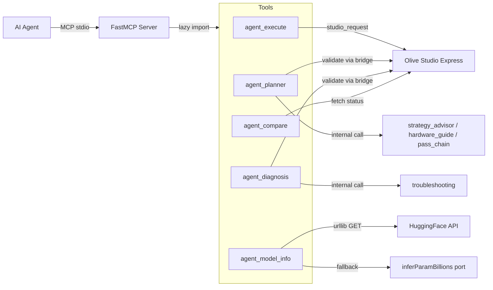

# Design Document: v0.3-agent-mcp-tools

## Overview

This design introduces five new Python MCP tools that close the autonomous agent loop in Olive Studio. Together they form a **plan → execute → observe → diagnose → compare** cycle:

| Tool | Purpose | Side-effect? |
|------|---------|:---:|
| `plan_optimization` | NL intent → UIState patch | No |
| `execute_and_observe` | Submit recipe + poll to terminal state | Yes |
| `diagnose_and_fix` | Error + recipe → diagnosis + repaired recipe | No |
| `compare_results` | Multi-job scoring with preference weighting | No |
| `get_model_info` | HF metadata / heuristic param lookup | No |

All tools live in `olive-mcp-server/olive_mcp_server/tools/`, are lazy-imported via `_TOOL_IMPORTS`, and reuse existing infrastructure (`studio_loopback`, `troubleshooting`, `strategy_advisor`, `hardware_guide`, `pass_chain`, `compatibility`).

### Design Goals

1. **Zero new pip dependencies** — tools use only Python stdlib + project internals.
2. **Fast startup preserved** — no module-level network or heavy imports.
3. **Structured errors everywhere** — same `{"error", "message", "detail?"}` shape as existing tools.
4. **Graceful degradation** — Studio-down paths return partial results rather than crashing.

## Architecture



### Module Layout

```
olive-mcp-server/olive_mcp_server/tools/
├── agent_execute.py      # execute_and_observe
├── agent_planner.py      # plan_optimization
├── agent_diagnosis.py    # diagnose_and_fix
├── agent_compare.py      # compare_results
├── agent_model_info.py   # get_model_info
└── (existing modules unchanged)
```

### Registration

Each tool adds one entry to `_TOOL_IMPORTS` in `mcp_server.py` and one entry to `ALLOWED_MCP_TOOL_NAMES` in `allowedTools.ts` under a `// Phase 3: Agent autonomous loop` comment group.

## Components and Interfaces

### 1. `execute_and_observe` (`agent_execute.py`)

**Signature:**
```python
def execute_and_observe(
    recipe: dict[str, Any],
    timeout: int | None = None,  # seconds, clamped to [10, 1800], default 600
) -> dict[str, Any]:
```

**Behavior:**
1. Clamp timeout: `min(max(timeout or 600, 10), 1800)`
2. Submit via `studio_request("POST", "/api/olive/jobs/submit", body={"recipe": recipe})`
3. On submission error → return structured error (no `side_effect` field)
4. Poll `GET /api/olive/agent/status/{job_id}` every 2 seconds
5. Stop on terminal state or timeout expiry
6. Terminal-state-at-timeout-boundary: terminal wins (`timed_out: false`)
7. Return structured result with `side_effect: true`

**Response shape (success):**
```python
{
    "status": str,           # "completed" | "failed" | "cancelled"
    "job_id": str,
    "exit_code": int | None,
    "logs": list[str],       # max 200 entries
    "metrics": dict | None,
    "elapsed_ms": int,
    "artifact_path_refs": list[str],  # basenames only
    "timed_out": bool,
    "side_effect": True,
}
```

**Error codes:** `invalid_recipe`, `submission_denied`, `studio_unavailable`, `internal_error`

### 2. `plan_optimization` (`agent_planner.py`)

**Signature:**
```python
def plan_optimization(
    intent: str,                          # 1–2000 chars
    hardware_probe: dict[str, Any] | None = None,
    model_id: str = "",                   # 1–200 chars
) -> dict[str, Any]:
```

**Behavior:**
1. Parse intent via regex/keyword dispatch for: hardware target, model reference, optimization goal
2. If none found → `unparseable_intent` error
3. Call `get_quantization_strategy()`, `get_hardware_optimization_guide()`, `get_pass_chain()` internally
4. Compose UIState patch from results
5. If `hardware_probe` provided → override provider/CUDA selection
6. If `model_id` provided → run `_normalize_model_type()` for pass selection
7. Validate patch via `validate_ui_state_recipe()` through Studio bridge (best-effort)
8. Return patch + reasoning + alternatives

**Response shape:**
```python
{
    "ui_state_patch": dict,        # partial UIState
    "reasoning": str,
    "alternatives": list[dict],    # 0–3 items, each {description, ui_state_patch}
    "validated": bool,
    "validation_note": str | None, # only when validated=false
    "side_effect": False,
}
```

**Error codes:** `unparseable_intent`, `studio_unavailable` (non-fatal, degrades to `validated: false`)

### 3. `diagnose_and_fix` (`agent_diagnosis.py`)

**Signature:**
```python
def diagnose_and_fix(
    error_message: str,              # 1–4000 chars
    recipe: dict[str, Any],
    hardware_probe: dict[str, Any] | None = None,
) -> dict[str, Any]:
```

**Behavior:**
1. Validate inputs (length checks)
2. Call `troubleshoot_olive_error(error_message, ...)` internally
3. If diagnosis has `updated_config` and `applyable=True`:
   - Apply RFC 7386 JSON Merge Patch onto recipe → `fixed_recipe`
   - Generate `changes_made` descriptions
   - Validate via `validate_optimization_job(recipe=fixed_recipe)` (best-effort)
4. Else → `fixed_recipe: null`, `fix_confidence: "none"`
5. Map confidence: has `updated_config` → `"high"`, rule-based inference → `"medium"`, weak match → `"low"`

**Response shape:**
```python
{
    "diagnosis": dict,              # full troubleshoot result
    "fixed_recipe": dict | None,
    "changes_made": list[str],
    "recipe_validated": bool,
    "fix_confidence": str,          # "high" | "medium" | "low" | "none"
    "side_effect": False,
}
```

**Error codes:** `invalid_input`, `studio_unavailable` (non-fatal), `internal_error`

### 4. `compare_results` (`agent_compare.py`)

**Signature:**
```python
def compare_results(
    job_ids: list[str],               # 2–10 items
    preference: str = "balanced",     # "latency" | "size" | "accuracy" | "balanced"
) -> dict[str, Any]:
```

**Behavior:**
1. Validate job_ids count (2–10)
2. Normalize preference (unknown → `"balanced"`)
3. Fetch each job via `studio_request("GET", f"/api/olive/agent/status/{jid}")`
4. Exclude non-terminal, failed, or unfetchable jobs → `excluded_jobs`
5. Score remaining by metrics with preference weighting (2x for chosen metric, 1x for others)
6. Select highest score as winner (null if <2 scoreable)

**Scoring algorithm:**
- Extract available numeric metrics (`latency_ms`, `model_size_mb`, `accuracy`)
- Normalize each metric to [0, 1] range across scored jobs (min-max)
- For latency/size: lower is better (invert: `1 - normalized`)
- For accuracy: higher is better (use normalized directly)
- Apply weights: `"balanced"` = all 1x; specific preference = that metric 2x
- Final score = weighted average of available normalized metrics

**Response shape:**
```python
{
    "comparison": list[dict],       # {job_id, status, metrics, score}
    "winner": str | None,
    "reasoning": str,
    "excluded_jobs": list[dict],    # {job_id, reason}
    "preference": str,
    "side_effect": False,
}
```

**Error codes:** `invalid_job_count`, `invalid_job_id`, `studio_unavailable`, `internal_error`

### 5. `get_model_info` (`agent_model_info.py`)

**Signature:**
```python
def get_model_info(model_id: str) -> dict[str, Any]:
```

**Behavior:**
1. Validate `model_id` (1–256 chars)
2. Attempt `urllib.request.urlopen(f"https://huggingface.co/api/models/{model_id}", timeout=3)`
3. On success:
   - Extract param count from `safetensors.total` or `config.num_parameters`
   - Extract architecture from `config.architectures[0]`
   - Compute `estimated_vram_gb = params_b * 2`
   - Set `source="huggingface_api"`, `confidence="high"`
4. On failure (timeout, 404, parse error):
   - Port `inferParamBillions` regex heuristics from `src/lib/vramEstimate.ts`
   - Set `source="heuristic"`, confidence by match quality
5. Classify `model_type` via `_normalize_model_type()` (reuse from `strategy_advisor`)
6. Determine `recommended_quant`: `"int4"` if params_b ≥ 6.0, else `"int8"`

**Response shape:**
```python
{
    "params_b": float,
    "architecture": str,
    "model_type": str,          # "llm" | "cnn" | "vision" | "speech" | "generic"
    "estimated_vram_gb": float,
    "recommended_quant": str,   # "int4" | "int8"
    "source": str,              # "huggingface_api" | "heuristic"
    "confidence": str,          # "high" | "medium" | "low"
    "side_effect": False,
}
```

**Error codes:** `invalid_model_id`, `internal_error`

## Data Models

### UIState Patch (plan_optimization output)

A partial UIState object conforming to the frontend store shape. Only fields the agent wants to change are included:

```typescript
interface UIStatePatch {
  modelSource?: "huggingface" | "local" | "azure";
  hfModelId?: string;
  ihvProvider?: IHVProvider;
  openvinoTargetDevice?: string;
  cudaVersion?: string;
  passes?: Partial<PassSettings>;
}
```

### Error Response (universal)

```typescript
interface McpError {
  error: string;     // snake_case code
  message: string;   // human-readable
  detail?: string;   // diagnostic context
}
```

### Job Status (from Studio bridge)

```typescript
interface JobStatus {
  id: string;
  status: "pending" | "running" | "setting_up" | "completed" | "failed" | "cancelled";
  exitCode?: number | null;
  logs?: string[];
  latestMetrics?: Record<string, number> | null;
  finishedAt?: string | null;
}
```

### Comparison Score

```python
{
    "job_id": str,
    "status": str,
    "metrics": {
        "latency_ms": float | None,
        "model_size_mb": float | None,
        "accuracy": float | None,
    },
    "score": float,  # 0.0–1.0 weighted normalized
}
```

## Correctness Properties

*A property is a characteristic or behavior that should hold true across all valid executions of a system — essentially, a formal statement about what the system should do. Properties serve as the bridge between human-readable specifications and machine-verifiable correctness guarantees.*

### Prework Analysis

**Acceptance Criteria Testing Prework:**

1.10 Timeout clamping ceiling
  Thoughts: For any user-provided timeout value (including values above 1800, at 1800, below 10, at 10, negative, zero), the effective timeout should always be within [10, 1800]. This is a pure function over all integers.
  Classification: PROPERTY
  Test Strategy: Generate random integers, apply clamping logic, verify result is in [10, 1800].

1.11 Timeout default
  Thoughts: When timeout is omitted (None), the effective timeout should be 600. This is a single example.
  Classification: EXAMPLE

1.12 Timeout floor clamping
  Thoughts: Subsumed by 1.10's property — all values below 10 clamp to 10.
  Classification: PROPERTY (merged with 1.10)

1.9 Response JSON serialization round-trip
  Thoughts: For any valid execution result, serializing to JSON and parsing back should produce a value-equal dict. This tests our output construction.
  Classification: PROPERTY

2.3 Side-effect field presence/absence
  Thoughts: For any successful submission result, `side_effect` must be True. For any pre-submission error, `side_effect` must not be present. This is a property over all possible return paths.
  Classification: PROPERTY

3.5 Unparseable intent detection
  Thoughts: For any string that contains none of (hardware keyword, model reference, optimization goal), the tool should return `unparseable_intent`. We can generate random gibberish strings.
  Classification: PROPERTY

3.8 Response structure completeness
  Thoughts: For any successful plan result, all required keys must be present. This is a property over all valid intents.
  Classification: PROPERTY

5.3 JSON Merge Patch application
  Thoughts: For any recipe R and any updated_config U, applying U as merge patch should produce a recipe where all keys in U (with non-null values) override R, and null keys are removed. This is the merge-patch specification — a universal property.
  Classification: PROPERTY

5.7 Fix confidence mapping
  Thoughts: For any diagnosis result, the confidence level should deterministically map from the presence/absence of `updated_config` and match strength. Property over all diagnosis outputs.
  Classification: PROPERTY

7.3 Scoring with preference weighting
  Thoughts: For any set of job metrics and any valid preference, the preferred metric should receive 2x weight. We can generate random metric sets and verify the scoring formula.
  Classification: PROPERTY

7.8 Balanced scoring equal weights
  Thoughts: Subsumed by 7.3 — when preference is "balanced", all weights equal 1x.
  Classification: PROPERTY (merged with 7.3)

9.3 VRAM estimate formula
  Thoughts: For any params_b value, estimated_vram_gb should equal params_b × 2. Pure arithmetic property.
  Classification: PROPERTY

9.4 Heuristic fallback round-trip
  Thoughts: For any model_id that contains an explicit size token (e.g., "7B"), the heuristic should extract that number. We can generate model_id strings with known size tokens.
  Classification: PROPERTY

9.5 Recommended quant threshold
  Thoughts: For any params_b ≥ 6.0, recommended_quant should be "int4"; for params_b < 6.0, "int8". Pure function over all floats.
  Classification: PROPERTY

12.1 Error structure consistency
  Thoughts: For any error returned by any tool, it must contain non-empty "error" and "message" fields. Universal over all error paths.
  Classification: PROPERTY

12.7 Error priority ordering
  Thoughts: When multiple errors apply, the first in parameter-check order wins. We can generate inputs that trigger multiple errors and verify only the first is returned.
  Classification: PROPERTY

13.7 JSON round-trip for all tool outputs
  Thoughts: For any tool and any valid output dict, `json.loads(json.dumps(output)) == output`. Universal serialization property.
  Classification: PROPERTY

**Property Reflection:**

After review, the following consolidations apply:
- 1.10 + 1.12 → single timeout clamping property
- 7.3 + 7.8 → single scoring weight property
- 9.3 + 9.5 → can remain separate (different aspects: arithmetic vs threshold)
- 12.1 is the universal error shape property; 12.7 is distinct (ordering)
- 13.7 subsumes 1.9 (JSON round-trip is universal across all tools)

Final deduplicated properties: 10

### Property 1: Timeout Clamping Invariant

*For any* integer value T (including negative, zero, and very large values), applying the timeout clamping function SHALL produce an effective timeout E such that `10 ≤ E ≤ 1800`. When T is None, E SHALL equal 600.

**Validates: Requirements 1.10, 1.11, 1.12**

### Property 2: Side-Effect Field Correctness

*For any* invocation of `execute_and_observe` that successfully submits a job (reaches the polling phase), the response dictionary SHALL contain `"side_effect": True`. *For any* invocation that returns before submission (error path), the response dictionary SHALL NOT contain a `"side_effect"` key.

**Validates: Requirements 2.3**

### Property 3: Unparseable Intent Rejection

*For any* input string that contains no recognizable hardware target keyword, no model reference pattern, and no optimization goal keyword, `plan_optimization` SHALL return an error with code `"unparseable_intent"`.

**Validates: Requirements 3.5**

### Property 4: JSON Merge Patch Correctness

*For any* recipe object R and any non-null `updated_config` object U, applying U as an RFC 7386 merge patch onto R SHALL produce a result where: (a) every key in U with a non-null value overrides the corresponding key in R, (b) every key in U with a null value is absent from the result, and (c) all keys in R not mentioned in U are preserved unchanged.

**Validates: Requirements 5.3**

### Property 5: Fix Confidence Determinism

*For any* diagnosis result, `fix_confidence` SHALL be `"high"` when the KB entry matched with `updated_config` present and `applyable=true`, `"medium"` when matched with rule-based inference, `"low"` when the KB match is weak, and `"none"` when no fix could be produced. The mapping is deterministic and total over all diagnosis outcomes.

**Validates: Requirements 5.7**

### Property 6: Preference-Weighted Scoring

*For any* set of 2+ job metric objects and *any* valid preference value, the scoring function SHALL assign weight 2 to the preferred metric and weight 1 to all others when preference is specific, or weight 1 to all metrics when preference is `"balanced"`. The winner SHALL be the job with the highest weighted-average normalized score.

**Validates: Requirements 7.3, 7.8**

### Property 7: VRAM Estimate Arithmetic

*For any* positive float `params_b`, the `estimated_vram_gb` field SHALL equal `params_b × 2.0`.

**Validates: Requirements 9.3**

### Property 8: Recommended Quantization Threshold

*For any* float `params_b ≥ 6.0`, `recommended_quant` SHALL be `"int4"`. *For any* float `params_b < 6.0`, `recommended_quant` SHALL be `"int8"`.

**Validates: Requirements 9.5**

### Property 9: Error Structure Invariant

*For any* error returned by any of the five new tool functions, the response SHALL be a dict containing a non-empty string `"error"` (matching `^[a-z][a-z0-9_]*$`) and a non-empty string `"message"`.

**Validates: Requirements 12.1**

### Property 10: JSON Serialization Round-Trip

*For any* valid output dictionary produced by any of the five new tools, `json.loads(json.dumps(output))` SHALL produce a value-equal dictionary.

**Validates: Requirements 13.7**

## Error Handling

### Error Propagation Strategy

All five tools follow the same defensive pattern established by existing tools:

```python
def tool_function(...) -> dict[str, Any]:
    try:
        # 1. Input validation (return specific code immediately)
        # 2. Business logic
        # 3. Bridge calls (handle studio_unavailable gracefully)
        return result
    except Exception as exc:
        return {"error": "internal_error", "message": f"{type(exc).__name__}: {exc}"}
```

### Error Priority Order

When multiple conditions fail, tools evaluate in this order:
1. **Input validation** — `invalid_recipe`, `invalid_input`, `invalid_model_id`, `invalid_job_count`, `invalid_job_id`
2. **Policy checks** — `submission_denied`
3. **Bridge connectivity** — `studio_unavailable`
4. **Bridge response shape** — `invalid_bridge_response`
5. **Unexpected exceptions** — `internal_error`

### Graceful Degradation

| Condition | Tool | Behavior |
|-----------|------|----------|
| Studio down | `plan_optimization` | Return patch with `validated: false` |
| Studio down | `diagnose_and_fix` | Return fix with `recipe_validated: false` |
| Studio down | `execute_and_observe` | Return `studio_unavailable` error |
| Studio down | `compare_results` | Exclude unfetchable jobs |
| HF API down | `get_model_info` | Fall back to heuristic |

### Shared Utilities

All tools import from `studio_loopback.py`:
- `err(code, message, detail=None)` — build error dict
- `studio_unavailable(message, detail=None)` — specialized factory
- `studio_request(method, path, body=None, timeout=5.0)` — loopback HTTP with SSRF guard

## Testing Strategy

### Approach

All tests use **mocked externals** — no network, no Studio, no HuggingFace API. Each test file patches `studio_request` (or `urllib.request.urlopen`) at the module boundary.

### Test Files

| File | Tool | Key Scenarios |
|------|------|---------------|
| `tests/test_agent_execute.py` | `execute_and_observe` | Successful completion, failed job early-abort, timeout expiry, submission denied (policy), studio unavailable, invalid recipe |
| `tests/test_agent_planner.py` | `plan_optimization` | LLM intent, CNN intent, hardware_probe override, Studio-down degradation, unparseable intent |
| `tests/test_agent_diagnosis.py` | `diagnose_and_fix` | KB match with `updated_config` (patched recipe), KB match without fix, no KB match, Studio-down validation skip, invalid input length |
| `tests/test_agent_compare.py` | `compare_results` | 2+ completed jobs with winner, excluded non-terminal jobs, fewer than 2 scoreable, invalid job count, preference-based scoring differences |
| `tests/test_agent_model_info.py` | `get_model_info` | HF API success (params from safetensors), HF timeout → heuristic fallback, HF 404 → heuristic, invalid model_id, explicit-size-token confidence vs family-default confidence |

### Property-Based Tests

The feature is suitable for property-based testing. The following properties will use `hypothesis` (already available in the dev dependencies via `pytest-hypothesis` or standalone):

- **Timeout clamping** (Property 1): `@given(st.integers())` → assert result in [10, 1800]
- **Merge patch correctness** (Property 4): `@given(st.dictionaries(...), st.dictionaries(...))` → assert RFC 7386 semantics
- **Scoring weights** (Property 6): `@given(st.lists(st.fixed_dictionaries(...)))` → verify weight application
- **VRAM arithmetic** (Property 7): `@given(st.floats(min_value=0.01, max_value=1000))` → assert `result == params_b * 2`
- **Quant threshold** (Property 8): `@given(st.floats(min_value=0.001, max_value=1000))` → assert int4/int8 boundary
- **JSON round-trip** (Property 10): Every test constructs output and asserts `json.loads(json.dumps(r)) == r`

Configuration: **minimum 100 iterations** per property test. Each test tagged with:
```python
# Feature: v0.3-agent-mcp-tools, Property {N}: {title}
```

### Unit Tests (Example-Based)

- Timeout default (None → 600)
- Specific error code mapping for each categorized failure
- Side-effect field presence/absence on each return path
- HF API response parsing for different JSON shapes (safetensors vs config paths)
- Heuristic confidence levels (explicit size token → medium, family default → low)

### Integration Tests

Not needed for this feature — all tools communicate via `studio_request` which is already integration-tested in the existing test suite. The new tools are pure logic + bridge calls.

### Running Tests

```bash
cd olive-mcp-server
python -m pytest tests/test_agent_execute.py tests/test_agent_planner.py \
  tests/test_agent_diagnosis.py tests/test_agent_compare.py \
  tests/test_agent_model_info.py -q
```

All tests run in CI via the existing `python-tests` job in `.github/workflows/ci.yml`.
