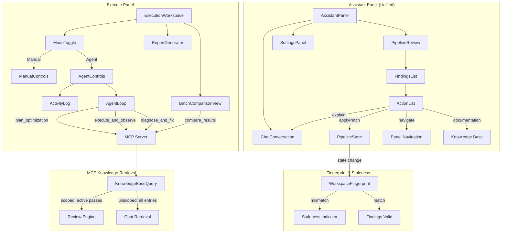

# Design Document — v0.5.0 Release

## Overview

Olive Studio v0.5.0 delivers four workstreams: (1) a Unified Assistant that merges Audit + Chat into a single conversational panel with a shared Finding/Action contract and workspace fingerprinting; (2) Agent UI in the Execute panel with Manual/Agent mode toggle, real-time activity log, and MCP-powered batch comparison; (3) Product features including report export and recipe catalog version pinning; (4) Distribution via Docker docs, PyPI publish, and Tauri signed installers.

The design preserves the existing zustand single-store architecture (`pipelineStore.ts`), the `commitUiStateUpdate` coercion pipeline, and the deterministic validation authority of `CROSS_PASS_RULES`. New types (`Finding`, `Action`) supersede the legacy `Suggestion` interface while maintaining backward compatibility during migration.

## Architecture



### Key Architectural Decisions

1. **Single-panel Assistant**: The `SidebarTab` type changes from `"audit" | "chat" | "settings"` to `"assistant" | "settings"`. The Assistant tab contains a collapsible PipelineReview above the chat conversation.

2. **Finding/Action over Suggestion**: The legacy `Suggestion` type (`{ title, description, impact, type, autofix: { pass, value } }`) is replaced by the richer `Finding` type with typed `Action[]`. The existing `sanitizeChatActionPatch` validator is reused for `applyPatch` actions.

3. **Deterministic validation authority**: `CROSS_PASS_RULES` and `getProviderConflicts()` remain authoritative. The review reconciler discards AI-generated findings that contradict deterministic issues.

4. **Agent mode isolation**: Agent UI state (activity log, running status) lives in a dedicated `useAgentMode` hook with local state, not in the global `pipelineStore`. Only concrete pipeline mutations flow through `commitUiStateUpdate`.

5. **Workspace fingerprint**: A SHA-256 hash of serialized UIState (excluding `activeJobId`, `localFiles`) provides O(1) staleness detection. The fingerprint is attached to each review result set.

## Components and Interfaces

### Workstream 1: Unified Assistant

#### New Components

| Component            | Path                                                       | Responsibility                                             |
| -------------------- | ---------------------------------------------------------- | ---------------------------------------------------------- |
| `PipelineReview`     | `src/components/features/assistant/PipelineReview.tsx`     | Collapsible review summary with score, findings, staleness |
| `FindingCard`        | `src/components/features/assistant/FindingCard.tsx`        | Single finding with action buttons                         |
| `ActionButton`       | `src/components/features/assistant/ActionButton.tsx`       | Polymorphic action trigger (patch/navigate/explain/docs)   |
| `StalenessIndicator` | `src/components/features/assistant/StalenessIndicator.tsx` | Visual staleness badge on findings                         |

#### Modified Components

| Component              | Change                                                                           |
| ---------------------- | -------------------------------------------------------------------------------- |
| `AssistantSidebar.tsx` | Remove `"audit"` tab, add `"assistant"` tab combining PipelineReview + ChatPanel |
| `AuditPanel.tsx`       | Deprecated — functionality absorbed into PipelineReview                          |
| `types.ts`             | Add `Finding`, `Action`, `ReviewResult`, `WorkspaceFingerprint` types            |

#### New Hooks

| Hook                      | Path                                                       | Purpose                                                              |
| ------------------------- | ---------------------------------------------------------- | -------------------------------------------------------------------- |
| `useWorkspaceFingerprint` | `src/lib/hooks/useWorkspaceFingerprint.ts`                 | Computes and tracks fingerprint from UIState                         |
| `usePipelineReview`       | `src/components/features/assistant/usePipelineReview.ts`   | Orchestrates review lifecycle, staleness, reconciliation             |
| `useReviewReconciler`     | `src/components/features/assistant/useReviewReconciler.ts` | Merges AI findings with deterministic validation, discards conflicts |

### Workstream 2: Agent UI

#### New Components

| Component            | Path                                                     | Responsibility                                                |
| -------------------- | -------------------------------------------------------- | ------------------------------------------------------------- |
| `ModeToggle`         | `src/components/features/execute/ModeToggle.tsx`         | Manual/Agent switch with confirmation dialog                  |
| `AgentControls`      | `src/components/features/execute/AgentControls.tsx`      | Start/Stop buttons, agent status                              |
| `ActivityLog`        | `src/components/features/execute/ActivityLog.tsx`        | Scrollable chronological event stream                         |
| `ActivityLogEntry`   | `src/components/features/execute/ActivityLogEntry.tsx`   | Single entry (reasoning/tool_call/tool_result/decision/error) |
| `AgentConfirmDialog` | `src/components/features/execute/AgentConfirmDialog.tsx` | Confirmation when switching away from active agent            |

#### New Hooks

| Hook             | Path                                                | Purpose                                                  |
| ---------------- | --------------------------------------------------- | -------------------------------------------------------- |
| `useAgentMode`   | `src/components/features/execute/useAgentMode.ts`   | Agent lifecycle (start/stop/status), activity log buffer |
| `useAgentStream` | `src/components/features/execute/useAgentStream.ts` | SSE connection to agent events endpoint                  |

#### Enhanced Components

| Component                 | Change                                                                                      |
| ------------------------- | ------------------------------------------------------------------------------------------- |
| `ExecutionWorkspace.tsx`  | Add ModeToggle, conditionally render Manual vs Agent controls                               |
| `BatchComparisonView.tsx` | Accept `compare_results` MCP tool output, add scoring preference selector, winner highlight |

### Workstream 3: Product

#### New Modules

| Module                | Path                          | Responsibility                                         |
| --------------------- | ----------------------------- | ------------------------------------------------------ |
| `reportGenerator.ts`  | `src/lib/reportGenerator.ts`  | Markdown/PDF report generation from JobHistoryRecord[] |
| `recipeCatalogPin.ts` | `src/lib/recipeCatalogPin.ts` | SHA resolution, staleness check, cache management      |

#### New Components

| Component             | Path                                                      | Responsibility                                       |
| --------------------- | --------------------------------------------------------- | ---------------------------------------------------- |
| `ExportReportMenu`    | `src/components/features/execute/ExportReportMenu.tsx`    | Dropdown with Markdown/PDF options and report config |
| `CatalogUpdateNotice` | `src/components/features/recipes/CatalogUpdateNotice.tsx` | Inline notification for newer recipes available      |

### Workstream 4: Distribution

| Artifact      | Location                                                              | Responsibility                                |
| ------------- | --------------------------------------------------------------------- | --------------------------------------------- |
| Docker guide  | `docs/deployment/docker.md`                                           | User-facing Docker deployment documentation   |
| PyPI config   | `olive-mcp-server/pyproject.toml`                                     | Package metadata, entry point, data includes  |
| CI workflow   | `.github/workflows/publish-mcp-pypi.yml`                              | Tag-triggered sdist/wheel build + PyPI upload |
| Tauri signing | `src-tauri/tauri.conf.json` + `.github/workflows/release-desktop.yml` | Signed installer pipeline                     |

## Data Models

### Finding Type

```typescript
export type FindingSeverity = "critical" | "warning" | "info";

export type ActionKind = "applyPatch" | "navigate" | "explain" | "documentation";

export interface ActionPayloadApplyPatch {
  kind: "applyPatch";
  label: string; // max 80 chars
  payload: ChatActionPatch; // validated by sanitizeChatActionPatch
}

export interface ActionPayloadNavigate {
  kind: "navigate";
  label: string;
  payload: { targetPanel: string };
}

export interface ActionPayloadExplain {
  kind: "explain";
  label: string;
  payload: { body: string }; // markdown
}

export interface ActionPayloadDocumentation {
  kind: "documentation";
  label: string;
  payload: { url?: string; topicKey?: string };
}

export type Action =
  | ActionPayloadApplyPatch
  | ActionPayloadNavigate
  | ActionPayloadExplain
  | ActionPayloadDocumentation;

export interface Finding {
  id: string; // unique within a review run
  title: string; // max 120 chars
  description: string; // max 2000 chars
  severity: FindingSeverity;
  evidence: string;
  actions: Action[]; // 1–10 elements
}
```

### Review Result

```typescript
export interface ReviewResult {
  findings: Finding[];
  score: number; // 0–100
  level: "Optimized" | "Suboptimal" | "Inefficient";
  summary: string;
  fingerprint: string; // SHA-256 hex of UIState at review time
  timestamp: string; // ISO 8601
}
```

### Workspace Fingerprint

```typescript
export interface WorkspaceFingerprintState {
  fingerprint: string; // SHA-256 hex (64 chars)
  computedAt: number; // Date.now() timestamp
}

// Transient fields excluded from fingerprint computation:
const FINGERPRINT_EXCLUDED_KEYS: (keyof UIState)[] = [
  "activeJobId",
  "localFiles",
];
```

### Activity Log Entry

```typescript
export type ActivityEntryKind =
  | "reasoning"
  | "tool_call"
  | "tool_result"
  | "decision"
  | "error";

export interface ActivityLogEntry {
  id: string;
  kind: ActivityEntryKind;
  timestamp: string; // HH:MM:SS
  text: string; // truncated per kind limits
  expandedText?: string; // full text when truncated
  stepRef?: string; // originating step for error entries
}

export interface AgentSessionState {
  mode: "manual" | "agent";
  agentRunning: boolean;
  entries: ActivityLogEntry[]; // max 2000
  startedAt?: string;
  outcome?: {
    status: "success" | "failure" | "cancelled";
    totalSteps: number;
    elapsedMs: number;
    errorDescription?: string;
    cancelledAtStep?: number;
  };
}
```

### Report Generator Types

```typescript
export interface ReportOptions {
  jobs: JobHistoryRecord[];
  includeRecipeJson?: boolean;
  includeLogSummary?: boolean;
  format: "markdown" | "pdf";
}

export interface ReportMetadata {
  title: string;
  generatedAt: string; // UTC YYYY-MM-DD HH:mm:ss
  jobCount: number;
}
```

### Recipe Catalog Pin

```typescript
export interface CatalogMetadata {
  branch: string;
  commitSha: string; // 40-char hex
  fetchedAt: string; // ISO 8601
}

export interface CatalogEntry {
  id: string;
  name: string;
  architecture: string;
  deviceTarget: string;
  content: Record<string, unknown>;
  pinned: CatalogMetadata;
}
```

### Batch Comparison Enhanced Types

```typescript
export interface CompareResultsOutput {
  results: Array<{
    job_id: string;
    latency_ms: number | null;
    model_size_mb: number | null;
    accuracy: number | null;
    score: number;
  }>;
  winner: string | null;
  reasoning: string;
  excluded_jobs: Array<{ job_id: string; reason: string }>;
}

export type ScoringPreference = "latency" | "size" | "accuracy" | "balanced";
```

## Correctness Properties

*A property is a characteristic or behavior that should hold true across all valid executions of a system — essentially, a formal statement about what the system should do. Properties serve as the bridge between human-readable specifications and machine-verifiable correctness guarantees.*

### Prework: Acceptance Criteria Testing Analysis

**Requirement 1 (Unified Assistant Panel Structure):**

1.1 Tab structure displays exactly two top-level tabs
  - Thoughts: This is a specific UI rendering check — does the panel render two tabs? A single example test suffices.
  - Classification: EXAMPLE

1.2–1.8 Collapsible section rendering, expand/collapse behavior, zero-state
  - Thoughts: These are UI interaction/rendering requirements. Example-based component tests verify specific states.
  - Classification: EXAMPLE

**Requirement 2 (Shared Finding/Action Contract):**

2.1 Finding type field constraints (id unique, title max 120 chars, etc.)
  - Thoughts: Field constraints should hold for ALL valid Finding objects. We can generate random Findings and assert constraints hold.
  - Classification: PROPERTY

2.2 Action type field constraints
  - Thoughts: Similar to 2.1 — for any Action, kind determines payload schema.
  - Classification: PROPERTY

2.3 applyPatch action payload conforms to ChatActionPatch
  - Thoughts: For any applyPatch action, sanitizeChatActionPatch(payload) must return non-null. This is testable across generated payloads.
  - Classification: PROPERTY

2.4 At least one Action per Finding
  - Thoughts: For any displayed Finding, actions.length >= 1. Universal invariant.
  - Classification: PROPERTY

2.5 Fallback to explain/documentation when patches fail
  - Thoughts: For any Finding where all candidate patches are null, the Finding still has an action of kind explain or documentation.
  - Classification: PROPERTY

2.6 applyPatch triggers re-run within 300–1000ms
  - Thoughts: Timing behavior — integration test with timer assertions.
  - Classification: INTEGRATION

2.7 Coercion notice when committed state differs from patch
  - Thoughts: For any patch where commitUiStateUpdate produces different values than requested, a notice is generated.
  - Classification: PROPERTY

2.8 Non-patch actions execute without modifying store
  - Thoughts: For any navigate/explain/documentation action execution, the PipelineStore state before and after must be identical.
  - Classification: PROPERTY

**Requirement 3 (Workspace Fingerprint and Staleness):**

3.1 Fingerprint computed excluding transient fields
  - Thoughts: For any UIState, varying only transient fields (activeJobId, localFiles) should produce the same fingerprint. This is a property.
  - Classification: PROPERTY

3.2 Fingerprint comparison within 100ms
  - Thoughts: Performance constraint — smoke test.
  - Classification: SMOKE

3.3 Stale results discarded on mismatch
  - Thoughts: For any review result with mismatched fingerprint, it must not appear in the findings list.
  - Classification: PROPERTY

3.4 Patch that changes fingerprint marks findings stale
  - Thoughts: For any UIState transition that changes the fingerprint, existing findings must be marked stale.
  - Classification: PROPERTY

3.5 Deterministic fingerprint (deep-equal states produce identical hashes)
  - Thoughts: For any two deeply-equal UIState objects (after transient exclusion), fingerprints must be byte-identical. Classic property.
  - Classification: PROPERTY

3.6 Concurrent review: newer wins
  - Thoughts: This is about race condition behavior — integration test with controlled timing.
  - Classification: INTEGRATION

3.7 No-op patch retains findings
  - Thoughts: For any state update that produces the same fingerprint, findings remain valid. Testable as property.
  - Classification: PROPERTY

**Requirement 4 (MCP Knowledge Retrieval):**

4.1–4.6 Retrieval scope, mode selection, fallback
  - Thoughts: These test external MCP service interaction and configuration. Integration tests with mocked MCP.
  - Classification: INTEGRATION

**Requirement 5 (Deterministic Validation Authority):**

5.1 AI finding discarded when contradicting deterministic issue on same pass field
  - Thoughts: For any pair of (PipelineIssue, AuditSuggestion) targeting the same pass field with conflicting values, the AI suggestion must be discarded.
  - Classification: PROPERTY

5.2 Critical deterministic severity preserved regardless of AI severity
  - Thoughts: For any deterministic critical issue, the display severity must remain critical regardless of AI assessment.
  - Classification: PROPERTY

5.3 Review does not inject into chatHistory
  - Thoughts: For any review cycle, the chatHistory/chatMessages arrays must remain unchanged.
  - Classification: PROPERTY

5.4 Chat references deterministic issues from context
  - Thoughts: Integration behavior with LLM prompting — integration test.
  - Classification: INTEGRATION

5.5 AI suggestion suppressed when autofix wouldn't resolve provider conflict
  - Thoughts: For any suggestion whose autofix.pass matches a getProviderConflicts() critical entry and whose value wouldn't resolve it, the suggestion must be suppressed.
  - Classification: PROPERTY

**Requirement 6 (Agent Mode Toggle):**

6.1–6.6 Toggle states, conditional rendering, confirmation dialog
  - Thoughts: UI interaction tests with specific state transitions.
  - Classification: EXAMPLE

**Requirement 7 (Activity Log):**

7.1 Entries appended within 500ms
  - Thoughts: Timing test.
  - Classification: INTEGRATION

7.2 Entry type support with truncation limits
  - Thoughts: For any entry with text exceeding the kind-specific limit, the displayed text must be truncated to that limit.
  - Classification: PROPERTY

7.3 Auto-scroll unless user has scrolled away
  - Thoughts: UI behavior — component test.
  - Classification: EXAMPLE

7.4 Terminal entry with correct outcome info
  - Thoughts: For any agent completion, the terminal entry must contain the correct fields per outcome type.
  - Classification: PROPERTY

7.5–7.6 Max 2000 entries, FIFO eviction
  - Thoughts: For any log state at max capacity, appending an entry must remove the oldest and maintain count <= 2000.
  - Classification: PROPERTY

**Requirement 8 (Batch Comparison):**

8.1–8.2 Enable/disable based on completed job count
  - Thoughts: Example-based tests for threshold behavior.
  - Classification: EXAMPLE

8.3 Columns match MCP tool metric keys
  - Thoughts: For any CompareResultsOutput, the table must contain all expected columns.
  - Classification: EXAMPLE

8.4 Winner row highlighted
  - Thoughts: For any non-null winner, that row must be visually distinct.
  - Classification: EXAMPLE

8.5 Null winner shows excluded jobs
  - Thoughts: For any null-winner result, each excluded job with reason is shown.
  - Classification: EXAMPLE

8.6 2–10 job constraint
  - Thoughts: For any input outside [2,10] range, the comparison must reject. Boundary property.
  - Classification: PROPERTY

8.7 Scoring preference selection
  - Thoughts: Example test for preference UI.
  - Classification: EXAMPLE

**Requirement 9 (Report Export):**

9.1 Export available when completed/failed/cancelled jobs exist
  - Thoughts: Example test.
  - Classification: EXAMPLE

9.2 Markdown contains required fields
  - Thoughts: For any set of JobHistoryRecords, the generated markdown must contain model ID, provider, duration, status, etc.
  - Classification: PROPERTY

9.3 Optional sections included when configured
  - Thoughts: For any report with includeRecipeJson=true, the output contains a recipe JSON section.
  - Classification: PROPERTY

9.6 Supports 1–100 job records
  - Thoughts: For any count in [1,100], the generator produces valid output.
  - Classification: PROPERTY

9.7 Comparison section for 2+ completed jobs
  - Thoughts: For any report with 2+ completed jobs, the output contains fastest, lowest VRAM, and average.
  - Classification: PROPERTY

9.9 File naming pattern
  - Thoughts: For any export, the filename matches `olive-report-YYYY-MM-DD.md`.
  - Classification: PROPERTY

**Requirement 10 (Recipe Catalog Version Pinning):**

10.1–10.2 SHA recorded as 40-char hex
  - Thoughts: For any stored catalog metadata, commitSha must be exactly 40 hex characters.
  - Classification: PROPERTY

10.5 Failure retains previous catalog
  - Thoughts: For any fetch failure, stored catalog/SHA must be unchanged. Integration-level.
  - Classification: INTEGRATION

**Requirements 11–14 (MultiLoRA, Docker Docs, PyPI, Tauri):**

11.2 Adapter validation (name, path, rank, alpha constraints)
  - Thoughts: For any adapter entry, all field constraints must be validated. Property testable.
  - Classification: PROPERTY

11.4 VRAM-based adapter count limit
  - Thoughts: For any hardware profile, the adapter count limit must match the VRAM threshold rule.
  - Classification: PROPERTY

11.5 Duplicate name detection
  - Thoughts: For any adapters array with duplicate names, validation must report the error.
  - Classification: PROPERTY

12–14 are documentation/CI pipeline requirements — not PBT-suitable.
  - Classification: SMOKE/INTEGRATION

### Consolidation Notes

After reviewing all identified properties, the following consolidations apply:

- **2.1 + 2.4** → Combined into a single "Finding structural invariant" property (valid fields AND non-empty actions)
- **2.3 + 2.5** → Combined: for any Finding, at least one action is valid (either a valid patch or a fallback explain/docs action)
- **3.1 + 3.5** → Combined into "fingerprint determinism" property (transient field exclusion IS the determinism guarantee)
- **3.3 + 3.4 + 3.7** → Combined into "fingerprint staleness consistency" (match → retain, mismatch → stale/discard)
- **5.1 + 5.2 + 5.5** → Combined into "deterministic validation authority" (all about AI findings being discarded/suppressed when they contradict rule-engine results)
- **7.5 + 7.6** → Combined: "activity log bounded FIFO"
- **9.2 + 9.3 + 9.7** → Combined: "report content completeness" (required fields present based on config/data)

### Properties

### Property 1: Finding Structural Invariant

*For any* valid `Finding` object produced by the review engine, the following must hold: `id` is a non-empty string unique within its review run, `title` is a non-empty string of at most 120 characters, `description` is at most 2000 characters, `severity` is one of `"critical" | "warning" | "info"`, `evidence` is a string, and `actions` is an array with between 1 and 10 elements where each element has a valid `kind` and `label` of at most 80 characters.

**Validates: Requirements 2.1, 2.4**

### Property 2: Action Payload Validity

*For any* `Action` with kind `"applyPatch"`, calling `sanitizeChatActionPatch(action.payload)` must return a non-null `ChatActionPatch`. *For any* Finding where all candidate applyPatch payloads would produce null from `sanitizeChatActionPatch`, the Finding's actions array must contain at least one action with kind `"explain"` or `"documentation"`.

**Validates: Requirements 2.3, 2.5**

### Property 3: Non-Patch Actions Preserve Store

*For any* Action with kind `"navigate"`, `"explain"`, or `"documentation"`, executing that action must not modify the PipelineStore state — the UIState before and after execution must be deeply equal.

**Validates: Requirements 2.8**

### Property 4: Coercion Difference Detection

*For any* `ChatActionPatch` applied via `commitUiStateUpdate`, if the committed UIState differs from the direct merge of the patch fields onto the prior state (indicating auto-coercion occurred), a coercion notice must be generated identifying the changed fields.

**Validates: Requirements 2.7**

### Property 5: Fingerprint Determinism and Transient Exclusion

*For any* two UIState objects that are deeply equal after excluding transient fields (`activeJobId`, `localFiles`), the computed workspace fingerprint must be byte-identical. Conversely, *for any* two UIState objects that differ only in transient fields, the fingerprints must still be identical.

**Validates: Requirements 3.1, 3.5**

### Property 6: Fingerprint Staleness Consistency

*For any* review result whose attached fingerprint does not match the current workspace fingerprint, those findings must be discarded or marked stale. *For any* UIState update that produces the same fingerprint as before (no-op patch), existing findings must remain unmarked. *For any* UIState update that produces a different fingerprint, all existing findings must be marked stale.

**Validates: Requirements 3.3, 3.4, 3.7**

### Property 7: Deterministic Validation Authority

*For any* pair of (deterministic `PipelineIssue`, AI `AuditSuggestion`) targeting the same pass field: if the deterministic issue has severity "critical" and the AI suggestion's recommended value would not resolve the conflict (as determined by `getProviderConflicts()`), the AI suggestion must be suppressed from displayed results. The displayed severity for that pass field must always be the deterministic issue's severity, regardless of AI assessment.

**Validates: Requirements 5.1, 5.2, 5.5**

### Property 8: Review Isolation from Chat History

*For any* automatic review refresh cycle triggered by `/api/ai/analyze-state`, the `chatHistory` array and `chatMessages` state must remain identical before and after the review completes — no elements appended, prepended, or modified.

**Validates: Requirements 5.3**

### Property 9: Activity Log Entry Truncation

*For any* `ActivityLogEntry` with kind `"reasoning"`, the displayed `text` must be at most 512 characters. *For any* entry with kind `"tool_call"` or `"decision"`, `text` must be at most 256 characters. *For any* entry with kind `"tool_result"` or `"error"`, `text` must be at most 512 characters. When the original text exceeds the limit, `expandedText` must contain the full untruncated value.

**Validates: Requirements 7.2**

### Property 10: Activity Log Terminal Entry Correctness

*For any* agent loop termination, the terminal entry must contain: on success — total step count and elapsed wall-clock duration; on failure — the error description from the failing step; on cancellation — the step number at which cancellation occurred.

**Validates: Requirements 7.4**

### Property 11: Activity Log Bounded FIFO

*For any* activity log state, the entry count must never exceed 2000. When at maximum capacity and a new entry is appended, the oldest entry must be removed such that the count remains exactly 2000. When a new agent session starts, all entries from the previous session must be cleared before appending new entries.

**Validates: Requirements 7.5, 7.6**

### Property 12: Batch Comparison Job Count Constraint

*For any* invocation of the batch comparison, the input job record count must be between 2 and 10 inclusive. Inputs outside this range must be rejected without producing a comparison table.

**Validates: Requirements 8.6**

### Property 13: Report Content Completeness

*For any* set of `JobHistoryRecord[]` passed to the report generator with Markdown format: the output must contain the model identifier, hardware provider, pass names in order, duration, and terminal status for each job. When `includeRecipeJson` is true, the output must contain a recipe JSON section. When `includeLogSummary` is true, the output must contain total log count, error count, and last log line (truncated to 200 chars). When 2 or more completed jobs are present, the output must contain a comparison section with fastest job, lowest VRAM (if present), and average duration.

**Validates: Requirements 9.2, 9.3, 9.7**

### Property 14: Report Filename Pattern

*For any* Markdown export, the downloaded filename must match the regex pattern `^olive-report-\d{4}-\d{2}-\d{2}\.md$` where the date portion equals the current UTC date.

**Validates: Requirements 9.9**

### Property 15: Catalog Commit SHA Format

*For any* stored `CatalogMetadata`, the `commitSha` field must be exactly 40 characters long and consist only of hexadecimal characters (`[0-9a-f]`).

**Validates: Requirements 10.1, 10.2**

### Property 16: MultiLoRA Adapter Validation

*For any* adapter entry in the `adapters` array (when `multiLora` flag is enabled): `name` must be a non-empty string unique across all entries, `path` must be a non-empty string, `rank` must be a positive integer, `alpha` must be a positive finite number, and optional `targetModules` must be an array of non-empty strings. The maximum adapter count must be 2 for hardware profiles with <= 12 GB VRAM and 8 for profiles above 12 GB VRAM.

**Validates: Requirements 11.2, 11.4, 11.5**

## Error Handling

### Workstream 1: Unified Assistant

| Scenario                                                            | Handling                                                                                       |
| ------------------------------------------------------------------- | ---------------------------------------------------------------------------------------------- |
| AI provider unreachable during review                               | Display error in PipelineReview with retry button; retain previous valid findings if available |
| `sanitizeChatActionPatch` returns null for all patches in a Finding | Inject fallback `explain` action with rationale; never display a Finding with zero actions     |
| Review result arrives with stale fingerprint                        | Silently discard results; show "Results outdated" indicator with Refresh button                |
| Concurrent review race                                              | Abandon older in-flight result on arrival; only display most-recently-initiated review         |
| Fingerprint computation fails (malformed state)                     | Fall back to empty string fingerprint; log warning; treat all results as potentially stale     |

### Workstream 2: Agent UI

| Scenario                                    | Handling                                                                                                                          |
| ------------------------------------------- | --------------------------------------------------------------------------------------------------------------------------------- |
| Agent loop fails to start within 10s        | Append error entry to ActivityLog; re-enable Start button; do not switch to agent-running state                                   |
| SSE connection drops during agent execution | Append `error` entry; attempt reconnection up to 3 times with exponential backoff; after 3 failures, mark agent as stopped        |
| MCP tool invocation timeout                 | Append `error` entry referencing the tool call step; agent loop continues with next step or terminates based on error criticality |
| User switches mode while agent running      | Confirmation dialog; Cancel = dismiss + continue; Confirm = cancel agent loop gracefully then switch                              |

### Workstream 3: Product

| Scenario                                       | Handling                                                                                            |
| ---------------------------------------------- | --------------------------------------------------------------------------------------------------- |
| Report generation with empty job list          | Do not trigger export; menu item disabled when no qualifying jobs exist                             |
| PDF popup blocked by browser                   | Catch window.open failure; do not throw; silently fail the print action                             |
| Catalog fetch network failure                  | Retain existing catalog unchanged; display inline error with reason (network/auth/branch-not-found) |
| Pinned commit SHA no longer reachable upstream | Serve from local cache if available; otherwise display error indicating revision unavailable        |

### Workstream 4: Distribution

| Scenario                             | Handling                                                                                             |
| ------------------------------------ | ---------------------------------------------------------------------------------------------------- |
| PyPI version mismatch with Git tag   | CI workflow fails without uploading; logs the mismatch                                               |
| Code-signing certificate unavailable | Produce unsigned installer; emit CI warning; job completes with non-failure exit code                |
| Docker health check fails            | Document expected `GET /sse` connection-open response; user troubleshoots with provided curl command |

## Testing Strategy

### Dual Testing Approach

This release uses both example-based unit tests and property-based tests (via `fast-check`) to achieve comprehensive coverage.

- **Unit tests**: Verify specific UI rendering states, integration points, edge cases, and error paths
- **Property tests**: Verify universal invariants across randomized inputs for data transformations and validation logic
- **Component tests**: Verify React component rendering and interaction via `@testing-library/react`
- **Integration tests**: Verify Express route behavior and MCP tool proxy with mocked externals

### Property-Based Testing Configuration

- Library: **fast-check** (already available in the project's test ecosystem via vitest)
- Minimum iterations: **100** per property test
- Each property test is tagged with a comment referencing the design property:
  - Tag format: **Feature: v05-release, Property {number}: {property_text}**

### Test Distribution by Workstream

| Workstream        | Unit Tests                          | Property Tests   | Component Tests                           | Integration Tests                     |
| ----------------- | ----------------------------------- | ---------------- | ----------------------------------------- | ------------------------------------- |
| Unified Assistant | Finding/Action type guards          | Properties 1–8   | PipelineReview rendering, collapse/expand | Review endpoint flow                  |
| Agent UI          | Entry formatting, truncation        | Properties 9–12  | ModeToggle, ActivityLog scroll            | Agent SSE stream                      |
| Product           | Report file naming, date formatting | Properties 13–15 | ExportReportMenu states                   | Catalog fetch + SHA resolution        |
| MultiLoRA         | Adapter entry validation            | Property 16      | —                                         | —                                     |
| Distribution      | —                                   | —                | —                                         | CI pipeline smoke (in GitHub Actions) |

### Key Test Files

| File                                             | Scope                                                                |
| ------------------------------------------------ | -------------------------------------------------------------------- |
| `src/lib/__tests__/findingContract.test.ts`      | Properties 1–2: Finding/Action structural invariants                 |
| `src/lib/__tests__/workspaceFingerprint.test.ts` | Properties 5–6: Fingerprint determinism and staleness                |
| `src/lib/__tests__/reviewReconciler.test.ts`     | Properties 7–8: Deterministic validation authority, review isolation |
| `src/lib/__tests__/activityLog.test.ts`          | Properties 9–11: Entry truncation, terminal entry, FIFO              |
| `src/lib/__tests__/batchComparison.test.ts`      | Property 12: Job count constraint                                    |
| `src/lib/__tests__/reportGenerator.test.ts`      | Properties 13–14: Content completeness, filename pattern             |
| `src/lib/__tests__/recipeCatalogPin.test.ts`     | Property 15: SHA format                                              |
| `src/lib/__tests__/multiLoraValidation.test.ts`  | Property 16: Adapter validation                                      |

### What Is NOT Tested with PBT

- UI rendering and layout (Requirements 1.1–1.8, 6.1–6.6) → component tests with `@testing-library/react`
- Timing constraints (Requirements 2.6, 3.2, 7.1) → integration tests with controlled timers
- MCP retrieval modes (Requirements 4.1–4.6) → integration tests with mocked MCP server
- External service interaction (catalog fetch, Docker health) → integration/smoke tests
- Documentation content (Requirements 12.1–12.6) → manual review + markdown lint
- CI pipeline behavior (Requirements 13.6–13.7, 14.1–14.7) → tested by CI itself

### Testing Commands (per project conventions)

| Command                                                                       | Use                                                |
| ----------------------------------------------------------------------------- | -------------------------------------------------- |
| `pnpm test`                                                                   | Run unit + property tests in `src/lib/`            |
| `pnpm test:server`                                                            | Server route unit tests                            |
| `pnpm test:integration`                                                       | Integration tests (mocked externals, real Express) |
| `pnpm test:component`                                                         | Component rendering tests                          |
| Single file: `pnpm vitest run src/lib/__tests__/workspaceFingerprint.test.ts` | Targeted local verification                        |
