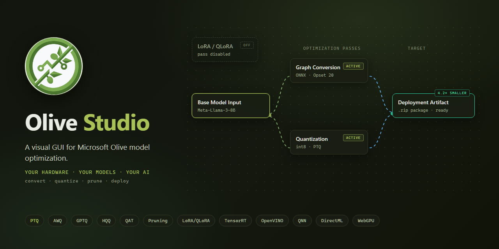
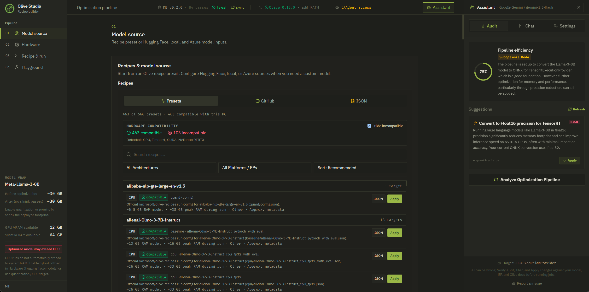
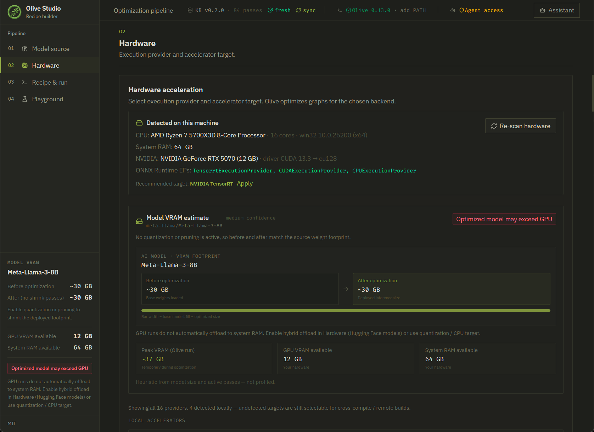
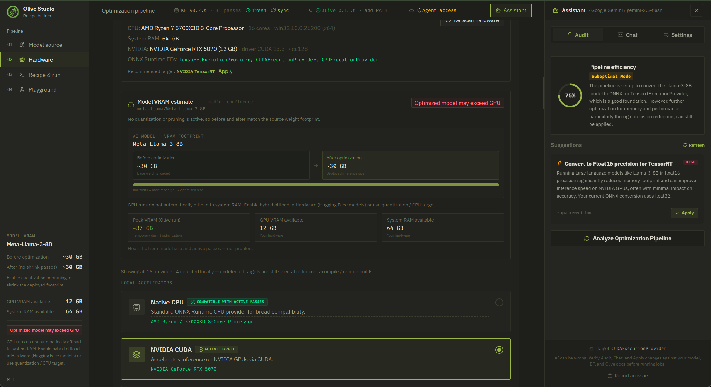
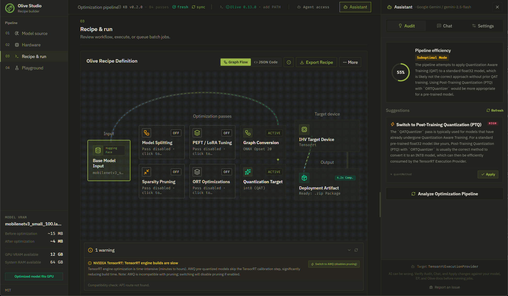

# Olive Studio

[](LICENSE)
[](package.json)
[](https://pnpm.io)
[](https://github.com/tonythethompson/Olive-Studio/actions/workflows/ci.yml)

<p align="center">
  
</p>

Olive Studio is a visual GUI for [Microsoft Olive](https://github.com/microsoft/Olive) model optimization. Configure model sources, hardware targets, and optimization passes, then execute on your own machine without cloud accounts. Ships with an AI assistant (20 providers), hardware validation with one-click autofix, and an MCP server for agent-driven workflows.

[Microsoft Olive docs](https://microsoft.github.io/Olive/) · [Olive recipes catalog](https://github.com/microsoft/olive-recipes) · [Roadmap](docs/ROADMAP.md)

---

## Screenshots

|                                    Recipe catalog                                     |                                  Hardware detection                                  |
| :-----------------------------------------------------------------------------------: | :----------------------------------------------------------------------------------: |
|  |  |

|                           Hardware VRAM & providers                            |                               Recipe graph flow                               |
| :----------------------------------------------------------------------------: | :---------------------------------------------------------------------------: |
|  |  |

---

## Quick start

### Prerequisites

- **Node.js** 22+
- **pnpm** 11.17+ (`npm install` is blocked)
- **Python** 3.10-3.13 (3.12 recommended) on PATH, or set from the app's Runtime control

Optional: NVIDIA / Intel / Qualcomm / AMD drivers for GPU/NPU recipes. [Hugging Face token](https://huggingface.co/settings/tokens) for gated models.

### Install and run

**Pinned release** (matches [Releases](https://github.com/tonythethompson/Olive-Studio/releases); replace the tag as needed):

```bash
git clone --branch v0.4.0 --depth 1 https://github.com/tonythethompson/Olive-Studio.git
cd Olive-Studio
pnpm install
pnpm dev
```

Tagged clones are detached HEAD. `git pull` will not move you to a newer release. To update: `git fetch --depth 1 origin tag vX.Y.Z && git checkout vX.Y.Z && pnpm install`.

**Develop on `main`** (contributors; continuous updates via `git pull`):

```bash
git clone https://github.com/tonythethompson/Olive-Studio.git
cd Olive-Studio
pnpm install
pnpm dev
```

Open <http://localhost:3000>. On the first Execute Live run, the server creates a `.venv/` and installs Olive automatically.

### Production build

```bash
pnpm build
pnpm start
```

### Ubuntu desktop packages

Official Linux releases include a Node 22 runtime for the Tauri sidecar; a system Node installation is not required to launch the DEB or AppImage. Ubuntu 22.04+ needs the desktop runtime libraries:

```bash
sudo apt update
sudo apt install -y libwebkit2gtk-4.1-0 libgtk-3-0 libayatana-appindicator3-1 xdg-utils
```

Install a DEB with `sudo apt install ./Olive-Studio_*.deb`, or make an AppImage executable with `chmod +x Olive-Studio_*.AppImage` and run it. Building from source still requires Node 22+, pnpm, Python, and Rust. For NVIDIA CUDA or AMD ROCm recipes, install the vendor driver/runtime first; CPU recipes work without GPU tooling.

### macOS Installation (Unsigned DMG)

The macOS DMG is not code-signed or notarized. On first launch, macOS
Gatekeeper will block the app. To open it:

1. Right-click (or Control-click) the Olive Studio application
2. Select **Open** from the context menu
3. Click **Open** in the confirmation dialog

On macOS 15 and later, if that flow does not offer a way to continue, first try
to open Olive Studio once. Then open **System Settings → Privacy & Security**,
scroll to **Security**, click **Open Anyway**, and confirm **Open**. Only override
Gatekeeper for a DMG downloaded from the official Olive Studio releases.

This is only required on first launch. Subsequent launches work normally.

---

## Features

### Three-step pipeline

1. **Model source** — Hugging Face model ID, local files, Azure ML path, or a starter recipe from the curated GitHub catalog
2. **Hardware** — pick an execution provider; the app probes your machine and surfaces only what it can run
3. **Recipe & run** — edit passes in a graph or JSON view, validate, execute, queue batch jobs, or export

### Optimization passes

| Pass                | What it does                                                      |
| ------------------- | ----------------------------------------------------------------- |
| **Conversion**      | PyTorch / TensorFlow / JAX → ONNX, OpenVINO IR, QNN, or TensorRT  |
| **Quantization**    | PTQ, AWQ, QAT, GPTQ, HQQ, RTN, SpinQuant, QuaRot (INT8/INT4/FP16) |
| **Pruning**         | Magnitude, SparseGPT, Wanda (structured or unstructured)          |
| **ORT transforms**  | Transformer-specific ONNX Runtime graph optimizations             |
| **PEFT**            | LoRA / QLoRA, including diffusion LoRA                            |
| **Model splitting** | Shard large models across devices                                 |

Pass combinations are validated against your execution provider. Incompatible combinations surface conflict banners with one-click autofix.

### Execution providers

| Provider     | Target                        |
| ------------ | ----------------------------- |
| CPU          | Broad compatibility           |
| CUDA         | NVIDIA GPUs                   |
| TensorRT     | NVIDIA datacenter (full SDK)  |
| TensorRT RTX | Consumer GeForce RTX          |
| OpenVINO     | Intel CPU / GPU / NPU         |
| QNN          | Qualcomm Snapdragon NPU       |
| ROCm         | AMD GPUs                      |
| DirectML     | Windows GPU acceleration      |
| WebGPU       | In-browser (ONNX Runtime Web) |

### Runtime intelligence

- **Hardware probe** — detects ORT providers, GPU drivers, VRAM, and recommends a default
- **VRAM estimates** — per-pass and provider memory guidance
- **Pipeline validation** — schema checks, compatibility rules, and Olive preflight before spawn
- **Auto dependency install** — creates `.venv/`, installs olive-ai, pins GPU runtimes on demand
- **Batch queue** — run and track multiple jobs with shared validation
- **MCP diagnostics** — query the bundled MCP server for troubleshooting and pass guidance
- **In-browser validation** — smoke-test exported ONNX models with WebGPU or CPU
- **WebGPU benchmark** — measure browser GPU inference performance
- **Model Arena** — side-by-side A/B comparison of optimization outputs

### AI assistant (optional)

20 providers supported: Gemini, OpenAI, ChatGPT Plus/Pro, Anthropic, Mistral, xAI, OpenRouter, Groq, Together, Fireworks, NVIDIA NIM, Hugging Face, Cloudflare Workers AI, OpenAI Codex, GitHub Copilot, Devin, Kilo Code, OpenCode Zen, OpenCode Go, and generic OpenAI-compatible endpoints. Local engines (LM Studio, Ollama) work via the OpenAI-compatible provider over loopback.

- **Audit** — reviews your pipeline configuration and suggests optimizations
- **Chat** — workspace-aware Q&A about your recipe, hardware, and Olive workflows
- **Apply actions** — AI suggestions can be applied directly to your pipeline state

Set credentials in-app under Assistant → Settings, or via environment variables.

---

## Environment variables

Create `.env` or `.env.local` in the project root. All are optional:

| Variable             | Purpose                                                                           |
| -------------------- | --------------------------------------------------------------------------------- |
| `GEMINI_API_KEY`     | Google Gemini                                                                     |
| `OPENAI_API_KEY`     | OpenAI / compatible                                                               |
| `ANTHROPIC_API_KEY`  | Anthropic Claude                                                                  |
| `HF_TOKEN`           | Hugging Face (models + chat)                                                      |
| `MISTRAL_API_KEY`    | Mistral                                                                           |
| `XAI_API_KEY`        | xAI Grok                                                                          |
| `OPENROUTER_API_KEY` | OpenRouter                                                                        |
| `GROQ_API_KEY`       | Groq                                                                              |
| `TOGETHER_API_KEY`   | Together AI                                                                       |
| `OLIVE_BIND`         | Server bind address (default `127.0.0.1`; set to `0.0.0.0` only on a trusted LAN) |
| `SYNC_KB_TOKEN`      | Server-side secret for `POST /api/mcp/sync-kb`                                    |
| `VITE_SYNC_KB_TOKEN` | Client-side copy of `SYNC_KB_TOKEN` sent as `x-sync-token`                        |

Full list of supported keys in [AGENTS.md](AGENTS.md).

---

## GPU notes (NVIDIA)

- The server pins `onnxruntime-gpu==1.26.0` with CUDA 12 runtime wheels into `.venv`
- TensorRT (`tensorrt==10.9.0.34`) installs for `TensorrtExecutionProvider` recipes
- TensorRT RTX (`tensorrt-rtx`) installs for `NvTensorRTRTXExecutionProvider` recipes
- Restart `pnpm dev` after server-side dependency changes

---

## MCP server

The repository includes `olive-mcp-server/`, a Python FastMCP server with 32 tools covering pass catalog, hardware guides, troubleshooting, compatibility checks, recipe validation, agent autonomy workflows, and job lifecycle.

- Runs as a stdio server; the web app proxies calls via `POST /api/mcp/tool`
- `.mcp.json` at repo root registers it for AI coding agents (Claude Code, Cursor, etc.)
- Troubleshooting feedback is local-only and aggregate (no logs or PII stored)

See [olive-mcp-server/README.md](olive-mcp-server/README.md) for setup and tool documentation.

---

## Project layout

```
Olive-Studio/
├── src/
│   ├── components/features/  # React feature panels (zustand-connected)
│   ├── lib/                  # Recipe builder, validation, stores, hooks
│   └── server/
│       ├── routes/           # Express route modules (ai, olive, mcp, env, system, arena)
│       ├── services/         # AI providers (20), olive jobs, venv, MCP client
│       └── middleware/       # bodyGuard, rateLimit, localOnly
├── server.ts                 # Express entry point
├── olive-mcp-server/         # Python MCP server (32 tools)
├── bin/                      # Production CLI
├── scripts/                  # Catalog generator, smoke tests, utilities
└── docs/                     # Roadmap, release notes, architecture docs
```

---

## Scripts

| Command                 | Description                         |
| ----------------------- | ----------------------------------- |
| `pnpm dev`              | Development server (Vite + Express) |
| `pnpm build`            | Production build                    |
| `pnpm start`            | Serve production build              |
| `pnpm test`             | Unit tests (vitest)                 |
| `pnpm test:server`      | Server unit tests                   |
| `pnpm test:integration` | Integration tests                   |
| `pnpm test:component`   | Component tests (jsdom)             |
| `pnpm lint`             | TypeScript + ESLint                 |
| `pnpm lint:quick`       | Fast lint (oxlint)                  |
| `pnpm validate:recipe`  | Recipe builder smoke test           |

---

## Contributing

Issues and pull requests welcome. See [CONTRIBUTING.md](CONTRIBUTING.md).

---

## Roadmap

**v0.4** (current)

- olive-ai 0.13.0 upgrade (8 new passes, KQuant method, migration module)
- Agent autonomy tools: plan, execute, diagnose, compare, model-info
- Hardware detection fixes (CUDA, TensorRT, NVIDIA fallback)
- Client bundle reduced 37.9% via tree-shaking and code splitting
- Validation & test hardening for new cross-pass rules

**v0.5** (next)

- Unified Assistant experience (audit + chat merged, shared action contract)
- Execute Agent mode toggle (Manual vs Agent, activity log)
- Multi-model batch comparison view
- Export optimization reports (PDF/Markdown)
- MCP Docker deployment docs and PyPI publish
- Tauri signed installer

Full details in [docs/ROADMAP.md](docs/ROADMAP.md).

---

## Related

- [Microsoft Olive](https://github.com/microsoft/Olive) — the optimization engine
- [microsoft/olive-recipes](https://github.com/microsoft/olive-recipes) — official recipe catalog
- [ONNX Runtime](https://onnxruntime.ai/) — inference runtime

---

## License

MIT. See [LICENSE](LICENSE).

Microsoft Olive and related names are trademarks of Microsoft Corporation. This project is independent community tooling.
